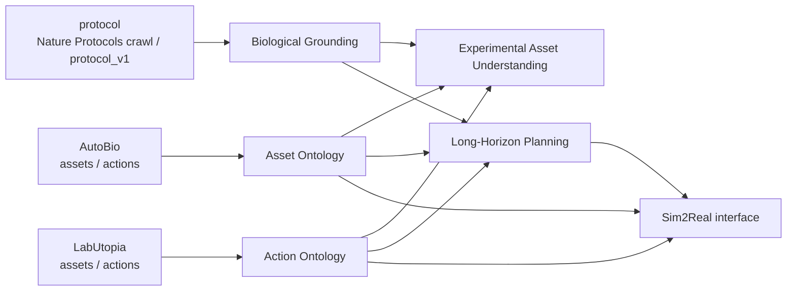
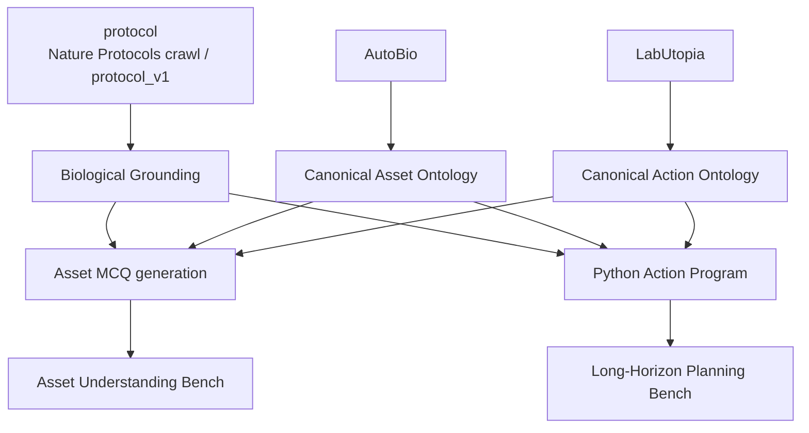

# LabOS

> 面向实验室智能体的三段式 benchmark。
> 本文档反映截至 2026-04-16 的最新规划：LabOS 当前直接使用三个数据源：`protocol`（即 `Nature Protocols` 爬取并落地后的 `protocol_v1`）、`AutoBio`、`LabUtopia`。

## 项目概述

LabOS 现在拆成三个部分：

1. **Experimental Asset Understanding**
   输入实验仪器图片和一道选择题，输出正确选项。题目主要围绕仪器识别、部件含义、状态判断和使用方式。
2. **Long-Horizon Planning**
   输入实验描述、目标、可用材料/设备等信息，输出一份**非常长、结构化、可执行**的实验步骤。
3. **Sim2Real**
   面向仿真与真实执行的评测接口，后续再展开。

这三个部分不是孤立的。它们背后直接对应三个数据源：

- `protocol`：也就是 `Nature Protocols` 爬取并整理后的 `protocol_v1`，提供实验目的、实验步骤、设备用途和科学语义；
- `AutoBio`：提供实验室场景里真正要对齐的一部分 assets 与 actions；
- `LabUtopia`：提供另一部分可复用的 assets、actions 与具身任务组织方式。



## 当前判断

这次调整以后，LabOS 的重点不是把 `AutoBio` 和 `LabUtopia` 拿掉，而是把它们放到更准确的位置：

- `protocol` 负责 benchmark 的**科学对齐**；
- `AutoBio` 与 `LabUtopia` 负责 benchmark 的**具身对齐**；
- 前两块 benchmark 则负责把这两种对齐方式接到一起。

也就是说，LabOS 不是单纯做一个“实验文本 benchmark”，而是在做一座桥：

1. 一端对齐 `protocol` 这批高质量生物实验语料；
2. 一端对齐 `AutoBio`、`LabUtopia` 这样的具身资产与动作空间；
3. 中间通过 asset understanding 和 long-horizon planning 完成映射。

这条路线的价值在于：

- 有科学内容上的约束，不会变成泛泛的 robotics benchmark；
- 有 assets / actions 上的复用，不需要重新发明一套实验室本体；
- 后续接 `sim2real` 时，不会和已有具身工作脱节。

## 核心原则

- **一方面对齐 `protocol`，另一方面对齐 `AutoBio` 与 `LabUtopia`。**
- **优先复用已有素材**，尤其是当前仓库里的 `protocol_v1`，以及已有具身工作里的 asset / action 设计。
- **先做可评分的 benchmark**，避免开放式任务难以比较。
- **输出保持结构化**，后续才能接自动评测和 sim2real。
- **设备知识、动作知识与 protocol 知识共享接口**，避免第一块和第二块完全分裂。

## 三个数据源

### protocol

`protocol` 在 LabOS 里承担的是**生物理解与科学正确性锚点**。这里的 `protocol` 指的就是 `Nature Protocols` 爬取下来并落地为 `protocol_v1` 的语料：

- 定义某类实验的目标和阶段；
- 提供高质量、非常详细的步骤；
- 提供设备为什么使用、什么时候使用、如何使用的语义背景；
- 为前三个部分都提供“这件事在生物实验上是否合理”的依据。

### AutoBio

`AutoBio` 在 LabOS 里承担的是**可执行世界的一部分本体锚点**：

- 有哪些实验室 assets；
- 有哪些 canonical actions；
- 哪些 assets / actions 已经在具身环境中被建模。

### LabUtopia

`LabUtopia` 在 LabOS 里承担的是**另一部分可执行世界本体锚点**：

- 有哪些实验室 assets；
- 有哪些 canonical actions；
- 动作如何被组织成更长链的 protocol；
- 后续 sim2real 最可能接到什么动作空间和场景对象。

因此，这两个项目的价值不只是“以后做 sim2real 再看”，而是从现在开始就应该决定：

- asset understanding 里优先做哪些设备；
- long-horizon planning 里每一步如何映射成 canonical action；
- benchmark 的 schema 里哪些字段必须预留。

### protocol_v1

当前仓库里的 [data/protocol_v1/README.md](data/protocol_v1/README.md) 就是这里说的 `protocol` 数据源在仓库内的目录名。

## 关键对齐来源

- protocol / Nature Protocols: <https://www.nature.com/nprot/>
- AutoBio: <https://github.com/autobio-bench/AutoBio>
- LabUtopia: <https://github.com/Rui-li023/LabUtopia>
- SGI-WetExperiment: <https://huggingface.co/datasets/InternScience/SGI-WetExperiment>
- protocol_v1: [data/protocol_v1/README.md](data/protocol_v1/README.md)

## Part I: Experimental Asset Understanding

### 任务定义

输入：

- 一张实验设备图片；
- 一道关于该设备的选择题；
- 若干候选项。

输出：

- 正确选项。

任务重点不是通用视觉识别，而是**实验设备使用知识**。也就是说，问题应该尽量考：

- 设备类别与用途；
- 部件和按钮的功能；
- 当前状态识别；
- 下一步正确操作；
- 安全与兼容性判断。

### 这块为什么重要

如果模型连实验设备都没看懂，后面的长程 planning 很容易出现两类错误：

1. 计划里调用了错误设备或错误部件；
2. 计划文本看起来合理，但和真实仪器的使用方式不一致。

所以第一块不是一个边缘小任务，它应该成为第二块的基础约束来源。

更具体地说，这一块要同时满足两种对齐：

- 和 `protocol` 对齐：设备在实验中到底用来做什么；
- 和 `AutoBio`、`LabUtopia` 对齐：这个设备在具身世界里对应哪个 asset family。

### 建议的题目类型

建议先把题目分成四类，每类都做成单选：

1. **Asset Identification**
   识别设备类别，例如 thermal cycler、microplate reader、multichannel pipette。
2. **Component / Control Understanding**
   判断某个按钮、旋钮、盖子、接口或显示区域的作用。
3. **State / Mode Understanding**
   判断设备当前状态，例如 lid open/closed、ready/running、某模式是否已开启。
4. **Usage / Safety Decision**
   在给定场景下判断正确操作、错误操作、兼容耗材或安全注意事项。

如果要做难度分层，建议这样拆：

- `A1` 设备识别；
- `A2` 状态判断；
- `A3` 操作理解；
- `A4` 安全与故障排查。

### 最快的数据构造路线

这块目前仓库里还没有成型图像集，所以最快路线不是从零发明视觉语料，而是先做三步对齐：

1. 用 `AutoBio` 和 `LabUtopia` 确定优先覆盖的 asset family；
2. 用 `protocol` 提供这些 assets 在真实实验中的用途和使用语义；
3. 用现有 `protocol_v1` 扩大设备名覆盖与长尾变体。

#### Step 1: 先定 asset family，再抽设备词表

第一步不应该只从语料里盲抽设备名，而应该先从 `AutoBio` 和 `LabUtopia` 里整理一份优先对齐的实验资产集合，例如：

- thermal cycler
- centrifuge
- pipette / multichannel pipette
- microplate reader
- vortex / thermal mixer
- tube / plate / rack / lid / drawer 这类高频可操作对象

然后再直接用 [data/protocol_v1/README.md](data/protocol_v1/README.md) 去补充：

- 已抽取的 `equipment`、`reagents`、`steps`、`abstract` 等字段；
- 设备名、步骤短语和阶段模板；
- 可直接服务于设备归一化和题目候选构造的结构化内容。

这一步建议做的不是出题，而是：

- 归一化设备名；
- 合并同义词；
- 去掉明显噪声项；
- 补部件、状态和典型用途；
- 得到一份 `canonical asset ontology`。

#### Step 2: 收图时同时考虑科学语义和具身可复用性

优先收集以下来源中的公开图片：

- 厂商 product page；
- 仪器说明书 / user manual；
- protocol 图示；
- 教学视频帧图；
- 公开实验室教学材料。

第一版不必追求图像数量特别大，重点是：

- 设备覆盖要代表真实 wet-lab 高频资产；
- 图像来源要多样，避免只学会某个产品宣传图风格；
- 尽量贴近 `AutoBio` 和 `LabUtopia` 中真正出现过的设备家族；
- 每个设备至少要有不同视角、不同状态、不同背景的图片。

#### Step 3: 题目必须围绕用途，而不只围绕识别

题目不要做成纯常识题，而要尽量让答案和图像有关。也就是说，题目的正确性应该来自：

- 图片里可见的部件；
- 图片里可见的状态；
- 设备类别决定的操作语义。

同时，题目的语义来源最好来自 `protocol` 里的描述，对象来源则来自 `AutoBio` 和 `LabUtopia` 的 asset family。

一个更稳的规则是：每道题都标一个 `evidence` 字段，记录出题依据来自哪一处视觉信息或哪条设备知识。

### 建议的数据格式

```json
{
  "item_id": "asset_000001",
  "asset_id": "thermal_cycler",
  "image": "images/thermal_cycler/xxx.jpg",
  "question": "在该设备使用前，哪一个部件需要先关闭以开始升温循环？",
  "choices": {
    "A": "样品架侧门",
    "B": "上盖",
    "C": "显示屏外壳",
    "D": "电源适配器"
  },
  "answer": "B",
  "skill_tag": "usage",
  "difficulty": "A3",
  "evidence": "top lid visible in image",
  "canonical_actions": ["close_lid", "start_cycle"],
  "source": "manual",
  "split": "dev"
}
```

### 评测建议

这块主指标很简单，先用 `accuracy` 即可，但要分组报：

- overall accuracy；
- by `skill_tag`；
- by `difficulty`；
- by asset family；
- by image source。

此外建议单独保留两种 harder split：

- **OOD asset view**：同一设备的陌生视角；
- **OOD asset instance**：同类但不同型号设备。

这样才不至于把 benchmark 做成“见过图就会选”的模板匹配题。

## Part II: Long-Horizon Planning

### 任务定义

输入：

- 实验目标或实验描述；
- 可选的摘要、背景、试剂、设备、允许 assets、允许 actions、约束条件；
- 一组**有限动作空间**，每个动作带函数签名与参数说明；
- 可选的输出格式要求。

输出：

- 一份**非常长**的实验步骤；
- 但输出形式不再是自由文本或纯 JSON，而是**由有限动作空间组合出来的 Python 程序**。

这里要明确：这块不是一般问答，也不是简短 workflow generation，而是**长程实验规划**。重点是模型能否把一个实验目标拆成几十步、跨多个阶段、前后依赖清楚的 protocol。

同时，这块的任务形式应当显式参考 `SGI-WetExperiment`：

- 输入中提供 `research direction / question`；
- 输入中提供 `action_pool`；
- 输出是动作的组合以及参数设置。

但 LabOS 不直接复用它的字符串格式，而是进一步改成**合法的 Python 函数调用**，以便做 AST 级评测。

### 现有基础其实已经不错

这块的核心不是单纯“拿一堆 protocol 来生成步骤”，而是做一份**既和科学 protocol 对齐、又和具身 asset / action 对齐**的 planning benchmark。

当前最直接的基础有两层：

1. `protocol` / [data/protocol_v1/README.md](data/protocol_v1/README.md)
   提供高质量、非常详细的实验流程和设备用途语义，也提供当前仓库里可直接使用的结构化字段；
2. `AutoBio` 与 `LabUtopia`
   提供 assets / actions 的可执行本体。

这意味着第二块最合理的策略就是直接围绕三个数据源做对齐：

- 用 `protocol` 提供实验语义、详细步骤和参数线索；
- 用 `AutoBio` 提供一部分 assets / actions；
- 用 `LabUtopia` 提供另一部分 assets / actions 和长链动作组织方式。

### 这块真正要测什么

建议把第二块的能力定义为下面五项：

1. **Goal Decomposition**
   能否把高层实验目标拆成多个阶段。
2. **Long-range Coherence**
   后面的步骤是否真的依赖前面的准备，而不是局部凑句子。
3. **Constraint Satisfaction**
   是否遵守给定设备、试剂、assets 和 actions 约束。
4. **Parameter Fidelity**
   时间、温度、体积、离心条件等关键参数是否合理。
5. **Execution Readiness**
   输出是否足够结构化，后续可接自动评测甚至 sim2real。

### 建议的输入设置

为了让 benchmark 有层次，建议至少做三档：

1. **P1: Scaffolded Planning**
   给 `title + abstract + reagents + equipment + action_pool`，要求生成完整 protocol program。
2. **P2: Constrained Planning**
   给实验目标、可用设备/材料、可用 assets/actions，要求在约束下生成 protocol program。
3. **P3: Sparse Planning**
   只给高层实验描述和有限动作空间，要求输出长步骤 program。

这三档里，`P1` 最适合先跑通基线，因为当前仓库里的 `protocol_v1` 已经具备对应字段。随后可以把 `AutoBio` 与 `LabUtopia` 的 asset / action 约束逐步加进 `P2` 和 `P3`。

### 建议的输出格式

这块建议采用两层表示：

1. **对模型的目标输出**：Python action program
2. **对评测器的内部表示**：由 Python AST 归一化得到的 `Protocol AST IR`

也就是说，模型看到的是一组可调用动作，最终输出的是 Python 代码；评测时我们再把代码解析成标准中间表示。

#### Action specification

动作空间建议直接定义成 Python 函数签名，而不是自定义 DSL：

```python
def process_tissue_samples(tissue_sample: str, processing_method: str) -> str: ...
def score_pd_l1_expression(stained_tissue: str, cell_type: str) -> int: ...
def administer_treatment(patient: str, dose: str, schedule: str) -> str: ...
def collect_blood_sample(patient: str, collection_time: str, tube_type: str) -> str: ...
def analyze_cytokines(plasma_sample: str, cytokine_panel: str) -> str: ...
```

#### Target output

模型输出应当是由这些动作函数组成的长程序，例如：

```python
processed_tissue = process_tissue_samples(
    tissue_sample="archived_paraffin_embedded_tissue",
    processing_method="standard_ihc_protocol",
)

immune_cell_score = score_pd_l1_expression(
    stained_tissue=processed_tissue,
    cell_type="tumor_infiltrating_immune_cells",
)

treatment_record = administer_treatment(
    patient="eligible_ubc_patient",
    dose="15_mg_per_kg",
    schedule="q3w",
)

baseline_blood = collect_blood_sample(
    patient="eligible_ubc_patient",
    collection_time="pre_dose",
    tube_type="sodium_heparin",
)

cytokine_panel = analyze_cytokines(
    plasma_sample=baseline_blood,
    cytokine_panel="IL18_IFNG",
)
```

相对于 `SGI-WetExperiment` 的函数式字符串输出，这里进一步要求：

- 函数名必须是合法 Python identifier；
- 参数全部显式命名；
- 变量依赖通过赋值表达；
- 不允许调用动作池外的函数。

这样做的好处是，评测时可以直接使用 Python AST，而不需要自己写一套复杂的动作序列比较器。

#### Protocol AST IR

评测器在解析模型输出后，可自动提取出下面这些字段：

- `calls`
- `call_order`
- `callee_name`
- `keyword_arguments`
- `assigned_variables`
- `data_dependencies`
- `illegal_calls`
- `missing_required_args`
- `unused_results`

### 数据构造建议

基于当前设计，第二块的数据构造应该分三步：

1. **protocol / protocol_v1 -> biological protocol**
   提取目标、阶段、详细步骤、设备用途和关键参数。
2. **AutoBio and LabUtopia -> canonical asset & action space**
   整理每一步可能对应的资产与动作词表。
3. **alignment**
   把 protocol 中的设备与操作映射到统一的 `asset/action ontology`，再转成 Python 函数签名。

具体工程上，最快路线是：

1. 以 `all.jsonl` 作为主输入；
2. 规范化 `steps`、`equipment`、`reagents` 字段；
3. 从 `protocol_v1` 中优先抽长而细的 protocol 记录做 dev/test；
4. 从 `title`、`abstract`、`materials/equipment` 自动构造 prompt；
5. 先把 step 中的操作词映射到 `AutoBio` 与 `LabUtopia` 的 canonical actions；
6. 再把 canonical actions 定义成 Python 函数签名；
7. 把 gold protocol 转成 Python action program；
8. 评测时再从程序反解出 `Protocol AST IR`；
9. 按 prompt 可见信息量切出 `P1/P2/P3` 三种任务；
10. dev/test 做更强人工质检，尤其看长链依赖、参数正确性和 action 映射质量。

### 评测建议

这块不建议只用文本相似度。既然输出就是 Python program，更合适的做法是直接走 AST 评测。

建议分成三层：

1. **Syntax / Parse Layer**
   - Python 是否可解析；
   - 是否只调用了 action pool 中允许的函数；
   - 是否满足基本参数签名。
2. **Structure Layer**
   - 调用覆盖率；
   - 调用顺序是否合理；
   - 变量依赖图是否合理；
   - 是否有非法调用、缺参、重复无效调用。
3. **Semantic Layer**
   - 参数是否正确；
   - 设备与动作是否匹配；
   - 整体程序是否对应参考实验流程。

建议至少报告这些指标：

- **AST Parse Success**
- **Allowed Call Accuracy**
- **Call Coverage / F1**
- **Dependency Edge Accuracy**
- **Argument Match**
- **Action Consistency**
- **Length Adequacy**
- **Program-level Exact Match**（归一化后）

如果需要更高层语义评分，再补：

- **LLM-as-judge**：评估程序整体是否实现了目标实验流程；
- **专家抽检**：主要看关键参数与科学合理性。

## 前两块如何衔接

这次规划调整后，最关键的不是“两个 benchmark 并排放着”，而是把它们通过共享的**生物语义、资产本体和动作本体**连起来。

建议共享下面三层接口：

1. **Biological Grounding**
   由 `protocol` 提供实验阶段、设备用途和步骤语义。
2. **Canonical Asset / Action Ontology**
   统一设备类别、部件、状态、典型操作和别名。
3. **Python Action Program / Protocol AST IR**
   统一 planning 的目标输出格式，以及评测器内部使用的 AST 归一化表示。



这有两个直接好处：

- 第一块不会只学视觉分类，而会学到对后续 planning 真有用的设备语义；
- 第二块不会只生成漂亮文本，而会天然受 `AutoBio` 与 `LabUtopia` 的 asset / action 空间约束。

## Part III: Sim2Real

这一块暂时不展开，只保留接口位置。

当前更合理的策略是：

- 先把 `biological grounding`、`asset/action ontology`、Python action spec 和 `Protocol AST IR` 定稳；
- 先把前两块 benchmark 做到可跑、可评分、可扩展；
- 等第一块和第二块稳定后，再把输出更自然地接到 `AutoBio` 与 `LabUtopia` 风格的仿真与执行接口。

## 建议的 MVP 路线

### Phase 0: 统一接口

- 定 `canonical asset ontology`
- 定 `canonical action ontology`
- 定 `asset MCQ` 数据格式
- 定 Python action signatures
- 定 `Protocol AST IR`
- 定评测脚本输出格式

### Phase 1: Asset Understanding MVP

- 从 `AutoBio` 与 `LabUtopia` 整理高频 asset family
- 用 `protocol_v1` 补设备用途与别名
- 选 20 到 30 个高频设备 family
- 每个 family 收若干公开图片
- 做 300 到 1000 条高质量单选题

### Phase 2: Long-Horizon Planning MVP

- 基于 `protocol_v1` 构造 `P1` 任务
- 接入 `AutoBio` 与 `LabUtopia` 的 asset / action 词表
- 先做 100 到 300 条高质量 dev/test
- 跑通结构化协议生成与自动评分
- 再扩到 `P2` / `P3`

### Phase 3: Joint Consistency

- 把设备本体接进 planning 的约束检查
- 把 action ontology 接进 step-level consistency 检查
- 加入“设备使用是否合理”的评测维度
- 为后续 sim2real 预留接口

## 当前建议

如果现在目标是尽快把 benchmark 做成形，那么最稳的落地顺序是：

1. 先以 `protocol_v1` 定义 benchmark 的科学锚点和规划语料；
2. 再用 `AutoBio` 与 `LabUtopia` 定义 assets 和 actions 的可执行锚点；
3. 用这三个数据源的对齐结果，把 planning 数据准备和设备覆盖快速做起来；
4. 围绕高频资产做 `experimental asset understanding` 的图像题；
5. 最后再考虑 sim2real。

换句话说，LabOS 的主线应该写成：

- **`protocol_v1` 就是 protocol 数据源本身，也就是爬取下来的 Nature Protocols 语料；**
- **AutoBio 与 LabUtopia 提供 assets 与 actions；**
- **前两块 benchmark 负责把这两套世界观对齐起来；**
- **后续 sim2real 再承接这个统一接口。**
