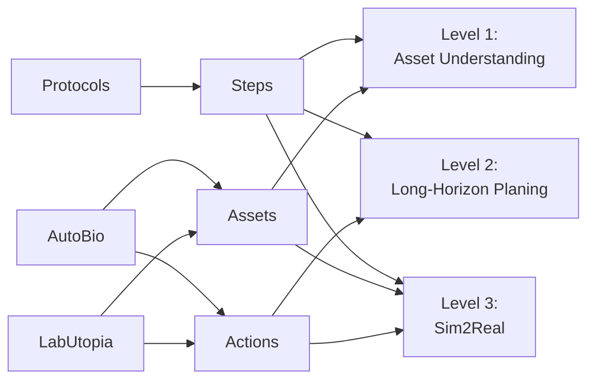

# LabOS

面向实验室智能体的三段式 benchmark。

当前版本直接围绕三个数据源构建：

- `Protocols`：即 `Nature Protocols` 爬取并整理后的 `protocol_v1`，提供实验步骤、阶段结构、设备用途和参数线索
- `AutoBio`：提供实验室具身环境中的 assets 与 actions
- `LabUtopia`：提供另一套可复用的 assets、actions 与长链任务组织方式

## 1. 数据构造管线



说明：

- `Protocols` 只向右游提供 `Steps`。这里的 `Steps` 不是原始长文，而是从 `protocol_v1` 中抽取并清洗后的实验阶段、步骤顺序、关键参数、设备使用语义和必要的背景描述。
- `AutoBio` 和 `LabUtopia` 同时向右游提供 `Assets` 与 `Actions`。`Assets` 包括仪器、容器、部件、工作台对象等；`Actions` 包括可执行的原子操作和可被组织成长链 protocol 的动作集合。
- 三个中间层不是独立数据集，而是三个数据源经过标准化后的统一接口：
  - `Steps`：从 `Protocols` 中抽取
  - `Assets`：从 `AutoBio` 与 `LabUtopia` 中归一化
  - `Actions`：从 `AutoBio` 与 `LabUtopia` 中归一化
- `Level 1` 使用 `Steps + Assets`，因为它既要知道“这是什么仪器”，也要知道“这个仪器在实验中做什么”。
- `Level 2` 使用 `Steps + Actions`，因为它要把实验目标和 protocol 步骤映射到长程动作序列。
- `Level 3` 使用 `Steps + Assets + Actions`，因为它需要把 biological protocol、场景对象和动作执行同时接到 sim2real 设置里。

在工程实现上，数据构造可以拆成四步：

1. 从 `protocol_v1` 中抽取 `title / abstract / equipment / reagents / steps / timing` 等字段，形成可直接用于 benchmark 构造的 protocol record。
2. 从 `AutoBio` 和 `LabUtopia` 中抽取实验资产名称、对象类别、动作名称、任务片段和可视化素材，形成 asset/action inventory。
3. 把 protocol 中提到的设备和操作词对齐到统一的 `Assets / Actions` 命名空间，例如把不同写法的 thermal cycler、centrifuge、lid close、insert 都归一到固定名称。
4. 按目标 level 产出数据：
   - `Level 1`：构造图片+问题+选项
   - `Level 2`：构造长程规划输入与结构化动作输出
   - `Level 3`：构造带步骤、资产、动作和执行观测的 sim2real 任务

## 2. Level 1: Asset Understanding

Level 1 评测模型是否真正理解实验仪器的用途、部件、状态和使用方式。这个 level 的目标不是做通用视觉分类，而是回答“这个 asset 在实验里是什么、处于什么状态、接下来应该怎么用”。因此，Level 1 更接近实验语义理解，而不是普通图像识别。

### 2.1 输入

- 一张实验仪器图片。图片可以是实拍图、说明书截图、教学材料截图、渲染图或仿真画面，但都需要能清楚指向某个 `asset family`。
- 一道与仪器相关的选择题。问题类型主要包括：
  - 仪器识别
  - 部件功能
  - 状态判断
  - 使用决策
  - 安全与兼容性判断
- 若干候选项。默认是单选题，通常为 4 个选项。
- 附带元数据。实际数据构造时，建议每道题至少带上：
  - `asset_family`
  - `question_type`
  - `image_source`
  - `evidence`
  - `source_protocol_id`

题目语义主要来自 `Protocols`，对象集合主要与 `AutoBio`、`LabUtopia` 中实际出现过的 asset family 对齐。也就是说，题目不能只问“图里是什么”，还应当问“这个对象在真实实验 protocol 中承担什么作用”。

### 2.2 输出

- 一个单一选项，通常是 `A / B / C / D` 中的一个。
- 评测时只取模型最终归一化后的选项标签：
  - 若模型输出 `B`，直接记为 `B`
  - 若模型输出 `Answer: B`，归一化后记为 `B`
  - 若模型同时输出多个选项，或输出无法归一化到唯一选项，则记为错误

### 2.3 指标

- 主指标是 `Accuracy`
  - 计算方式：`Accuracy = #Correct / #Total`
  - 其中 `#Correct` 是模型预测与标准答案完全一致的题目数，`#Total` 是全部题目数
- 按 `asset family` 分组准确率
  - 计算方式：`Acc(asset_family = k) = #Correct_k / #Total_k`
  - 作用：检查模型是否只会少数常见设备，而不会长尾设备
- 按 `question type` 分组准确率
  - 计算方式：`Acc(type = t) = #Correct_t / #Total_t`
  - 作用：区分模型究竟擅长识别、状态判断，还是只擅长简单分类
- 按 `image source` 分组准确率
  - 计算方式：`Acc(source = s) = #Correct_s / #Total_s`
  - 作用：检查模型是否对某种图像风格过拟合
- 如需更稳的汇总指标，建议额外报告 `Macro Accuracy`
  - 计算方式：先分别算各组准确率，再对组求平均
  - 作用：避免某一大类数据量过大，把总体分数“冲高”
- 如需设置更严格测试，还可以单独报告：
  - `OOD View Accuracy`：同类设备但陌生视角
  - `OOD Instance Accuracy`：同类设备但不同型号

## 3. Level 2: Long-Horizon Planing

Level 2 评测模型能否根据实验目标、背景和约束生成长程、结构化、可执行的实验 protocol。这里的核心不是短回答，而是多步骤、长链条、前后依赖清晰的 planning。它要测的是：模型能否把 biological protocol 转成一条足够长、足够细、可被评测的动作计划。

### 3.1 输入

- 实验目标或实验描述，例如某个 qPCR、孵育、离心、装载、插入或关盖任务
- 可选的背景、摘要、试剂、设备和约束条件，这部分主要来自 `Protocols`
- 有限动作空间，这部分主要来自 `AutoBio` 与 `LabUtopia`
- 可选的输出格式约束，例如：
  - 必须使用给定动作集合
  - 必须显式填写参数
  - 必须满足步骤顺序
  - 不允许调用动作池外的函数

其中：

- `Protocols` 提供实验步骤、阶段结构和参数线索
- `AutoBio` 与 `LabUtopia` 提供动作来源、动作边界和动作命名空间

实际构造时，Level 2 的输入通常至少包含以下字段：

- `task_id`
- `goal`
- `context`
- `equipment`
- `reagents`
- `constraints`
- `action_pool`
- `source_protocol_id`

如果要做难度分层，可以继续保留三档输入密度：

- `P1`：给较完整的 scaffold
- `P2`：给中等约束
- `P3`：只给高层目标和动作空间

### 3.2 输出

- 一份长程、结构化的实验 protocol
- 在 benchmark 的正式形式里，推荐把输出规范成由有限动作空间组成的 Python action program，原因是这样可以直接做 AST 级评测
- 输出必须满足以下约束：
  - 只能使用动作池中允许的动作
  - 参数必须显式给出
  - 步骤依赖必须可解析
  - 顺序必须与 protocol 逻辑一致

一个最小输出片段可以长这样：

```python
plate = aliquot_master_mix(
    reagent_set="cytokine_qpcr_mix",
    destination_plate="96_well_plate",
    volume_ul=18,
)

loaded_plate = load_samples(
    sample_tubes="stimulated_rna_samples",
    destination_plate=plate,
    layout="triplicate_layout",
)
```

网页展示层当前只用动作名称方块来表示顺序，但 benchmark 本身应以结构化动作输出为准。

### 3.3 指标

- `AST Parse Success`
  - 计算方式：`AST Parse Success = #Parseable / #Total`
  - 含义：模型输出中有多少比例能被 Python AST 正常解析
- `Allowed Call Accuracy`
  - 计算方式：`Allowed Call Accuracy = #AllowedCalls / #PredictedCalls`
  - 其中 `#AllowedCalls` 是属于给定动作池的调用数
  - 若模型调用了未定义动作，这部分直接记错
- `Argument Match`
  - 计算方式：在对齐后的动作调用上，统计参数名和值都正确的参数个数，再除以标准答案参数总数
  - 记作：`Argument Match = #MatchedArguments / #GoldArguments`
- `Dependency / Order Accuracy`
  - 先把预测程序和标准程序都解析为调用顺序与依赖边
  - 计算方式：`Dependency / Order Accuracy = #CorrectEdges / #GoldEdges`
  - 这里的边可以是“先做 A 再做 B”或“B 依赖 A 的输出”
- `Program-level Exact Match`
  - 先对程序做归一化，例如忽略临时变量名差异、统一字符串格式
  - 计算方式：`Program-level Exact Match = #ExactlyMatchedPrograms / #Total`
  - 只有整体结构、动作、参数和顺序都一致时才算命中
- `Length Adequacy`
  - 作用：防止模型用过短程序“投机取巧”
  - 一个简单可用的计算方式是：
    `Length Adequacy = min(#PredSteps, #GoldSteps) / max(#PredSteps, #GoldSteps)`
  - 该值在 `0` 到 `1` 之间，越接近 `1` 说明长度越接近标准答案

如果后续需要汇总成单一总分，可以在报告中单独给出加权平均，但基础指标应原样分别报告，避免一个综合分掩盖具体失败模式。

## 4. Level 3: Sim2Real

Level 3 评测模型能否把前两个 level 中的 biological steps、assets 和 actions 进一步接到具身执行与 sim2real 场景中。它关心的不只是“会不会规划”，而是“这个规划能不能真的落到仿真与真实执行里”。

### 4.1 输入

- 与任务相关的 protocol steps
- 可用 assets
- 可用 actions
- 仿真观测、状态或多视角视频
- 可选的执行约束，例如安全规则、完成条件、失败条件

从数据来源关系上看：

- `Protocols` 提供任务步骤和阶段语义
- `AutoBio` 与 `LabUtopia` 提供资产和动作空间
- 观测可以是多视角视频、状态序列或仿真日志

### 4.2 输出

- 面向执行的动作序列、策略或任务结果判断
- 在更具体的任务设置中，输出可以有两种主要形式：
  - `action generation`：直接输出下一步或整段动作
  - `result judgment`：判断当前执行是否成功、是否安全、是否可转移到真实环境

无论采用哪一种形式，输出都应与给定的 assets、actions 和 protocol steps 对齐，而不能脱离任务约束自由生成。

### 4.3 指标

- `Task Success`
  - 计算方式：`Task Success = #SuccessfulEpisodes / #AllEpisodes`
  - 只要整段任务达到预设完成条件，记为成功
- `Step Success`
  - 计算方式：`Step Success = #SuccessfulSubgoals / #AllSubgoals`
  - 用于检查模型是“整体成了”，还是只完成了部分步骤
- `Sim Success`
  - 计算方式：在仿真环境中成功完成任务的 episode 比例
- `Real Success`
  - 计算方式：在真实环境中成功完成任务的 episode 比例
- `Sim-to-Real Gap`
  - 计算方式：`Sim-to-Real Gap = Sim Success - Real Success`
  - 也可以同时报告其绝对值 `|Sim Success - Real Success|`
  - gap 越小，说明 sim2real 一致性越好
- `Safety`
  - 计算方式：`Safety = #EpisodesWithoutUnsafeEvents / #AllEpisodes`
  - `unsafe events` 可以包括碰撞、液体洒漏、错误开盖、对象跌落、危险接触等

对于 Level 3，建议所有成功率指标都同时报告平均值和 episode 数量，避免只给比例而不说明评测规模。

## 5. 当前重点

当前工作的重点仍然是前两个 level：

- `Level 1`：先把高频实验资产、图片来源和题目类型做稳
- `Level 2`：先把长程 planning 的输入格式、动作空间、结构化输出和评测跑通
- `Level 3`：先把输入输出接口、视频展示和指标定义定稳，后续再继续扩展为真正的 sim2real benchmark

## 6. 相关链接

- `protocol_v1`：[data/protocol_v1/README.md](data/protocol_v1/README.md)
- `Nature Protocols`：<https://www.nature.com/nprot/>
- `AutoBio`：<https://github.com/autobio-bench/AutoBio>
- `LabUtopia`：<https://github.com/Rui-li023/LabUtopia>
- `SGI-WetExperiment`：<https://huggingface.co/datasets/InternScience/SGI-WetExperiment>
