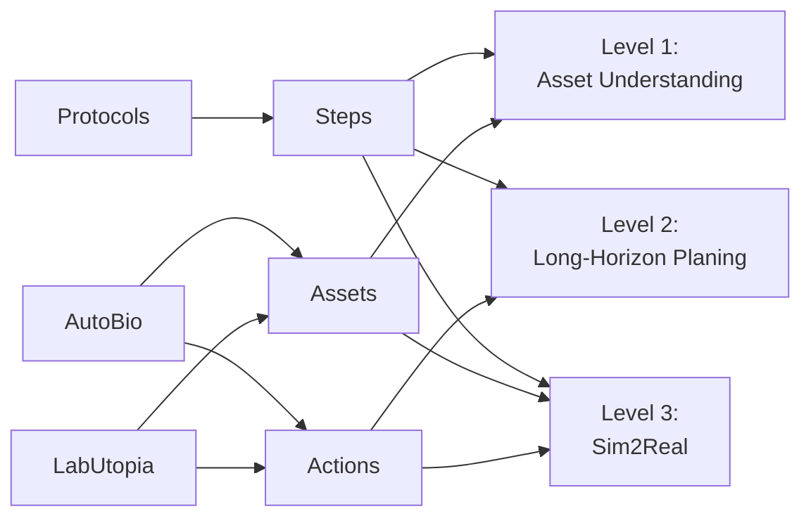

# LabOS

面向实验室智能体的三段式 benchmark。

当前版本直接围绕三个数据源构建：

- `Protocols`：即 `Nature Protocols` 爬取并整理后的 `protocol_v1`，提供实验步骤、阶段结构、设备用途和参数线索
- `AutoBio`：提供实验室具身环境中的 assets 与 actions
- `LabUtopia`：提供另一套可复用的 assets、actions 与长链任务组织方式

## 1. 数据构造管线



说明：

- `Protocols` 只向右游提供 `Steps`。这里的 `Steps` 不是原始长文，而是从 `protocol_v1` 中抽取并清洗后的实验阶段、步骤顺序、关键参数、设备使用语义和必要的背景描述。
- `AutoBio` 和 `LabUtopia` 同时向右游提供 `Assets` 与 `Actions`。`Assets` 包括仪器、容器、部件、工作台对象等；`Actions` 包括可执行的原子操作和可被组织成长链 protocol 的动作集合。
- 三个中间层不是独立数据集，而是三个数据源经过标准化后的统一接口：
  - `Steps`：从 `Protocols` 中抽取
  - `Assets`：从 `AutoBio` 与 `LabUtopia` 中归一化
  - `Actions`：从 `AutoBio` 与 `LabUtopia` 中归一化
- `Level 1` 使用 `Steps + Assets`，因为它既要知道“这是什么仪器”，也要知道“这个仪器在实验中做什么”。
- `Level 2` 使用 `Steps + Actions`，因为它要把实验目标和 protocol 步骤映射到长程动作序列。
- `Level 3` 使用 `Steps + Assets + Actions`，因为它需要把 biological protocol、场景对象和动作执行同时接到 sim2real 设置里。

在工程实现上，数据构造可以拆成四步：

1. 从 `protocol_v1` 中抽取 `title / abstract / equipment / reagents / steps / timing` 等字段，形成可直接用于 benchmark 构造的 protocol record。
2. 从 `AutoBio` 和 `LabUtopia` 中抽取实验资产名称、对象类别、动作名称、任务片段和可视化素材，形成 asset/action inventory。
3. 把 protocol 中提到的设备和操作词对齐到统一的 `Assets / Actions` 命名空间，例如把不同写法的 thermal cycler、centrifuge、lid close、insert 都归一到固定名称。
4. 按目标 level 产出数据：
   - `Level 1`：构造图片+问题+选项
   - `Level 2`：构造长程规划输入与结构化动作输出
   - `Level 3`：构造带步骤、资产、动作和执行观测的 sim2real 任务

## 2. Level 1: Asset Understanding

Level 1 评测模型是否真正理解实验仪器的用途、部件、状态和使用方式。这个 level 的目标不是做通用视觉分类，而是回答“这个 asset 在实验里是什么、处于什么状态、接下来应该怎么用”。因此，Level 1 更接近实验语义理解，而不是普通图像识别。

### 2.1 输入

- 一个 `asset` 的三视图，而不是单张图片。默认至少包含三个互补视角，例如：
  - `front view`
  - `side view`
  - `top / oblique view`
- 一道与该 `asset` 相关的选择题。题目可以考察：
  - 仪器用途
  - 部件含义
  - 当前状态
  - 正确使用方式
  - 安全与兼容性判断
- 若干候选项。默认是单选题，通常为 4 个选项。
- 题目元数据。建议至少包含：
  - `asset_family`
  - `question_type`
  - `views`
  - `evidence`
  - `source_protocol_id`

Level 1 的关键点是：模型不能只看一张图猜类别，而要综合三视图完成实验语义判断。题目语义主要来自 `Protocols`，对象集合主要与 `AutoBio`、`LabUtopia` 中真实出现过的 asset family 对齐。

### 2.2 输出

- 输出包含两部分：
  1. `reasoning_steps`：`list[string]`，表示模型给出的推理步骤
  2. `answer`：一个单一字母，通常是 `A / B / C / D`

推荐输出格式如下：

```json
{
  "reasoning_steps": [
    "The front view shows the main body and lid geometry.",
    "The side view indicates this is a thermal cycler rather than a mixer.",
    "The top view suggests the lid must be closed before cycling."
  ],
  "answer": "B"
}
```

评测时：

- `reasoning_steps` 作为步骤级推理输出单独评分
- `answer` 先归一化到唯一字母，再参与最终答案评测
- 若模型输出多个答案字母，或无法归一化到唯一字母，则答案部分记为错误

### 2.3 指标

- Level 1 只报告两个指标。

1. `Reasoning Step Accuracy`
   - 这是一个基于 LLM-as-judge 的步骤级指标
   - 对每道题，把模型输出的 `reasoning_steps` 与标准答案、三视图证据和题目进行联合评测
   - judge 需要判断每一步是否：
     - 与图像证据一致
     - 与题目相关
     - 没有引入明显错误事实
   - 若第 `i` 条推理被 judge 判为正确，则记 `step_i = 1`，否则记 `step_i = 0`
   - 最终计算方式：
     `Reasoning Step Accuracy = sum(step_i over all predicted steps) / #AllPredictedSteps`
   - 这个指标评测的是“推理过程是否合理”，不是最终是否答对

2. `Answer Exact Match Accuracy`
   - 先把模型输出答案归一化到唯一字母
   - 若归一化答案与标准答案完全一致，则该题记 `1`，否则记 `0`
   - 计算方式：
     `Answer Exact Match Accuracy = #ExactMatchedAnswers / #TotalQuestions`
   - 这是 Level 1 的最终答案指标

## 3. Level 2: Long-Horizon Planing

Level 2 评测模型能否根据实验目标、背景和约束生成长程、结构化、可执行的实验 protocol。这里的核心不是短回答，而是多步骤、长链条、前后依赖清晰的 planning。它要测的是：模型能否把 biological protocol 转成一条足够长、足够细、可被评测的动作计划。

### 3.1 输入

- Level 2 的输入固定为三部分：

1. `实验背景`
   - 说明实验目标、对象、阶段和必要背景
   - 来自 `Protocols`
   - 可以包含摘要、设备清单、试剂清单、阶段描述

2. `具体实验约束和要求`
   - 说明必须满足的条件，例如：
     - 必须使用哪些设备
     - 必须满足哪些顺序
     - 需要哪些参数类型
     - 不能违反哪些实验要求
   - 这一部分不能直接泄露标准答案中的正确步骤顺序，不能把 gold protocol 原样塞进 prompt

3. `动作空间`
   - 来自 `AutoBio` 和 `LabUtopia`
   - 以代码函数定义的形式给出，而不是自然语言列表
   - 例如：

```python
def aliquot_master_mix(reagent_set: str, destination_plate: str, volume_ul: int) -> str: ...
def load_samples(sample_tubes: str, destination_plate: str, layout: str) -> str: ...
def seal_plate(plate: str, seal_type: str) -> str: ...
```

Level 2 的设计原则是：给模型足够多的背景和约束，但不把正确步骤直接告诉它；真正要预测的，是基于动作空间构造出来的长程代码计划。

### 3.2 输出

- 输出是一段代码形式的动作序列
- 输出必须是合法的 Python 代码，并且能够被 Python AST 成功解析
- 代码中只能调用输入动作空间中给定的函数
- 每一步都必须显式填写参数
- 代码顺序直接表示动作顺序
- 变量依赖直接表示步骤依赖
- 评测前会把代码归一化为 step list，每一步都抽象成：
  - `action`：函数名
  - `input`：参数字典
  - `output`：该步生成的变量名（若有）

一个最小输出片段如下：

```python
plate = aliquot_master_mix(
    reagent_set="cytokine_qpcr_mix",
    destination_plate="96_well_plate",
    volume_ul=18,
)

loaded_plate = load_samples(
    sample_tubes="stimulated_rna_samples",
    destination_plate=plate,
    layout="triplicate_layout",
)
```

Level 2 的标准评测对象是这段代码本身，而不是它的自然语言解释。

### 3.3 指标

- Level 2 只报告两个指标，但具体计算逻辑对齐 `SGI-Bench` 的 `evaluation/task_3_wet_experiment/step_2_score.py`。
- 差别只在于：`SGI-WetExperiment` 需要先把自定义文本结构解析成 step list，而 LabOS 直接把 Python 程序解析为 AST，再抽取同样的 `action / input / output` 结构，因此实现会更稳定，但评分逻辑保持一致。

1. `Action Sequence Similarity`
   - 先把预测代码和标准代码都解析成动作名序列，例如：
     - gold: `[aliquot_master_mix, load_samples, seal_plate, place_plate_in_thermal_cycler]`
     - pred: `[aliquot_master_mix, seal_plate, load_samples, place_plate_in_thermal_cycler]`
   - 该指标不使用 LCS，而是和 SGI 脚本一样，用 Kendall tau 风格的顺序相似度来衡量全局先后关系
   - 若预测步骤数与标准步骤数不同，则该项直接记为 `0`
   - 若步骤数相同，设动作序列长度为 `n`，逆序对数量为 `inversion_count`，则：
     `Action Sequence Similarity = 1 - inversion_count / (n * (n - 1) / 2)`
   - 当 `n <= 1` 时，该项记为 `1`
   - 该指标只关心动作相对顺序，不检查参数和变量依赖是否正确

2. `Parameter Accuracy`
   - 该指标同样沿用 SGI 的逐步比较逻辑，只是底层输入由正则解析结果换成了 AST 解析结果
   - 先按位置对齐 `min(len(gold_steps), len(pred_steps))` 个步骤，然后逐步检查：
     - 动作名是否一致
     - 参数键集合是否一致
     - 参数引用类型是否一致，也就是某个参数到底是在引用前序步骤生成的变量，还是在使用原始输入 / 常量
     - 若参数引用的是前序步骤生成变量，则需要进一步检查预测程序里的变量依赖，能否映射回标准程序里对应的上游输出
   - 只有当前一步的动作和参数都通过时，才会把该步的预测输出变量映射到标准输出变量，供后续步骤继续检查依赖链
   - 多出的步骤和缺失的步骤都会各自记为一个 error
   - 设总错误数为 `error_count`，则：
     `Parameter Accuracy = 1 - error_count / max(len(gold_steps), len(pred_steps))`
   - 这个指标本质上检查的是“动作接口 + 参数结构 + 变量依赖”是否正确，而不是简单的逐 token 文本匹配

若后续需要一个单一总分，可以和 SGI 脚本一样额外报告：
`Final Score = (Action Sequence Similarity + Parameter Accuracy) / 2`
但 README 的主报告指标仍然是上面两项。

## 4. Level 3: Sim2Real

Level 3 评测模型能否把前两个 level 中的 biological steps、assets 和 actions 进一步接到具身执行与 sim2real 场景中。它关心的不只是“会不会规划”，而是“这个规划能不能真的落到仿真与真实执行里”。

### 4.1 输入

- Level 3 的输入不再只是静态文本，而是沿用 AutoBio 的 runtime evaluation interface。
- 每个 episode 至少包含以下输入组成：
  1. `prompt`
     - 也就是任务指令字符串，对应 AutoBio 任务里的 `task_info['prefix']`
     - 例如“close the lid of the thermal cycler”这一类可执行任务描述
  2. `observation/state`
     - 由环境状态向量按 `state_indices` 截取得到
     - 用来向策略暴露机器人和场景的低维状态
  3. 视觉观测
     - 至少包括 `observation/image`
     - 以及 `observation/wrist_image`
     - 若场景定义了更多相机，还可以继续提供 `observation/wrist_image_2` 等额外视角
  4. 任务元数据
     - 至少包括 `action_indices`、`camera_mapping`、`seed`
     - 这些字段决定策略输出作用到哪些控制维度，以及观测来自哪些相机
  5. 可选历史观测
     - 当 `image_history > 0` 时，输入中还会包含若干历史帧，例如 `observation/-1/image`
     - 这一点直接对应 AutoBio `Evaluator` 的实现方式
- 从公开数据组织形式看，AutoBio 官方数据集采用 LeRobot v2.0 结构，包含 `data/`、`meta/` 和 `videos/` 三部分；LabOS 如果发布 Level 3 数据，也可以沿用这一套外部格式。

从数据来源关系上看：

- `Protocols` 提供任务步骤和阶段语义
- `AutoBio` 与 `LabUtopia` 提供资产和动作空间
- Level 3 的一个 episode 则把这些内容进一步落到多视角观测、状态序列和可执行控制接口上

### 4.2 输出

- 输出不是自然语言答案，而是策略在 rollout 中连续生成的控制动作
- 对照 AutoBio 官方 `Evaluator`，策略函数 `policy(observation)` 的输出应为一个二维数组 `actions`
- 其中：
  - `actions.shape[0]` 是一次决策返回的 action chunk 长度
  - `actions.shape[1] = len(action_indices)`，对应环境允许控制的动作维度
- 评测器会把每一行 action 写入 `data.ctrl[action_indices]`，再推进若干个底层仿真 step；AutoBio 官方实现默认是每个 action 执行 10 个 simulator steps
- 因此，Level 3 的标准输出对象是低层控制序列，而不是符号化步骤列表
- episode 结束后，系统再根据环境中的完成条件输出该 episode 是否成功

### 4.3 指标

- Level 3 的评测逻辑与 AutoBio 官方仓库保持一致，只是任务链条更长。

1. `Episode Success`
   - 每个 episode 会先按给定 `seed` 重置任务环境，再开始 rollout
   - 若任务设置了 `early_stop = True`，则评测循环会在以下任一条件触发时停止：
     - `task.check()` 返回成功
     - 仿真时间超过 `time_limit`
   - 若任务没有开启 `early_stop`，则会一直运行到 `time_limit` 再统一判定
   - 在 rollout 过程中，只要出现以下情况之一，该 episode 直接记为失败：
     - MuJoCo warning 表明仿真发散
     - MuJoCo `FatalError`
     - 其他导致评测器无法继续推进的异常
   - 若 rollout 过程健康结束，并且最终 `task.check()` 为真，则该 episode 记为 `1`，否则记为 `0`

2. `Success Rate`
   - 对 `N` 个 episode 的二值结果求平均：
     `Success Rate = sum(success_i) / N`
   - 这正是 AutoBio 官方 `evaluate.py` 的输出汇总方式：先得到每个 episode 的结果列表，再计算平均成功率
   - 实际报告时可以同时给出：
     - 单任务 success rate
     - 跨任务平均 success rate

LabOS 在 Level 3 的变化点不是重新发明一套 sim2real 指标，而是保留 AutoBio 的 episode success 逻辑，把一个 episode 从短原子任务扩展到更长的 protocol 片段。对应地，真正需要扩展的是：

- 更长的 `prompt`
- 更长的 `time_limit`
- 覆盖多阶段子目标的 `task.check()`
- 与多阶段 protocol 对齐的 assets、actions 和观测流

## 5. 当前重点

当前工作的重点仍然是前两个 level：

- `Level 1`：先把高频实验资产、图片来源和题目类型做稳
- `Level 2`：先把长程 planning 的输入格式、动作空间、结构化输出和评测跑通
- `Level 3`：先把输入输出接口、视频展示和指标定义定稳，后续再继续扩展为真正的 sim2real benchmark

## 6. 相关链接

- `protocol_v1`：[data/protocol_v1/README.md](data/protocol_v1/README.md)
- `Nature Protocols`：<https://www.nature.com/nprot/>
- `AutoBio`：<https://github.com/autobio-bench/AutoBio>
- `LabUtopia`：<https://github.com/Rui-li023/LabUtopia>
- `SGI-WetExperiment`：<https://huggingface.co/datasets/InternScience/SGI-WetExperiment>
