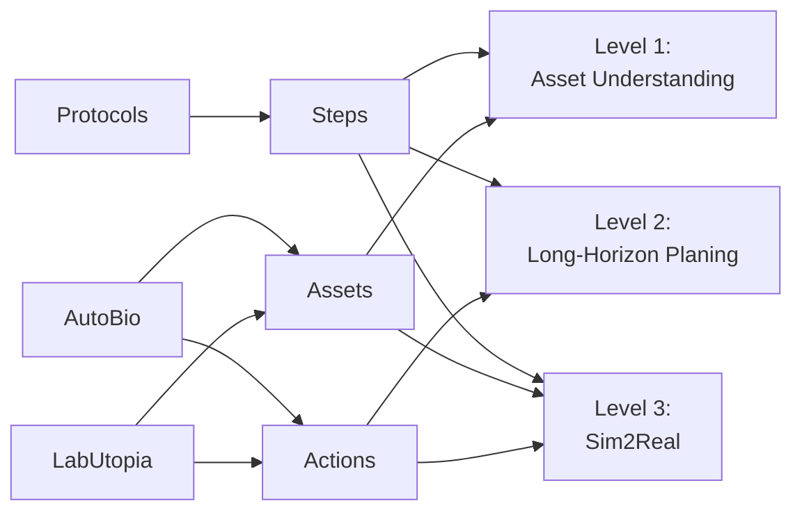

# LabOS

面向实验室智能体的三段式 benchmark。

当前版本直接围绕三个数据源构建：

- `Protocols`：即 `Nature Protocols` 爬取并整理后的 `protocol_v1`
- `AutoBio`
- `LabUtopia`

## 1. 数据构造管线

说明：

- `Protocols` 只提供 `Steps`
- `AutoBio` 和 `LabUtopia` 共同提供 `Assets` 与 `Actions`
- `Level 1` 使用 `Steps + Assets`
- `Level 2` 使用 `Steps + Actions`
- `Level 3` 使用 `Steps + Assets + Actions`

## 2. Level 1: Asset Understanding

Level 1 评测模型是否理解实验仪器的用途、部件、状态和使用方式。这个 level 的目标不是泛化视觉分类，而是面向实验场景的 asset understanding。

### 2.1 输入

- 一张实验仪器图片
- 一道与仪器相关的选择题
- 若干候选项

题目语义主要来自 `Protocols`，仪器对象主要与 `AutoBio`、`LabUtopia` 中实际出现过的 asset family 对齐。

### 2.2 输出

- 正确选项

### 2.3 指标

- `Accuracy`
- 按 `asset family` 分组的准确率
- 按 `question type` 分组的准确率
- 按 `image source` 分组的准确率

## 3. Level 2: Long-Horizon Planing

Level 2 评测模型能否根据实验目标、背景和约束生成长程、结构化、可执行的实验 protocol。这里的核心不是短回答，而是多步骤、长链条、前后依赖清晰的 planning。

### 3.1 输入

- 实验目标或实验描述
- 可选的背景、摘要、试剂、设备和约束条件
- 有限动作空间

其中：

- `Protocols` 提供实验步骤、阶段结构和参数线索
- `AutoBio` 与 `LabUtopia` 提供动作和约束的来源

### 3.2 输出

- 一份长程、结构化的实验 protocol

在正式 benchmark 中，输出会被规范为由有限动作空间组成的结构化动作序列；当前网页展示只用动作名称方块来表达顺序。

### 3.3 指标

- `AST Parse Success`
- `Allowed Call Accuracy`
- `Argument Match`
- `Dependency / Order Accuracy`
- `Program-level Exact Match`
- `Length Adequacy`

## 4. Level 3: Sim2Real

Level 3 评测模型能否把前两个 level 中的 biological steps、assets 和 actions 进一步接到具身执行与 sim2real 场景中。当前仓库中这一部分先保留接口和展示位。

### 4.1 输入

- 与任务相关的 protocol steps
- 可用 assets
- 可用 actions
- 仿真观测、状态或多视角视频

### 4.2 输出

- 面向执行的动作序列、策略或任务结果判断

### 4.3 指标

- `Task Success`
- `Step Success`
- `Sim Success`
- `Real Success`
- `Sim-to-Real Gap`
- `Safety`

## 5. 当前重点

当前工作的重点仍然是前两个 level：

- `Level 1`：先把高频实验资产和题目类型做稳
- `Level 2`：先把长程 planning 的输入输出和评测跑通
- `Level 3`：先保留接口，后续再继续扩展

## 6. 相关链接

- `protocol_v1`：[data/protocol_v1/README.md](data/protocol_v1/README.md)
- `Nature Protocols`：<https://www.nature.com/nprot/>
- `AutoBio`：<https://github.com/autobio-bench/AutoBio>
- `LabUtopia`：<https://github.com/Rui-li023/LabUtopia>
- `SGI-WetExperiment`：<https://huggingface.co/datasets/InternScience/SGI-WetExperiment>
