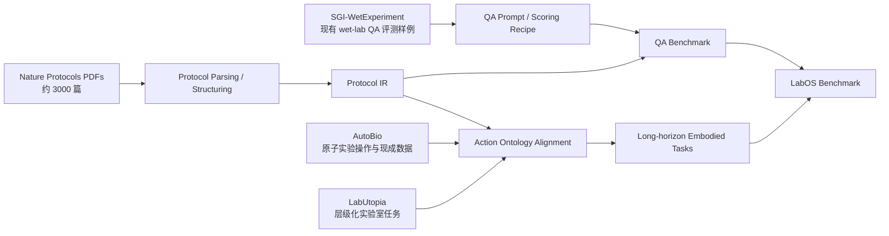
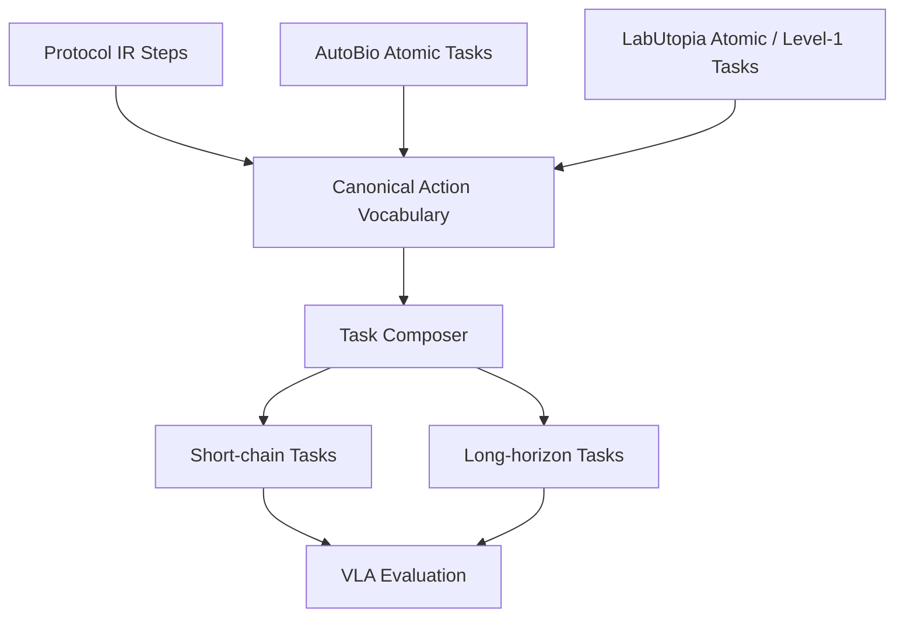

# LabOS

> 面向生物科学实验协议生成与实验室具身智能的双轨 benchmark。
> 本文档基于截至 2026-04-14 的公开资料整理，目标是先把 benchmark 的范围、可复用素材和最快落地路径说明白。

## 项目概述

LabOS 计划包含两个互补部分：

1. **QA Benchmark**
   输入实验背景、研究目标、可用动作/材料/设备等信息，输出**结构化的实验协议（protocol）**。
2. **Embodied Benchmark**
   面向实验室场景中的 VLA / embodied agent，评测模型执行**复杂长链 protocol** 的能力。

核心思路不是把两部分完全分开，而是让它们共享一个统一的 **Protocol IR（中间表示）**：

- QA 侧负责从文本背景生成结构化 protocol；
- 具身侧负责把 protocol 映射成可执行动作链，并在模拟环境中评测；
- 这样同一套 protocol 表达可以同时服务于数据构造、自动评测和 agent 执行。



## 设计目标

- **优先复用已有素材**，减少从零造数据、造环境、造动作空间的成本。
- **优先做可跑通的 MVP**，再追求更大规模和更复杂的任务设计。
- **输出必须结构化**，否则 QA 侧难自动评分，具身侧也难映射成动作链。
- **QA 与具身共享 schema**，避免出现两套数据表达、两套工具链。

## 为什么这个方向成立

### 1. QA 任务天然适合用 Nature Protocols 做高质量来源

`Nature Protocols` 本身就是面向实验流程的高质量 protocol 载体，公开介绍中强调了其文章通常包含试剂/材料、设备、时长、分步骤流程、关键步骤、问题排查等要素。对我们来说，这类文档非常适合被解析成结构化 protocol。

这意味着 QA benchmark 的 gold data 不需要从零标注，可以优先做：

- PDF 抽取；
- 章节解析；
- 步骤归一化；
- 参数抽取（体积、温度、时长、转速、设备、前后依赖）；
- 再补少量人工质检。

### 2. 具身任务可以直接站在现有实验室环境和动作库上

用户希望“越快越好”，那最重要的不是重新搭 simulator，而是复用已有的实验室任务库与训练/评测管线。

- `AutoBio` 已经提供了面向数字生物实验室的原子操作任务、数据格式转换和 policy evaluation 流程。
- `LabUtopia` 已经提供了实验室场景、层级任务、动作控制器、数据采集、训练和推理接口。

对 LabOS 来说，最合理的策略是：

1. 不重新定义底层机器人控制；
2. 不新造 3D 资产；
3. 优先做**动作本体对齐 + protocol 组合**；
4. 把 benchmark 难点放在**长链任务组织与评测**上。

## 统一中间表示：Protocol IR

如果这个 benchmark 想同时服务 QA 和 embodied，两边最好共享一套中间表示。建议最小可行 schema 如下：

```json
{
  "goal": "Isolate PBMCs from whole blood",
  "context": "Human peripheral blood sample preparation",
  "materials": ["whole blood", "PBS", "Ficoll"],
  "equipment": ["centrifuge", "pipette", "15 mL conical tube"],
  "constraints": ["keep sample at room temperature"],
  "steps": [
    {
      "step_id": 1,
      "action": "add_reagent",
      "description": "Dilute whole blood with PBS at a 1:1 ratio.",
      "inputs": ["whole blood", "PBS"],
      "outputs": ["diluted blood"],
      "parameters": {
        "volume_ratio": "1:1"
      },
      "depends_on": [],
      "safety": []
    }
  ]
}
```

建议每个 step 至少保留以下字段：

- `action`：归一化后的动作标签；
- `description`：自然语言步骤；
- `parameters`：时间、温度、体积、速度等；
- `depends_on`：前置依赖；
- `inputs / outputs`：有利于评估 step coverage 与执行一致性；
- `safety`：对 wet lab 很关键，后面可单独评测。

这个 IR 会成为整个项目的主干：

- QA：模型输出 IR；
- QA 评测：对 IR 做结构与语义评分；
- Embodied：把 IR 中的 `action` 映射到环境中的 atomic action；
- 长链任务：由多个 IR step 串联。

## Part I: QA Benchmark

### 任务定义

输入：

- 实验背景 / 研究目标；
- 可选的材料、设备、候选动作池、约束条件；
- 可选的论文摘要、实验对象、期望输出。

输出：

- 一份结构化的实验 protocol；
- 最好直接输出为 JSON / YAML，而不是纯自由文本。

### 现成素材

#### A. Nature Protocols PDF 语料

这是我们计划中的主数据来源，规模约为 **3000 篇 PDF**。它的价值在于：

- 来源质量高；
- 本身就是 step-by-step 实验流程；
- 往往自带 reagent、equipment、timing、critical step 等结构线索；
- 非常适合做“从文档到结构化 protocol”的抽取和重构。

#### B. SGI-WetExperiment

相关链接：<https://huggingface.co/datasets/InternScience/SGI-WetExperiment>

这个数据集很适合作为 **现有 wet-lab QA benchmark 的参考基线**。从公开页面可见：

- 规模较小：**68 条 test 样本**；
- 任务形式是：给定 `question` 与 `action_pool`，生成 `answer`；
- 数据字段包括：`question`、`action_pool`、`answer`、`discipline`、`direction`；
- 它属于 `SGI-Bench` 的 wet experiment 子任务。

对 LabOS 的意义：

- 它提供了一个现成的 wet-lab protocol generation 任务模板；
- 它证明“研究背景 + 动作池 -> 实验流程”这个问题已经可以 benchmark 化；
- 但它规模不够大，不足以覆盖我们想做的 protocol generation 主 benchmark。

因此更合适的定位是：

- 用它做 **baseline 参考**；
- 用它借鉴 prompt 形式和 scoring 思路；
- 不把它当作 LabOS QA 主体数据源。

### QA 建议难度分层

为了避免 benchmark 一上来就只有一种过于开放的生成任务，建议至少拆成三档：

1. **Reconstruction**
   给定较完整的材料/设备/目标信息，要求重建 protocol。
2. **Constrained Synthesis**
   给定背景、目标、可用设备/动作池，要求设计 protocol。
3. **Open Protocol Design**
   只给高层研究目标，要求生成较完整 protocol。

这样有三个好处：

- 便于先做 MVP；
- 便于区分“信息抽取能力”和“实验设计能力”；
- 便于和具身任务的可执行性对齐。

### QA 数据构造建议

建议先走一个“高自动化 + 轻人工校验”的路线：

1. 抓取 Nature Protocols PDF 与元数据。
2. 解析章节：
   - Title / Abstract
   - Materials / Reagents
   - Equipment
   - Procedure / Steps
   - Timing
   - Troubleshooting / Critical steps
3. 把 procedure 段落切成 step。
4. 抽取 step 参数：
   - time
   - temperature
   - volume / concentration
   - device / instrument
   - safety / caution
5. 归一化成 Protocol IR。
6. 对 dev/test 做人工质检，优先保证评测集质量。

### QA 评测建议

不要只做 BLEU / ROUGE。对 protocol 任务，更合适的是多维评分：

- **Schema Validity**：输出是否符合 JSON / YAML schema；
- **Step Coverage**：是否覆盖关键步骤；
- **Parameter Accuracy**：时间、温度、体积、速度等是否正确；
- **Dependency Consistency**：前后顺序和依赖是否合理；
- **Entity / Slot F1**：材料、设备、动作、产物抽取是否对齐；
- **Safety & Feasibility**：是否有明显危险或不可执行步骤；
- **Semantic Match**：与参考 protocol 的语义一致性。

建议采用三层评分：

1. 结构化自动评分；
2. LLM-as-judge 语义评分；
3. 小规模专家抽检。

## Part II: Embodied Benchmark

### 任务定义

具身部分的目标不是只测单步 manipulation，而是测模型是否能把一个实验 protocol 执行成**复杂长链任务**。

换句话说：

- 输入不只是图像；
- 还要有 protocol / subgoal；
- 输出不只是一个动作；
- 而是一串能够完成实验流程的行为。

### 现成素材 1：AutoBio

相关链接：

- GitHub：<https://github.com/autobio-bench/AutoBio>
- 官方 HF 组织：<https://huggingface.co/organizations/autobio-bench/activity/all>

根据公开 README 和 HF 页面，AutoBio 可以直接复用的部分包括：

- 面向数字生物实验室的原子任务；
- 已有数据与渲染结果；
- `LeRobot v2.0` 格式支持；
- `openpi` / `RoboticsDiffusionTransformer` 的训练与远程评测流程。

公开资料中可见的代表性任务包括：

- open / close thermal cycler lid
- pick up tube
- unscrew cap
- pipette liquid
- insert tube into centrifuge
- transport tube
- screw cap
- thermal mixer operation

从 HF 组织页面还能看到，它已经公开了多组任务数据，覆盖 **MuJoCo / Blender** 两种渲染版本。这对于快速搭建 VLA 训练与评测基线非常有价值。

对 LabOS 的价值：

- 提供了实验室原子动作与现成 episode 数据；
- 提供了训练/评测脚手架；
- 很适合作为“动作词表”和“短链任务库”的起点。

### 现成素材 2：LabUtopia

相关链接：

- GitHub：<https://github.com/Rui-li023/LabUtopia>
- 项目页：<https://rui-li023.github.io/labutopia-site/>

LabUtopia 的核心价值在于它不是单一任务，而是一个**高保真实验室模拟与层级化 benchmark 套件**。官方项目页描述它包含：

- `LabSim`：高保真实验室模拟；
- `LabScene`：可扩展场景生成；
- `LabBench`：从 atomic action 到 long-horizon mobile manipulation 的层级 benchmark。

公开 README 中已经能直接看到多层任务配置：

- **Level 1 基础任务**：
  `pick`、`place`、`open/close door`、`open/close drawer`、`pour`、`press`、`shake`、`stir`
- **Level 2 组合任务**：
  `ShakeBeaker`、`StirGlassrod`、`PourLiquid`、`TransportBeaker`、`Heat_Liquid`、`openclose`
- **Level 3 泛化任务**：
  更复杂的 `pour / heat / transport / open / pick / press`
- **Level 4 长链任务**：
  `CleanBeaker`、`DeviceOperation`

此外，README 还明确给出了：

- `controllers/atomic_actions/`；
- 数据采集流程；
- 训练流程；
- 推理接口；
- `OpenPI` WebSocket 客户端与动作返回格式。

对 LabOS 的价值：

- 它天然适合做“从原子动作到长链实验流程”的分层 benchmark；
- 已经有层级任务模板，不必从零定义任务难度；
- 适合承载需要环境交互、状态跟踪和步骤恢复能力的评测。

> 注：官方项目页写的是 five-level hierarchy，而公开 README 当前直接展示到 level 4 配置。实现时建议以仓库中的实际任务配置与 release 内容为准。

### 具身 benchmark 的建议层级

结合 AutoBio 与 LabUtopia，LabOS 可以采用下面的层级设计：

1. **E1: Atomic Actions**
   直接复用 AutoBio / LabUtopia 的原子任务。
2. **E2: Short Chains**
   2 到 4 步的短链流程，例如 `pick -> unscrew -> pipette -> screw`。
3. **E3: Instrument-centered Protocols**
   围绕单个设备或单类实验对象组织 5 到 10 步任务。
4. **E4: Long-horizon Protocols**
   跨容器、跨设备、跨状态变化的完整实验链。
5. **E5: Recovery / Generalization**
   在中间状态扰动、视角变化、容器变化、布局变化下测试恢复能力。

### 动作池整合策略

最关键的工程工作不是重新写 controller，而是做 **action ontology alignment**。

建议把 AutoBio 和 LabUtopia 的动作先映射到统一动作集合，例如：

- `pick`
- `place`
- `open`
- `close`
- `unscrew`
- `screw`
- `aspirate`
- `dispense`
- `pour`
- `press`
- `shake`
- `stir`
- `heat`
- `transport`
- `insert`

然后再做两层映射：

1. **文本 protocol step -> canonical action**
2. **canonical action -> environment-specific controller**



### 具身评测建议

建议至少包含下面这些指标：

- **Episode Success Rate**：整条 protocol 是否完成；
- **Step Success Rate**：每一步是否成功；
- **First Failure Depth**：第一次失败发生在第几步；
- **Recovery Success**：中途出错后能否回到正确轨道；
- **Action Efficiency**：完成任务用了多少动作 / 时间；
- **Constraint Satisfaction**：是否满足 protocol 中的关键条件；
- **Cross-environment Transfer**：同一 protocol 在不同环境中的迁移能力。

## 为什么这条路线最快

如果目标是尽快做出一个有说服力的 benchmark，最快路径不是“全栈重做”，而是：

1. **QA 侧**
   直接用 Nature Protocols 做主语料，用 SGI-WetExperiment 做参考基线与评分模板。
2. **具身侧**
   直接复用 AutoBio 和 LabUtopia 的任务、动作、数据、评测接口。
3. **中间层**
   优先定义统一 Protocol IR 与 canonical action vocabulary。

这样能把主要工作集中在三件真正关键的事上：

- 把高质量 protocol 变成结构化 benchmark；
- 把文本 step 映射成可执行动作链；
- 把 benchmark 难点放在长链规划与执行，而不是底层环境重复建设。

## 建议的 MVP 路线

### Phase 0: 统一接口

- 定 Protocol IR；
- 定 canonical action vocabulary；
- 定 QA 输出格式与 embodied 输入格式；
- 先做一套最小评测 harness。

### Phase 1: QA MVP

- 从 Nature Protocols 中抽取一小批高质量样本；
- 做 100 到 300 条高质量 dev/test；
- 引入 SGI-WetExperiment 作为外部对照；
- 跑通结构化协议生成与自动评分。

### Phase 2: Embodied MVP

- 从 AutoBio 抽原子任务；
- 从 LabUtopia 抽 level 1 / level 2 / long-sequence 模板；
- 先合成 10 到 20 个长链 protocol；
- 跑现有 VLA 基线模型。

### Phase 3: 正式版

- 扩大 QA 数据规模；
- 扩大具身 protocol 组合规模；
- 加入扰动、恢复、泛化评测；
- 建立统一 leaderboard。

## 需要尽早确认的问题

- **Nature Protocols 原始 PDF 的版权与再分发边界**
  建议公开 benchmark 时优先发布：
  - 元数据；
  - 解析脚本；
  - 结构化标注；
  - 样本索引与 DOI；
  而不是直接重新分发全文 PDF。

- **AutoBio / 相关数据的许可证边界**
  在正式打包发布前，建议再次核对代码、数据和渲染结果的复用许可。

- **LabUtopia 的环境成本**
  其公开 README 依赖 Ubuntu 24.04、Python 3.11、Isaac Sim 5.1 与 RTX GPU，环境比纯文本 benchmark 重很多，最好尽早决定是否把它作为主评测环境还是作为扩展赛道。

## 相关资料

- Nature Protocols: <https://www.nature.com/nprot/>
- SGI-WetExperiment: <https://huggingface.co/datasets/InternScience/SGI-WetExperiment>
- SGI-Bench: <https://github.com/InternScience/SGI-Bench>
- AutoBio: <https://github.com/autobio-bench/AutoBio>
- AutoBio HF organization: <https://huggingface.co/organizations/autobio-bench/activity/all>
- LabUtopia: <https://github.com/Rui-li023/LabUtopia>
- LabUtopia project page: <https://rui-li023.github.io/labutopia-site/>

## 当前判断

如果目标是“尽快做出一个有研究价值、又不至于全靠人工从零构造的数据集”，那么 LabOS 最合适的路线是：

- **QA 主体靠 Nature Protocols 做规模与质量；**
- **QA baseline 参考 SGI-WetExperiment；**
- **具身任务主体靠 AutoBio + LabUtopia 做动作与环境复用；**
- **整个项目用统一的 Protocol IR 串起来。**

这条路线的优点是：

- 可以很快拿到第一版 benchmark；
- 现有素材足够多；
- QA 与 embodied 两部分之间有天然桥梁；
- 后续可以继续扩到更强的 scientist agent 评测，而不需要推倒重来。
