# Merged Benchmark Asset Catalog

| Preview | Asset Name | Match Group | Entry Type | Source Project | Local Relative Path | Render Status | Original URL |
|---|---|---|---|---|---|---|---|
| 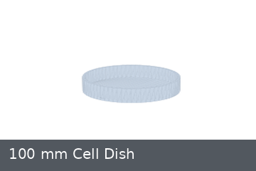 | 100 mm Cell Dish | cell_dish | asset (standalone_mesh_root) | autobio | `data/benchmark_assets/files/autobio/autobio/assets/container/cell_dish_100_vis.obj` | ready_obj | [link](https://raw.githubusercontent.com/autobio-bench/AutoBio/main/autobio/assets/container/cell_dish_100_vis.obj) |
|  | 1.5 mL Screw-Cap Microcentrifuge Tube | microcentrifuge_tube_1_5ml | asset (standalone_mesh_root) | autobio | `data/benchmark_assets/files/autobio/autobio/assets/container/centrifuge_1-5ml_screw_vis.obj` | ready_obj | [link](https://raw.githubusercontent.com/autobio-bench/AutoBio/main/autobio/assets/container/centrifuge_1-5ml_screw_vis.obj) |
|  | 10 mL Centrifuge Tube | centrifuge_tube_10ml | asset (standalone_mesh_root) | autobio | `data/benchmark_assets/files/autobio/autobio/assets/container/centrifuge_10ml_vis.obj` | ready_obj | [link](https://raw.githubusercontent.com/autobio-bench/AutoBio/main/autobio/assets/container/centrifuge_10ml_vis.obj) |
|  | 1.5 mL Open Microcentrifuge Tube | microcentrifuge_tube_1_5ml | asset (standalone_mesh_root) | autobio | `data/benchmark_assets/files/autobio/autobio/assets/container/centrifuge_1500ul_no_lid_vis.obj` | ready_obj | [link](https://raw.githubusercontent.com/autobio-bench/AutoBio/main/autobio/assets/container/centrifuge_1500ul_no_lid_vis.obj) |
|  | 15 mL Screw-Cap Centrifuge Tube | centrifuge_tube_15ml | asset (standalone_mesh_root) | autobio | `data/benchmark_assets/files/autobio/autobio/assets/container/centrifuge_15ml_screw_vis.obj` | ready_obj | [link](https://raw.githubusercontent.com/autobio-bench/AutoBio/main/autobio/assets/container/centrifuge_15ml_screw_vis.obj) |
| 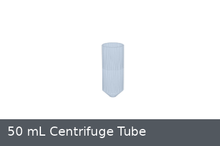 | 50 mL Centrifuge Tube | centrifuge_tube_50ml | asset (standalone_mesh_root) | autobio | `data/benchmark_assets/files/autobio/autobio/assets/container/centrifuge_50ml_vis.obj` | ready_obj | [link](https://raw.githubusercontent.com/autobio-bench/AutoBio/main/autobio/assets/container/centrifuge_50ml_vis.obj) |
|  | 50 mL Screw-Cap Centrifuge Tube | centrifuge_tube_50ml | asset (standalone_mesh_root) | autobio | `data/benchmark_assets/files/autobio/autobio/assets/container/centrifuge_50ml_screw_vis.obj` | ready_obj | [link](https://raw.githubusercontent.com/autobio-bench/AutoBio/main/autobio/assets/container/centrifuge_50ml_screw_vis.obj) |
| 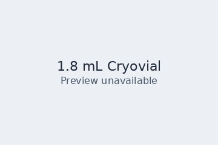 | 1.8 mL Cryovial | cryovial | asset (standalone_mesh_root) | autobio | `data/benchmark_assets/files/autobio/autobio/assets/container/cryovial_1-8ml_vis.obj` | ready_obj | [link](https://raw.githubusercontent.com/autobio-bench/AutoBio/main/autobio/assets/container/cryovial_1-8ml_vis.obj) |
| 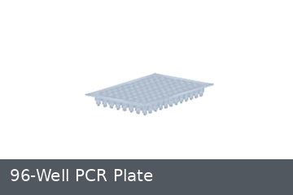 | 96-Well PCR Plate | pcr_plate | asset (standalone_mesh_root) | autobio | `data/benchmark_assets/files/autobio/autobio/assets/container/pcr_plate_96well_vis.obj` | ready_obj | [link](https://raw.githubusercontent.com/autobio-bench/AutoBio/main/autobio/assets/container/pcr_plate_96well_vis.obj) |
|  | 200 uL Pipette Tip | pipette_tip | asset (standalone_mesh_root) | autobio | `data/benchmark_assets/files/autobio/autobio/assets/container/tip_200ul_vis/visual.obj` | ready_obj | [link](https://github.com/autobio-bench/AutoBio/tree/main/autobio/assets/container/tip_200ul_vis) |
| 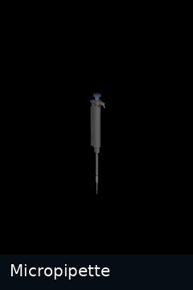 | Micropipette | pipette | composite asset (package_entrypoint) | autobio | `data/benchmark_assets/files/autobio/autobio/model/object/pipette.gen.xml` | ready_mjcf_package | [link](https://raw.githubusercontent.com/autobio-bench/AutoBio/main/autobio/model/object/pipette.gen.xml) |
|  | 24-Slot Tip Box | tip_box | asset (standalone_mesh_root) | autobio | `data/benchmark_assets/files/autobio/autobio/assets/rack/tip_box_24slot_vis.obj` | ready_obj | [link](https://raw.githubusercontent.com/autobio-bench/AutoBio/main/autobio/assets/rack/tip_box_24slot_vis.obj) |
| 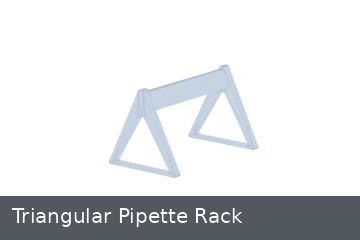 | Triangular Pipette Rack | pipette_rack | asset (standalone_mesh_root) | autobio | `data/benchmark_assets/files/autobio/autobio/assets/rack/pipette_rack_tri_vis.obj` | ready_obj | [link](https://raw.githubusercontent.com/autobio-bench/AutoBio/main/autobio/assets/rack/pipette_rack_tri_vis.obj) |
| 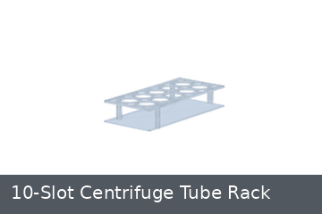 | 10-Slot Centrifuge Tube Rack | tube_rack | asset (standalone_mesh_root) | autobio | `data/benchmark_assets/files/autobio/autobio/assets/rack/centrifuge_10slot_vis.obj` | ready_obj | [link](https://raw.githubusercontent.com/autobio-bench/AutoBio/main/autobio/assets/rack/centrifuge_10slot_vis.obj) |
| 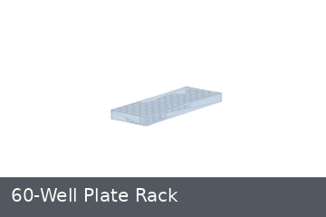 | 60-Well Plate Rack | tube_rack | asset (standalone_mesh_root) | autobio | `data/benchmark_assets/files/autobio/autobio/assets/rack/centrifuge_plate_60well_vis.obj` | ready_obj | [link](https://raw.githubusercontent.com/autobio-bench/AutoBio/main/autobio/assets/rack/centrifuge_plate_60well_vis.obj) |
| 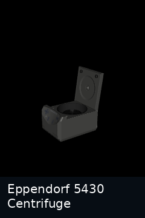 | Eppendorf 5430 Centrifuge | centrifuge | composite asset (package_entrypoint) | autobio | `data/benchmark_assets/files/autobio/autobio/model/instrument/centrifuge_eppendorf_5430.xml` | ready_mjcf_package | [link](https://raw.githubusercontent.com/autobio-bench/AutoBio/main/autobio/model/instrument/centrifuge_eppendorf_5430.xml) |
| 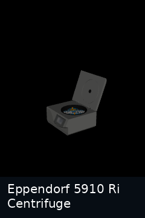 | Eppendorf 5910 Ri Centrifuge | centrifuge | composite asset (package_entrypoint) | autobio | `data/benchmark_assets/files/autobio/autobio/model/instrument/centrifuge_eppendorf_5910_ri.xml` | ready_mjcf_package | [link](https://raw.githubusercontent.com/autobio-bench/AutoBio/main/autobio/model/instrument/centrifuge_eppendorf_5910_ri.xml) |
| 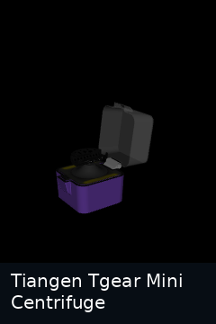 | Tiangen Tgear Mini Centrifuge | centrifuge | composite asset (package_entrypoint) | autobio | `data/benchmark_assets/files/autobio/autobio/model/instrument/centrifuge_tiangen_tgear_mini.xml` | ready_mjcf_package | [link](https://raw.githubusercontent.com/autobio-bench/AutoBio/main/autobio/model/instrument/centrifuge_tiangen_tgear_mini.xml) |
| 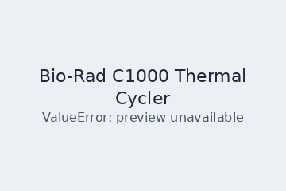 | Bio-Rad C1000 Thermal Cycler | thermal_cycler | composite asset (package_entrypoint) | autobio | `data/benchmark_assets/files/autobio/autobio/model/instrument/thermal_cycler_biorad_c1000.xml` | ready_mjcf_package | [link](https://raw.githubusercontent.com/autobio-bench/AutoBio/main/autobio/model/instrument/thermal_cycler_biorad_c1000.xml) |
|  | Eppendorf C Thermal Mixer | thermal_mixer | composite asset (package_entrypoint) | autobio | `data/benchmark_assets/files/autobio/autobio/model/instrument/thermal_mixer_eppendorf_c.xml` | ready_mjcf_package | [link](https://raw.githubusercontent.com/autobio-bench/AutoBio/main/autobio/model/instrument/thermal_mixer_eppendorf_c.xml) |
|  | Genie 2 Vortex Mixer | vortex_mixer | composite asset (package_entrypoint) | autobio | `data/benchmark_assets/files/autobio/autobio/model/instrument/vortex_mixer_genie_2.xml` | ready_mjcf_package | [link](https://raw.githubusercontent.com/autobio-bench/AutoBio/main/autobio/model/instrument/vortex_mixer_genie_2.xml) |
|  | Beaker Family | beaker | scene object reference (scene_prim_reference) | labutopia | `data/benchmark_assets/files/labutopia/assets/chemistry_lab/lab_001/lab_001.usd#/World/beaker` | downloaded_usd_requires_conversion | [link](https://media.githubusercontent.com/media/Rui-li023/LabUtopia/main/assets/chemistry_lab/lab_001/lab_001.usd) |
| 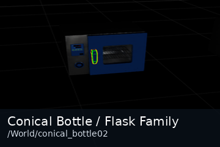 | Conical Bottle / Flask Family | conical_bottle | scene object reference (scene_prim_reference) | labutopia | `data/benchmark_assets/files/labutopia/assets/chemistry_lab/lab_001/lab_001.usd#/World/conical_bottle02` | downloaded_usd_requires_conversion | [link](https://media.githubusercontent.com/media/Rui-li023/LabUtopia/main/assets/chemistry_lab/lab_001/lab_001.usd) |
| 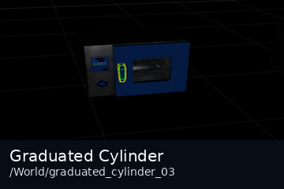 | Graduated Cylinder | graduated_cylinder | scene object reference (scene_prim_reference) | labutopia | `data/benchmark_assets/files/labutopia/assets/chemistry_lab/lab_001/lab_001.usd#/World/graduated_cylinder_03` | downloaded_usd_requires_conversion | [link](https://media.githubusercontent.com/media/Rui-li023/LabUtopia/main/assets/chemistry_lab/lab_001/lab_001.usd) |
| 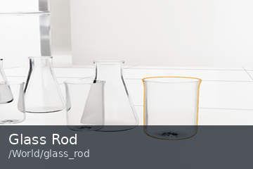 | Glass Rod | glass_rod | scene object reference (scene_prim_reference) | labutopia | `data/benchmark_assets/files/labutopia/assets/chemistry_lab/lab_003/lab_003.usd#/World/glass_rod` | downloaded_usd_requires_conversion | [link](https://media.githubusercontent.com/media/Rui-li023/LabUtopia/main/assets/chemistry_lab/lab_003/lab_003.usd) |
|  | Test Tube Rack | tube_rack | scene object reference (scene_prim_reference) | labutopia | `data/benchmark_assets/files/labutopia/assets/chemistry_lab/lab_001/lab_001.usd#/World/test_tube_rack` | downloaded_usd_requires_conversion | [link](https://media.githubusercontent.com/media/Rui-li023/LabUtopia/main/assets/chemistry_lab/lab_001/lab_001.usd) |
|  | Drying Box Family | drying_box | scene object reference (scene_prim_reference) | labutopia | `data/benchmark_assets/files/labutopia/assets/chemistry_lab/lab_001/lab_001.usd#/World/DryingBox_01` | downloaded_usd_requires_conversion | [link](https://media.githubusercontent.com/media/Rui-li023/LabUtopia/main/assets/chemistry_lab/lab_001/lab_001.usd) |
| 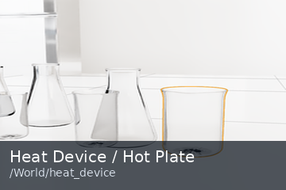 | Heat Device / Hot Plate | heating_device | scene object reference (scene_prim_reference) | labutopia | `data/benchmark_assets/files/labutopia/assets/chemistry_lab/lab_003/lab_003.usd#/World/heat_device` | downloaded_usd_requires_conversion | [link](https://media.githubusercontent.com/media/Rui-li023/LabUtopia/main/assets/chemistry_lab/lab_003/lab_003.usd) |
| 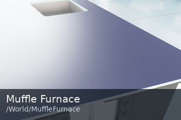 | Muffle Furnace | muffle_furnace | scene object reference (scene_prim_reference) | labutopia | `data/benchmark_assets/files/labutopia/assets/chemistry_lab/hard_task/Scene1_hard.usd#/World/MuffleFurnace` | downloaded_usd_requires_conversion | [link](https://media.githubusercontent.com/media/Rui-li023/LabUtopia/main/assets/chemistry_lab/hard_task/Scene1_hard.usd) |
