# AutoBio / LabUtopia 上游结构清单

这份文档只做两件事：

1. 把 `AutoBio` 和 `LabUtopia` 里的 `scene / asset / composite asset / scene object reference` 分清楚
2. 给出每一类的实际路径和预览图

## 1. 先记住四个概念

| 术语 | 中文解释 | 典型例子 |
|---|---|---|
| `scene` | 整个实验环境入口，打开后看到的是整张实验台或整个实验室 | `autobio/model/scene/lab.xml`、`assets/chemistry_lab/lab_001/lab_001.usd` |
| `asset (standalone_mesh_root)` | 单个对象的独立 mesh 根入口 | `autobio/assets/container/pcr_plate_96well_vis.obj` |
| `composite asset (package_entrypoint)` | 单个对象的装配入口文件，会继续引用多个 mesh / 部件 | `autobio/model/instrument/centrifuge_eppendorf_5430.xml` |
| `scene object reference (scene_prim_reference)` | scene 里的某个对象路径，本身不是独立文件 | `assets/chemistry_lab/lab_001/lab_001.usd#/World/conical_bottle02` |

一眼判断规则：

1. 加载后如果出来的是完整环境，就是 `scene`
2. 如果长得像 `xxx.usd#/World/...`，就是 `scene object reference`
3. 如果它是单对象 mesh 根文件，就是 `asset`
4. 如果它是单对象入口文件，但会继续引用很多部件，就是 `composite asset`

## 2. AutoBio

- 组织方式：`asset-first + scene xml`
- `scene` 主入口：`autobio/model/scene/`
- `composite asset` 主入口：`autobio/model/object/`、`autobio/model/instrument/`、`autobio/model/robot/`、`autobio/model/hand/`
- `asset` / raw mesh 主入口：`autobio/assets/container/`、`autobio/assets/rack/`、`autobio/assets/tool/`、`autobio/assets/instrument/`、`autobio/assets/robot/`

### 2.1 AutoBio scenes

| Preview | Scene | Path |
| --- | --- | --- |
|  | bottlecap | `autobio/model/scene/bottlecap.xml` |
|  | gallery | `autobio/model/scene/gallery.xml` |
|  | gallery2 | `autobio/model/scene/gallery2.xml` |
|  | insert | `autobio/model/scene/insert.xml` |
| 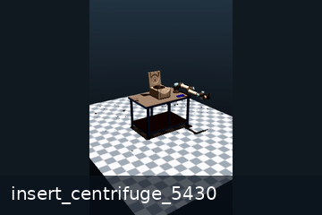 | insert_centrifuge_5430 | `autobio/model/scene/insert_centrifuge_5430.xml` |
| 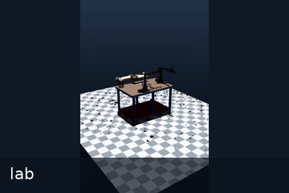 | lab | `autobio/model/scene/lab.xml` |
| 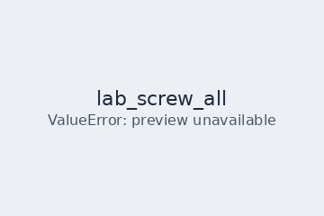 | lab_screw_all | `autobio/model/scene/lab_screw_all.xml` |
| 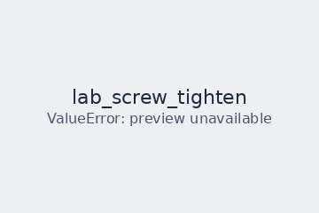 | lab_screw_tighten | `autobio/model/scene/lab_screw_tighten.xml` |
| 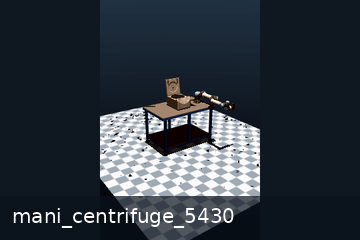 | mani_centrifuge_5430 | `autobio/model/scene/mani_centrifuge_5430.xml` |
| 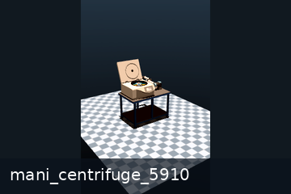 | mani_centrifuge_5910 | `autobio/model/scene/mani_centrifuge_5910.xml` |
| 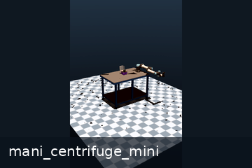 | mani_centrifuge_mini | `autobio/model/scene/mani_centrifuge_mini.xml` |
|  | mani_pipette | `autobio/model/scene/mani_pipette.xml` |
|  | mani_thermal_cycler | `autobio/model/scene/mani_thermal_cycler.xml` |
|  | mani_thermal_mixer | `autobio/model/scene/mani_thermal_mixer.xml` |
|  | pickup | `autobio/model/scene/pickup.xml` |
| 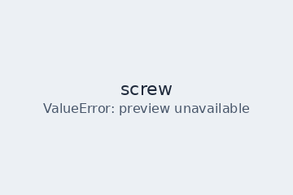 | screw | `autobio/model/scene/screw.xml` |
| 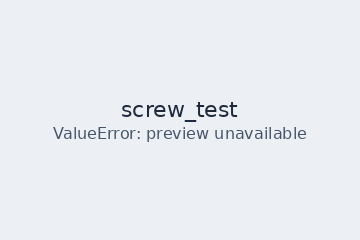 | screw_test | `autobio/model/scene/screw_test.xml` |
| 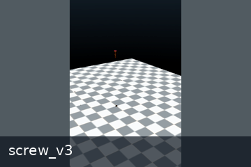 | screw_v3 | `autobio/model/scene/screw_v3.xml` |
|  | vortex_mixer | `autobio/model/scene/vortex_mixer.xml` |

### 2.2 AutoBio composite assets

说明：`object/` 目录里若同时存在 `.xml` 与 `.gen.xml`，这里按同一资产 family 合并展示。

| Preview | Category | Name | Path |
| --- | --- | --- | --- |
| 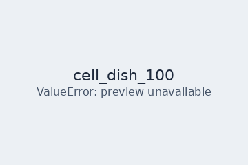 | object | cell_dish_100 | `autobio/model/object/cell_dish_100.xml` `autobio/model/object/cell_dish_100.gen.xml` |
|  | object | centrifuge_1-5ml | `autobio/model/object/centrifuge_1-5ml.xml` |
| 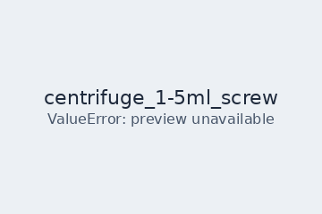 | object | centrifuge_1-5ml_screw | `autobio/model/object/centrifuge_1-5ml_screw.xml` |
| 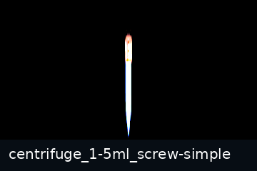 | object | centrifuge_1-5ml_screw-simple | `autobio/model/object/centrifuge_1-5ml_screw-simple.xml` |
|  | object | centrifuge_10ml | `autobio/model/object/centrifuge_10ml.xml` `autobio/model/object/centrifuge_10ml.gen.xml` |
| 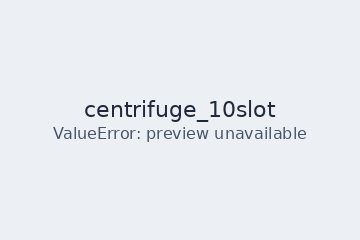 | object | centrifuge_10slot | `autobio/model/object/centrifuge_10slot.xml` `autobio/model/object/centrifuge_10slot.gen.xml` |
| 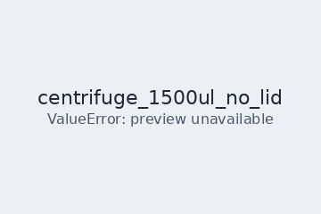 | object | centrifuge_1500ul_no_lid | `autobio/model/object/centrifuge_1500ul_no_lid.xml` `autobio/model/object/centrifuge_1500ul_no_lid.gen.xml` |
|  | object | centrifuge_15ml | `autobio/model/object/centrifuge_15ml.xml` |
|  | object | centrifuge_15ml_screw | `autobio/model/object/centrifuge_15ml_screw.xml` |
|  | object | centrifuge_50ml | `autobio/model/object/centrifuge_50ml.xml` `autobio/model/object/centrifuge_50ml.gen.xml` |
| 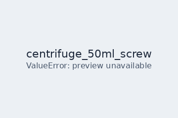 | object | centrifuge_50ml_screw | `autobio/model/object/centrifuge_50ml_screw.xml` |
|  | object | centrifuge_plate_60well | `autobio/model/object/centrifuge_plate_60well.xml` `autobio/model/object/centrifuge_plate_60well.gen.xml` |
| 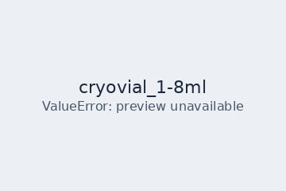 | object | cryovial_1-8ml | `autobio/model/object/cryovial_1-8ml.xml` |
| 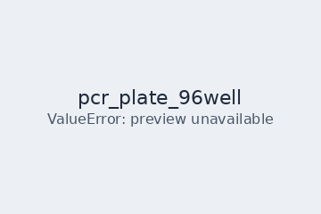 | object | pcr_plate_96well | `autobio/model/object/pcr_plate_96well.xml` `autobio/model/object/pcr_plate_96well.gen.xml` |
| 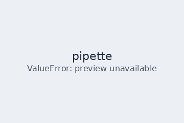 | object | pipette | `autobio/model/object/pipette.xml` `autobio/model/object/pipette.gen.xml` |
| 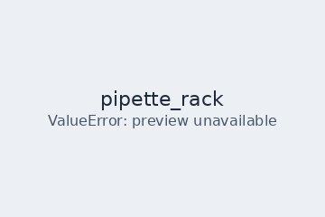 | object | pipette_rack | `autobio/model/object/pipette_rack.xml` `autobio/model/object/pipette_rack.gen.xml` |
|  | object | pipette_tip | `autobio/model/object/pipette_tip.xml` `autobio/model/object/pipette_tip.gen.xml` |
|  | object | tip_box | `autobio/model/object/tip_box.xml` `autobio/model/object/tip_box.gen.xml` |
| 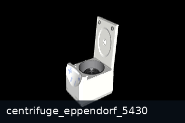 | instrument | centrifuge_eppendorf_5430 | `autobio/model/instrument/centrifuge_eppendorf_5430.xml` |
|  | instrument | centrifuge_eppendorf_5910_ri | `autobio/model/instrument/centrifuge_eppendorf_5910_ri.xml` |
| 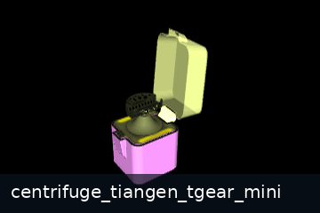 | instrument | centrifuge_tiangen_tgear_mini | `autobio/model/instrument/centrifuge_tiangen_tgear_mini.xml` |
| 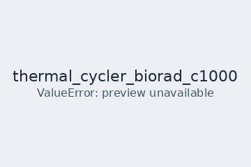 | instrument | thermal_cycler_biorad_c1000 | `autobio/model/instrument/thermal_cycler_biorad_c1000.xml` |
| 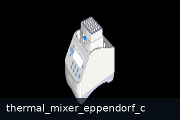 | instrument | thermal_mixer_eppendorf_c | `autobio/model/instrument/thermal_mixer_eppendorf_c.xml` |
|  | instrument | vortex_mixer_genie_2 | `autobio/model/instrument/vortex_mixer_genie_2.xml` |
| 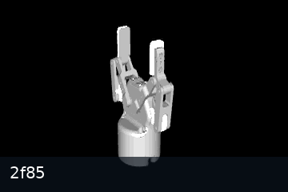 | robot | 2f85 | `autobio/model/robot/2f85.xml` |
| 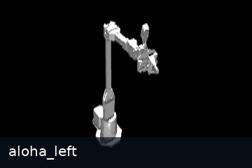 | robot | aloha_left | `autobio/model/robot/aloha_left.xml` |
| 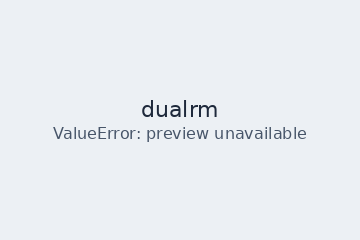 | robot | dualrm | `autobio/model/robot/dualrm.xml` |
| 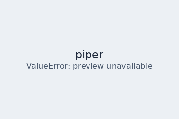 | robot | piper | `autobio/model/robot/piper.xml` |
| 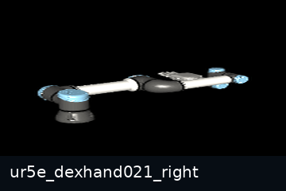 | robot | ur5e_dexhand021_right | `autobio/model/robot/ur5e_dexhand021_right.xml` |
| 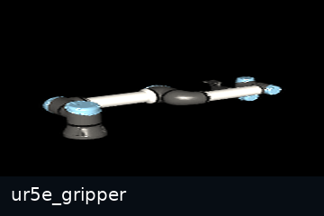 | robot | ur5e_gripper | `autobio/model/robot/ur5e_gripper.xml` |
|  | hand | dexhand021_right | `autobio/model/hand/dexhand021_right.xml` |
|  | hand | shadowhand_left | `autobio/model/hand/shadowhand_left.xml` |
|  | hand | shadowhand_right | `autobio/model/hand/shadowhand_right.xml` |
|  | hand | shadowhand_right_mjx | `autobio/model/hand/shadowhand_right_mjx.xml` |

### 2.3 AutoBio standalone assets / raw mesh roots

| Preview | Name | Path |
| --- | --- | --- |
| 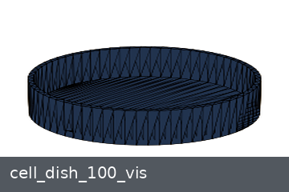 | cell_dish_100_vis | `autobio/assets/container/cell_dish_100_vis.obj` |
| 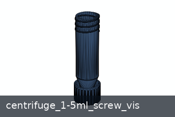 | centrifuge_1-5ml_screw_vis | `autobio/assets/container/centrifuge_1-5ml_screw_vis` |
| 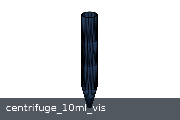 | centrifuge_10ml_vis | `autobio/assets/container/centrifuge_10ml_vis.obj` |
| 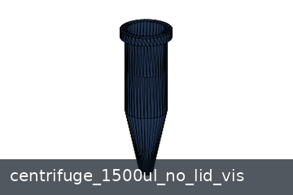 | centrifuge_1500ul_no_lid_vis | `autobio/assets/container/centrifuge_1500ul_no_lid_vis.obj` |
| 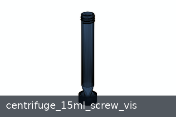 | centrifuge_15ml_screw_vis | `autobio/assets/container/centrifuge_15ml_screw_vis` |
| 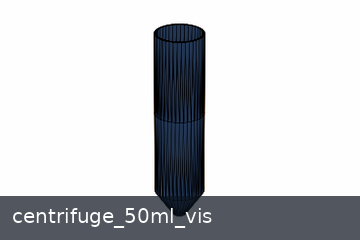 | centrifuge_50ml_vis | `autobio/assets/container/centrifuge_50ml_vis.obj` |
| 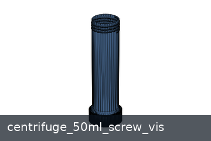 | centrifuge_50ml_screw_vis | `autobio/assets/container/centrifuge_50ml_screw_vis` |
| 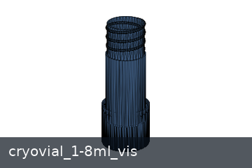 | cryovial_1-8ml_vis | `autobio/assets/container/cryovial_1-8ml_vis` |
|  | pcr_plate_96well_vis | `autobio/assets/container/pcr_plate_96well_vis.obj` |
| 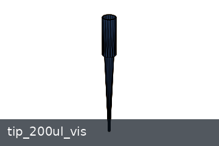 | tip_200ul_vis | `autobio/assets/container/tip_200ul_vis` |
| 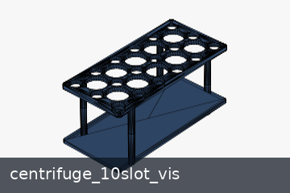 | centrifuge_10slot_vis | `autobio/assets/rack/centrifuge_10slot_vis.obj` |
| 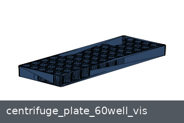 | centrifuge_plate_60well_vis | `autobio/assets/rack/centrifuge_plate_60well_vis.obj` |
| 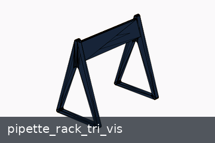 | pipette_rack_tri_vis | `autobio/assets/rack/pipette_rack_tri_vis.obj` |
| 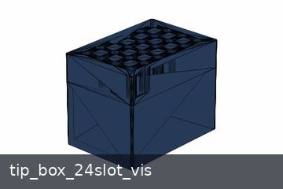 | tip_box_24slot_vis | `autobio/assets/rack/tip_box_24slot_vis.obj` |
| 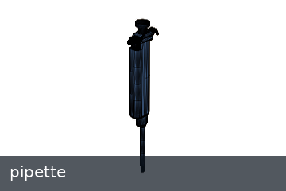 | pipette | `autobio/assets/tool/pipette` |
| 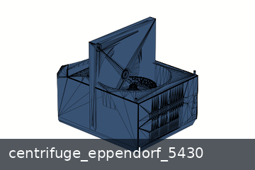 | centrifuge_eppendorf_5430 | `autobio/assets/instrument/centrifuge_eppendorf_5430` |
| 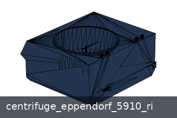 | centrifuge_eppendorf_5910_ri | `autobio/assets/instrument/centrifuge_eppendorf_5910_ri` |
| 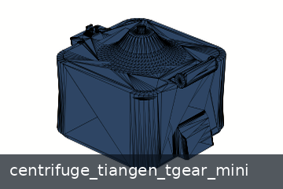 | centrifuge_tiangen_tgear_mini | `autobio/assets/instrument/centrifuge_tiangen_tgear_mini` |
| 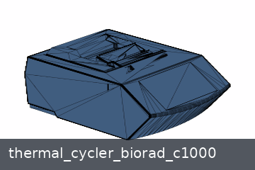 | thermal_cycler_biorad_c1000 | `autobio/assets/instrument/thermal_cycler_biorad_c1000` |
| 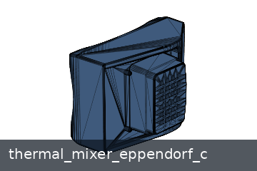 | thermal_mixer_eppendorf_c | `autobio/assets/instrument/thermal_mixer_eppendorf_c` |
| 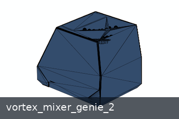 | vortex_mixer_genie_2 | `autobio/assets/instrument/vortex_mixer_genie_2` |
|  | aloha2 | `autobio/assets/robot/aloha2` |
|  | dexhand021 | `autobio/assets/robot/dexhand021` |
|  | robotiq | `autobio/assets/robot/robotiq` |
|  | ur5e | `autobio/assets/robot/ur5e` |

## 3. LabUtopia

- 组织方式：`scene-first USD`
- 主入口是 `scene`，不是对象级独立 mesh
- 当前 benchmark 里使用的主要是 `scene object reference`
- 下面的对象预览图目前使用的是“scene 缩略图 + 对象标签”，因为当前还没有把这些对象从 USD scene 里独立抽取出来

### 3.1 LabUtopia scenes

| Preview | Type | Scene | Path |
| --- | --- | --- | --- |
|  | chemistry main scene | lab_001 | `assets/chemistry_lab/lab_001/lab_001.usd` |
|  | chemistry main scene | lab_003 | `assets/chemistry_lab/lab_003/lab_003.usd` |
|  | chemistry main scene | Scene1_hard | `assets/chemistry_lab/hard_task/Scene1_hard.usd` |
|  | chemistry special scene | clock | `assets/chemistry_lab/lab_003/clock.usd` |
|  | navigation scene | navigation_lab_01 | `assets/navigation_lab/navigation_lab_01/lab.usd` |

### 3.2 Chemistry USD files visible in the repo

| Preview | Classification | Path |
| --- | --- | --- |
|  | main scene | `assets/chemistry_lab/lab_001/lab_001.usd` |
|  | main scene | `assets/chemistry_lab/lab_003/lab_003.usd` |
|  | main scene | `assets/chemistry_lab/hard_task/Scene1_hard.usd` |
|  | special scene | `assets/chemistry_lab/lab_003/clock.usd` |
|  | auxiliary USD | `assets/chemistry_lab/hard_task/lab_004.usd` |
|  | SubUSD | `assets/chemistry_lab/hard_task/SubUSDs/lab_015.usd` |
|  | SubUSD | `assets/chemistry_lab/lab_003/SubUSDs/lab_015.usd` |

### 3.3 LabUtopia scene object families

| Representative Preview | Family | Scene Object Paths |
| --- | --- | --- |
|  | cabinet | `/World/Cabinet_01` `/World/Cabinet_02` |
|  | drying box | `/World/DryingBox_01` `/World/DryingBox_02` `/World/DryingBox_03` |
|  | button | `/World/DryingBox_01/button` `/World/heat_device/button` |
|  | beaker | `/World/beaker1` `/World/beaker2` `/World/beaker3` `/World/beaker_2` `/World/target_beaker` |
|  | conical bottle | `/World/conical_bottle02` `/World/conical_bottle03` `/World/conical_bottle04` |
|  | glass rod | `/World/glass_rod` |
|  | graduated cylinder | `/World/graduated_cylinder_03` |
|  | heat device | `/World/heat_device` |
|  | muffle furnace | `/World/MuffleFurnace` |
|  | rack / platform | `/World/target_plat` |
|  | table surface | `/World/table/surface` `/World/table/surface/mesh` |

### 3.4 LabUtopia benchmark scene object entries

| Preview | Name | Path |
| --- | --- | --- |
|  | Beaker Family | `assets/chemistry_lab/lab_001/lab_001.usd#/World/beaker` |
|  | Conical Bottle / Flask Family | `assets/chemistry_lab/lab_001/lab_001.usd#/World/conical_bottle02` |
|  | Graduated Cylinder | `assets/chemistry_lab/lab_001/lab_001.usd#/World/graduated_cylinder_03` |
|  | Glass Rod | `assets/chemistry_lab/lab_003/lab_003.usd#/World/glass_rod` |
|  | Test Tube Rack | `assets/chemistry_lab/lab_001/lab_001.usd#/World/test_tube_rack` |
|  | Drying Box Family | `assets/chemistry_lab/lab_001/lab_001.usd#/World/DryingBox_01` |
|  | Heat Device / Hot Plate | `assets/chemistry_lab/lab_003/lab_003.usd#/World/heat_device` |
|  | Muffle Furnace | `assets/chemistry_lab/hard_task/Scene1_hard.usd#/World/MuffleFurnace` |

### 3.5 LabUtopia support files

| Type | Count |
|---|---:|
| `.usd` | 7 |
| `.mdl` | 260 |
| `.jpg` | 75 |
| `.png` | 28 |

这些 `materials / textures / SubUSDs` 是 support files，不应该直接算作独立实验资产。

## 4. 当前 benchmark 主清单和仓库全量结构的关系

- `AutoBio` 当前 benchmark 主清单：`14 x asset + 7 x composite asset`
- `LabUtopia` 当前 benchmark 主清单：`8 x scene object reference`
- 这些数字都只是 benchmark 现在实际使用的条目，不是两个仓库的全量资产数
