# 实验室条目总览

这个目录不再只围绕单个对象组织，而是统一收拢 `AutoBio` 与 `LabUtopia` 中适合 benchmark 复用的实验室条目，包括独立对象、组合对象、场景内对象引用、完整场景，以及少量仍然有参考价值的场景相关文件。

当前公开维护的核心产物有四类；另外，本地生成时还会额外产出 protocol 匹配结果文件，默认不纳入版本控制。

- `README.md`：总览、分类规则、可视化清单
- `benchmark_core_inventory.json`：机器可读的核心条目清单
- `preview_manifest.json`：预览图索引
- `previews/`：脚本生成的预览图
- `protocol_min_v1_with_inventory.jsonl` / `protocol_min_v1_inventory_matches.jsonl` / `protocol_min_v1_inventory_matches.stats.json`：本地生成的 protocol 匹配结果

## 1. 总览

| 来源仓库 | 组织方式 | 当前可见层级 | 核心条目数 | 主要路径 |
| --- | --- | --- | --- | --- |
| AutoBio | 对象优先，兼有完整 MuJoCo XML 场景 | 独立对象 25 组合对象 34 完整场景 19 | 40 | [assets/](files/autobio/autobio/assets) [model/](files/autobio/autobio/model) |
| LabUtopia | 场景优先，核心文件是 USD 场景 | 场景内对象引用 11 完整场景 5 场景相关文件 3 | 13 | [chemistry_lab/](files/labutopia/assets/chemistry_lab) |

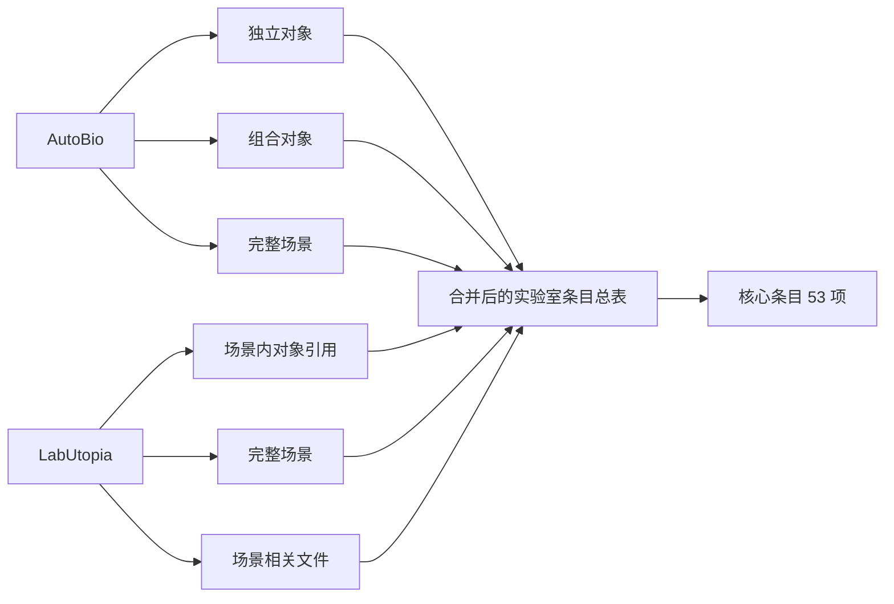

当前核心条目共 53 项，其中 `AutoBio` 40 项，`LabUtopia` 13 项。

## 2. 统一口径

这里统一使用“实验室条目”作为总称，不再把所有东西都叫作 asset。判断规则如下：

| 标识 | 中文解释 | 是否独立文件 | 典型路径 |
| --- | --- | --- | --- |
| `scene` | 完整场景入口，加载后看到的是整张实验台、整台设备或整个实验室。 | 是 | [lab.xml](files/autobio/autobio/model/scene/lab.xml) [lab_001.usd](files/labutopia/assets/chemistry_lab/lab_001/lab_001.usd) |
| `standalone_mesh_root` | 独立对象的 mesh 根入口，通常对应单个对象或单个对象目录。 | 是 | [pcr_plate_96well_vis.obj](files/autobio/autobio/assets/container/pcr_plate_96well_vis.obj) |
| `package_entrypoint` | 组合对象入口，会继续引用多个部件、材质或子文件。 | 是 | [centrifuge_eppendorf_5430.xml](files/autobio/autobio/model/instrument/centrifuge_eppendorf_5430.xml) |
| `scene_prim_reference` | 场景内对象引用，依附在某个 USD 场景里，本身不是独立文件。 | 否 | [lab_001.usd](files/labutopia/assets/chemistry_lab/lab_001/lab_001.usd) <code>#/World/conical_bottle02</code> |

补充说明：`LabUtopia` 的很多对象当前仍然是“场景里的对象引用”，所以预览图使用的是场景缩略图叠加对象标签，而不是把对象单独拆出来后的独立渲染。

## 3. 上游结构

- `AutoBio` 的主脉络是 `autobio/assets/` + `autobio/model/`。前者更偏原始对象与部件，后者更偏装配入口、仪器入口、机器人入口与完整场景入口。
- `LabUtopia` 的主脉络是 `assets/chemistry_lab/`。它本质上更偏 scene-first，很多对象只能通过 `xxx.usd#/World/...` 这种场景内路径来引用。
- 因此两者合并时，不能只看独立对象；必须把场景、场景内对象引用和组合对象一起纳入统一清单。

## 4. 全部资产 / 场景

这一章展示的是上游范围内所有值得盘点和可视化的条目，不等于最终全部纳入 benchmark。少数上游条目如果缺失 mesh 或存在坏引用，会回退到本地代理预览或信息卡，不再保留失败 placeholder。

### 4.1 场景内对象引用

| 预览 | 来源 | 名称 | 代表路径 | 所在场景 |
| --- | --- | --- | --- | --- |
|  | LabUtopia | cabinet | <code>/World/Cabinet_01</code> <code>/World/Cabinet_02</code> | [lab_001.usd](files/labutopia/assets/chemistry_lab/lab_001/lab_001.usd) |
| 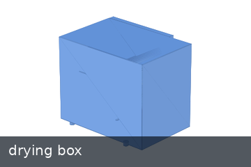 | LabUtopia | drying box | <code>/World/DryingBox_01</code> <code>/World/DryingBox_02</code> <code>/World/DryingBox_03</code> | [lab_001.usd](files/labutopia/assets/chemistry_lab/lab_001/lab_001.usd) |
| 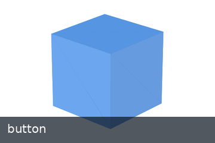 | LabUtopia | button | <code>/World/DryingBox_01/button</code> <code>/World/heat_device/button</code> | [lab_001.usd](files/labutopia/assets/chemistry_lab/lab_001/lab_001.usd) |
|  | LabUtopia | beaker | <code>/World/beaker1</code> <code>/World/beaker2</code> <code>/World/beaker3</code> <code>/World/beaker_2</code> <code>/World/target_beaker</code> | [lab_001.usd](files/labutopia/assets/chemistry_lab/lab_001/lab_001.usd) |
| 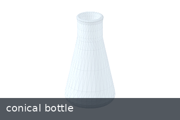 | LabUtopia | conical bottle | <code>/World/conical_bottle02</code> <code>/World/conical_bottle03</code> <code>/World/conical_bottle04</code> | [lab_001.usd](files/labutopia/assets/chemistry_lab/lab_001/lab_001.usd) |
| 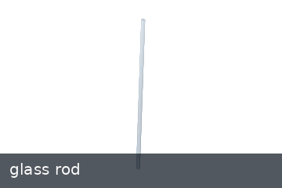 | LabUtopia | glass rod | <code>/World/glass_rod</code> | [lab_003.usd](files/labutopia/assets/chemistry_lab/lab_003/lab_003.usd) |
| 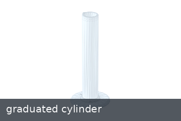 | LabUtopia | graduated cylinder | <code>/World/graduated_cylinder_03</code> | [lab_001.usd](files/labutopia/assets/chemistry_lab/lab_001/lab_001.usd) |
| 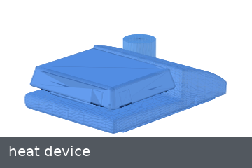 | LabUtopia | heat device | <code>/World/heat_device</code> | [lab_003.usd](files/labutopia/assets/chemistry_lab/lab_003/lab_003.usd) |
|  | LabUtopia | muffle furnace | <code>/World/MuffleFurnace</code> | [lab_001.usd](files/labutopia/assets/chemistry_lab/lab_001/lab_001.usd) |
|  | LabUtopia | rack / platform | <code>/World/target_plat</code> | [Scene1_hard.usd](files/labutopia/assets/chemistry_lab/hard_task/Scene1_hard.usd) |
|  | LabUtopia | table surface | <code>/World/table/surface</code> <code>/World/table/surface/mesh</code> | [lab_003.usd](files/labutopia/assets/chemistry_lab/lab_003/lab_003.usd) |

### 4.2 独立对象

| 预览 | 来源 | 名称 | 路径 |
| --- | --- | --- | --- |
|  | AutoBio | cell_dish_100_vis | [cell_dish_100_vis.obj](files/autobio/autobio/assets/container/cell_dish_100_vis.obj) |
| 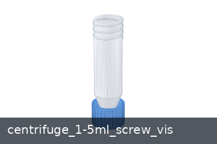 | AutoBio | centrifuge_1-5ml_screw_vis | [centrifuge_1-5ml_screw_vis/](files/autobio/autobio/assets/container/centrifuge_1-5ml_screw_vis) |
| 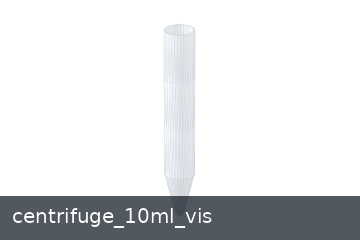 | AutoBio | centrifuge_10ml_vis | [centrifuge_10ml_vis.obj](files/autobio/autobio/assets/container/centrifuge_10ml_vis.obj) |
| 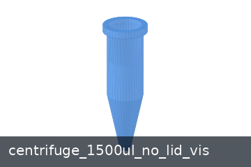 | AutoBio | centrifuge_1500ul_no_lid_vis | [centrifuge_1500ul_no_lid_vis.obj](files/autobio/autobio/assets/container/centrifuge_1500ul_no_lid_vis.obj) |
| 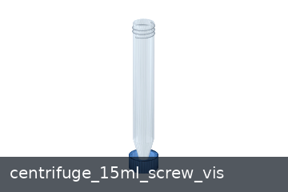 | AutoBio | centrifuge_15ml_screw_vis | [centrifuge_15ml_screw_vis/](files/autobio/autobio/assets/container/centrifuge_15ml_screw_vis) |
| 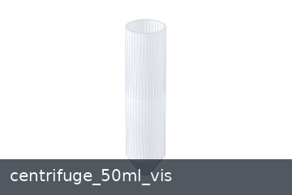 | AutoBio | centrifuge_50ml_vis | [centrifuge_50ml_vis.obj](files/autobio/autobio/assets/container/centrifuge_50ml_vis.obj) |
| 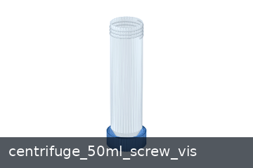 | AutoBio | centrifuge_50ml_screw_vis | [centrifuge_50ml_screw_vis/](files/autobio/autobio/assets/container/centrifuge_50ml_screw_vis) |
| 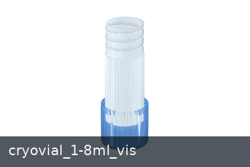 | AutoBio | cryovial_1-8ml_vis | [cryovial_1-8ml_vis/](files/autobio/autobio/assets/container/cryovial_1-8ml_vis) |
| 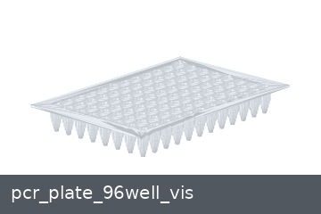 | AutoBio | pcr_plate_96well_vis | [pcr_plate_96well_vis.obj](files/autobio/autobio/assets/container/pcr_plate_96well_vis.obj) |
| 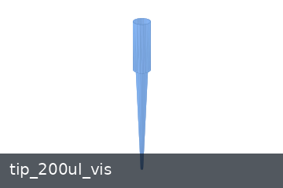 | AutoBio | tip_200ul_vis | [tip_200ul_vis/](files/autobio/autobio/assets/container/tip_200ul_vis) |
| 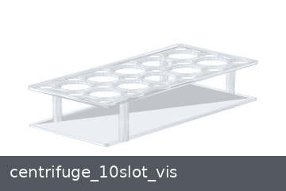 | AutoBio | centrifuge_10slot_vis | [centrifuge_10slot_vis.obj](files/autobio/autobio/assets/rack/centrifuge_10slot_vis.obj) |
|  | AutoBio | centrifuge_plate_60well_vis | [centrifuge_plate_60well_vis.obj](files/autobio/autobio/assets/rack/centrifuge_plate_60well_vis.obj) |
| 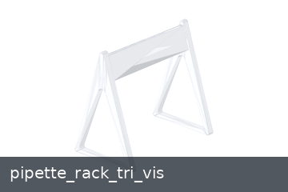 | AutoBio | pipette_rack_tri_vis | [pipette_rack_tri_vis.obj](files/autobio/autobio/assets/rack/pipette_rack_tri_vis.obj) |
| 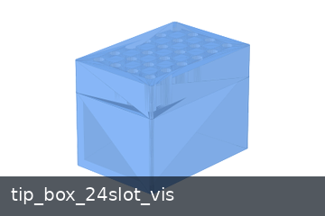 | AutoBio | tip_box_24slot_vis | [tip_box_24slot_vis.obj](files/autobio/autobio/assets/rack/tip_box_24slot_vis.obj) |
|  | AutoBio | pipette | [pipette/](files/autobio/autobio/assets/tool/pipette) |
|  | AutoBio | centrifuge_eppendorf_5430 | [centrifuge_eppendorf_5430/](files/autobio/autobio/assets/instrument/centrifuge_eppendorf_5430) |
| 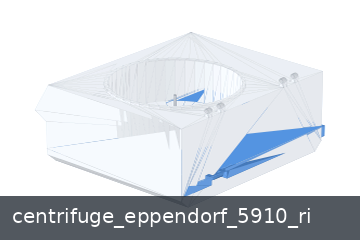 | AutoBio | centrifuge_eppendorf_5910_ri | [centrifuge_eppendorf_5910_ri/](files/autobio/autobio/assets/instrument/centrifuge_eppendorf_5910_ri) |
| 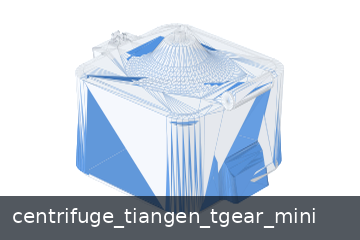 | AutoBio | centrifuge_tiangen_tgear_mini | [centrifuge_tiangen_tgear_mini/](files/autobio/autobio/assets/instrument/centrifuge_tiangen_tgear_mini) |
| 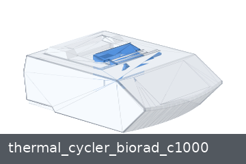 | AutoBio | thermal_cycler_biorad_c1000 | [thermal_cycler_biorad_c1000/](files/autobio/autobio/assets/instrument/thermal_cycler_biorad_c1000) |
|  | AutoBio | thermal_mixer_eppendorf_c | [thermal_mixer_eppendorf_c/](files/autobio/autobio/assets/instrument/thermal_mixer_eppendorf_c) |
|  | AutoBio | vortex_mixer_genie_2 | [vortex_mixer_genie_2/](files/autobio/autobio/assets/instrument/vortex_mixer_genie_2) |
| 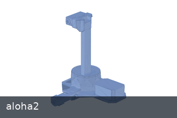 | AutoBio | aloha2 | [aloha2/](files/autobio/autobio/assets/robot/aloha2) |
| 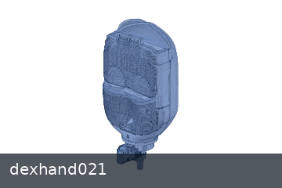 | AutoBio | dexhand021 | [dexhand021/](files/autobio/autobio/assets/robot/dexhand021) |
| 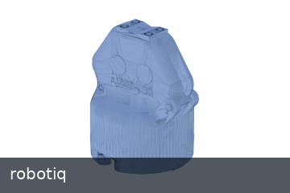 | AutoBio | robotiq | [robotiq/](files/autobio/autobio/assets/robot/robotiq) |
| 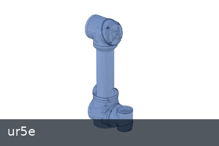 | AutoBio | ur5e | [ur5e/](files/autobio/autobio/assets/robot/ur5e) |

### 4.3 组合对象

| 预览 | 来源 | 类别 | 名称 | 路径 |
| --- | --- | --- | --- | --- |
| 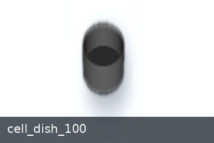 | AutoBio | 对象 | cell_dish_100 | [cell_dish_100.gen.xml](files/autobio/autobio/model/object/cell_dish_100.gen.xml) [cell_dish_100.xml](files/autobio/autobio/model/object/cell_dish_100.xml) |
| 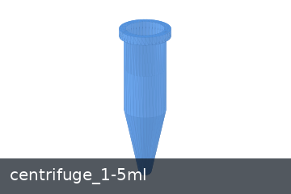 | AutoBio | 对象 | centrifuge_1-5ml | [centrifuge_1-5ml.xml](files/autobio/autobio/model/object/centrifuge_1-5ml.xml) |
| 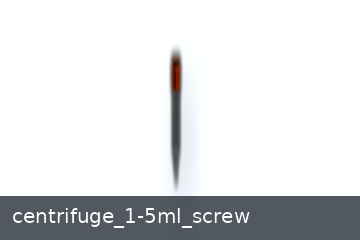 | AutoBio | 对象 | centrifuge_1-5ml_screw | [centrifuge_1-5ml_screw.xml](files/autobio/autobio/model/object/centrifuge_1-5ml_screw.xml) |
|  | AutoBio | 对象 | centrifuge_1-5ml_screw-simple | [centrifuge_1-5ml_screw-simple.xml](files/autobio/autobio/model/object/centrifuge_1-5ml_screw-simple.xml) |
|  | AutoBio | 对象 | centrifuge_10ml | [centrifuge_10ml.gen.xml](files/autobio/autobio/model/object/centrifuge_10ml.gen.xml) [centrifuge_10ml.xml](files/autobio/autobio/model/object/centrifuge_10ml.xml) |
| 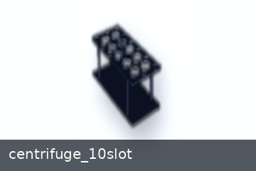 | AutoBio | 对象 | centrifuge_10slot | [centrifuge_10slot.gen.xml](files/autobio/autobio/model/object/centrifuge_10slot.gen.xml) [centrifuge_10slot.xml](files/autobio/autobio/model/object/centrifuge_10slot.xml) |
|  | AutoBio | 对象 | centrifuge_1500ul_no_lid | [centrifuge_1500ul_no_lid.gen.xml](files/autobio/autobio/model/object/centrifuge_1500ul_no_lid.gen.xml) [centrifuge_1500ul_no_lid.xml](files/autobio/autobio/model/object/centrifuge_1500ul_no_lid.xml) |
| 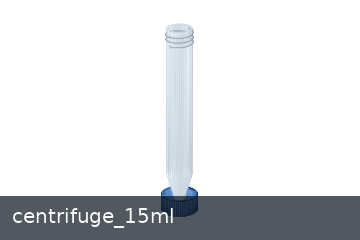 | AutoBio | 对象 | centrifuge_15ml | [centrifuge_15ml.xml](files/autobio/autobio/model/object/centrifuge_15ml.xml) |
| 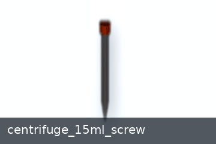 | AutoBio | 对象 | centrifuge_15ml_screw | [centrifuge_15ml_screw.xml](files/autobio/autobio/model/object/centrifuge_15ml_screw.xml) |
| 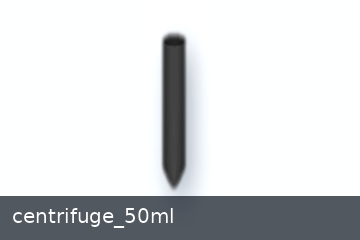 | AutoBio | 对象 | centrifuge_50ml | [centrifuge_50ml.gen.xml](files/autobio/autobio/model/object/centrifuge_50ml.gen.xml) [centrifuge_50ml.xml](files/autobio/autobio/model/object/centrifuge_50ml.xml) |
| 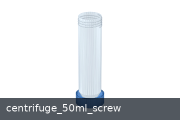 | AutoBio | 对象 | centrifuge_50ml_screw | [centrifuge_50ml_screw.xml](files/autobio/autobio/model/object/centrifuge_50ml_screw.xml) |
| 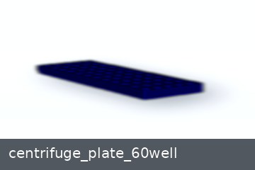 | AutoBio | 对象 | centrifuge_plate_60well | [centrifuge_plate_60well.gen.xml](files/autobio/autobio/model/object/centrifuge_plate_60well.gen.xml) [centrifuge_plate_60well.xml](files/autobio/autobio/model/object/centrifuge_plate_60well.xml) |
| 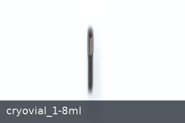 | AutoBio | 对象 | cryovial_1-8ml | [cryovial_1-8ml.xml](files/autobio/autobio/model/object/cryovial_1-8ml.xml) |
| 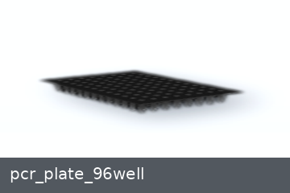 | AutoBio | 对象 | pcr_plate_96well | [pcr_plate_96well.gen.xml](files/autobio/autobio/model/object/pcr_plate_96well.gen.xml) [pcr_plate_96well.xml](files/autobio/autobio/model/object/pcr_plate_96well.xml) |
| 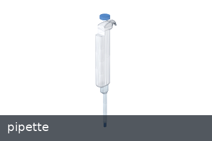 | AutoBio | 对象 | pipette | [pipette.gen.xml](files/autobio/autobio/model/object/pipette.gen.xml) [pipette.xml](files/autobio/autobio/model/object/pipette.xml) |
| 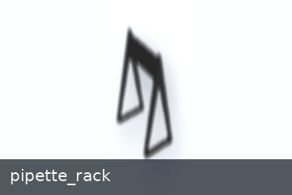 | AutoBio | 对象 | pipette_rack | [pipette_rack.gen.xml](files/autobio/autobio/model/object/pipette_rack.gen.xml) [pipette_rack.xml](files/autobio/autobio/model/object/pipette_rack.xml) |
|  | AutoBio | 对象 | pipette_tip | [pipette_tip.gen.xml](files/autobio/autobio/model/object/pipette_tip.gen.xml) [pipette_tip.xml](files/autobio/autobio/model/object/pipette_tip.xml) |
|  | AutoBio | 对象 | tip_box | [tip_box.gen.xml](files/autobio/autobio/model/object/tip_box.gen.xml) [tip_box.xml](files/autobio/autobio/model/object/tip_box.xml) |
|  | AutoBio | 仪器 | centrifuge_eppendorf_5430 | [centrifuge_eppendorf_5430.xml](files/autobio/autobio/model/instrument/centrifuge_eppendorf_5430.xml) |
| 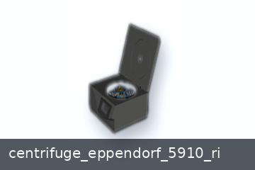 | AutoBio | 仪器 | centrifuge_eppendorf_5910_ri | [centrifuge_eppendorf_5910_ri.xml](files/autobio/autobio/model/instrument/centrifuge_eppendorf_5910_ri.xml) |
| 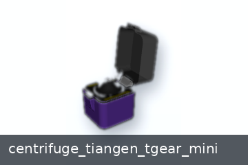 | AutoBio | 仪器 | centrifuge_tiangen_tgear_mini | [centrifuge_tiangen_tgear_mini.xml](files/autobio/autobio/model/instrument/centrifuge_tiangen_tgear_mini.xml) |
| 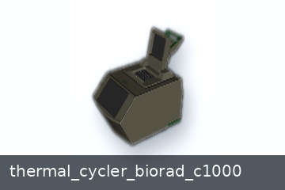 | AutoBio | 仪器 | thermal_cycler_biorad_c1000 | [thermal_cycler_biorad_c1000.xml](files/autobio/autobio/model/instrument/thermal_cycler_biorad_c1000.xml) |
| 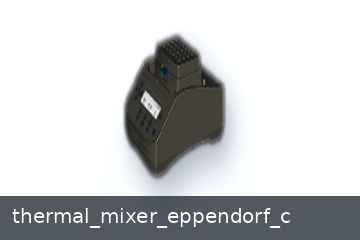 | AutoBio | 仪器 | thermal_mixer_eppendorf_c | [thermal_mixer_eppendorf_c.xml](files/autobio/autobio/model/instrument/thermal_mixer_eppendorf_c.xml) |
| 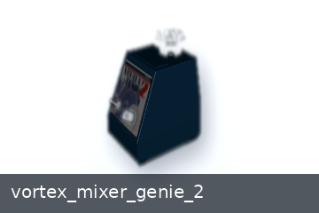 | AutoBio | 仪器 | vortex_mixer_genie_2 | [vortex_mixer_genie_2.xml](files/autobio/autobio/model/instrument/vortex_mixer_genie_2.xml) |
| 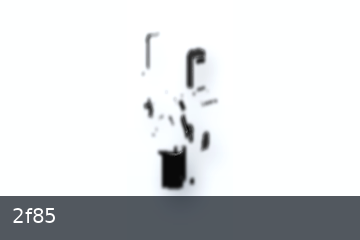 | AutoBio | 机器人 | 2f85 | [2f85.xml](https://github.com/autobio-bench/AutoBio/blob/main/autobio/model/robot/2f85.xml) |
| 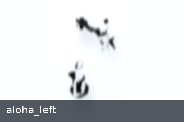 | AutoBio | 机器人 | aloha_left | [aloha_left.xml](https://github.com/autobio-bench/AutoBio/blob/main/autobio/model/robot/aloha_left.xml) |
| 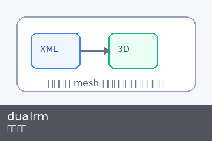 | AutoBio | 机器人 | dualrm | [dualrm.xml](https://github.com/autobio-bench/AutoBio/blob/main/autobio/model/robot/dualrm.xml) |
| 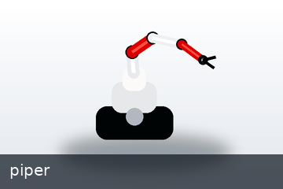 | AutoBio | 机器人 | piper | [piper.xml](https://github.com/autobio-bench/AutoBio/blob/main/autobio/model/robot/piper.xml) |
|  | AutoBio | 机器人 | ur5e_dexhand021_right | [ur5e_dexhand021_right.xml](https://github.com/autobio-bench/AutoBio/blob/main/autobio/model/robot/ur5e_dexhand021_right.xml) |
| 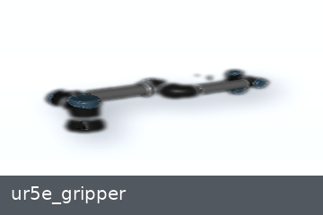 | AutoBio | 机器人 | ur5e_gripper | [ur5e_gripper.xml](https://github.com/autobio-bench/AutoBio/blob/main/autobio/model/robot/ur5e_gripper.xml) |
| 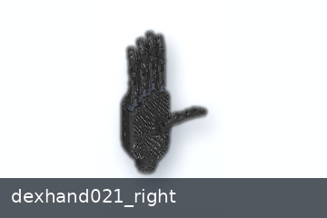 | AutoBio | 手部末端 | dexhand021_right | [dexhand021_right.xml](https://github.com/autobio-bench/AutoBio/blob/main/autobio/model/hand/dexhand021_right.xml) |
|  | AutoBio | 手部末端 | shadowhand_left | [shadowhand_left.xml](https://github.com/autobio-bench/AutoBio/blob/main/autobio/model/hand/shadowhand_left.xml) |
|  | AutoBio | 手部末端 | shadowhand_right | [shadowhand_right.xml](https://github.com/autobio-bench/AutoBio/blob/main/autobio/model/hand/shadowhand_right.xml) |
|  | AutoBio | 手部末端 | shadowhand_right_mjx | [shadowhand_right_mjx.xml](https://github.com/autobio-bench/AutoBio/blob/main/autobio/model/hand/shadowhand_right_mjx.xml) |

### 4.4 完整场景与场景相关文件

| 预览 | 来源 | 类别 | 名称 | 路径 | 说明 |
| --- | --- | --- | --- | --- | --- |
|  | AutoBio | 完整场景 | bottlecap | [bottlecap.xml](files/autobio/autobio/model/scene/bottlecap.xml) | MuJoCo XML 场景入口 |
|  | AutoBio | 完整场景 | gallery | [gallery.xml](files/autobio/autobio/model/scene/gallery.xml) | MuJoCo XML 场景入口 |
|  | AutoBio | 完整场景 | gallery2 | [gallery2.xml](files/autobio/autobio/model/scene/gallery2.xml) | MuJoCo XML 场景入口 |
|  | AutoBio | 完整场景 | insert | [insert.xml](files/autobio/autobio/model/scene/insert.xml) | MuJoCo XML 场景入口 |
|  | AutoBio | 完整场景 | insert_centrifuge_5430 | [insert_centrifuge_5430.xml](files/autobio/autobio/model/scene/insert_centrifuge_5430.xml) | MuJoCo XML 场景入口 |
|  | AutoBio | 完整场景 | lab | [lab.xml](files/autobio/autobio/model/scene/lab.xml) | MuJoCo XML 场景入口 |
|  | AutoBio | 完整场景 | lab_screw_all | [lab_screw_all.xml](files/autobio/autobio/model/scene/lab_screw_all.xml) | MuJoCo XML 场景入口 |
|  | AutoBio | 完整场景 | lab_screw_tighten | [lab_screw_tighten.xml](files/autobio/autobio/model/scene/lab_screw_tighten.xml) | MuJoCo XML 场景入口 |
|  | AutoBio | 完整场景 | mani_centrifuge_5430 | [mani_centrifuge_5430.xml](files/autobio/autobio/model/scene/mani_centrifuge_5430.xml) | MuJoCo XML 场景入口 |
|  | AutoBio | 完整场景 | mani_centrifuge_5910 | [mani_centrifuge_5910.xml](files/autobio/autobio/model/scene/mani_centrifuge_5910.xml) | MuJoCo XML 场景入口 |
|  | AutoBio | 完整场景 | mani_centrifuge_mini | [mani_centrifuge_mini.xml](files/autobio/autobio/model/scene/mani_centrifuge_mini.xml) | MuJoCo XML 场景入口 |
|  | AutoBio | 完整场景 | mani_pipette | [mani_pipette.xml](files/autobio/autobio/model/scene/mani_pipette.xml) | MuJoCo XML 场景入口 |
|  | AutoBio | 完整场景 | mani_thermal_cycler | [mani_thermal_cycler.xml](files/autobio/autobio/model/scene/mani_thermal_cycler.xml) | MuJoCo XML 场景入口 |
|  | AutoBio | 完整场景 | mani_thermal_mixer | [mani_thermal_mixer.xml](files/autobio/autobio/model/scene/mani_thermal_mixer.xml) | MuJoCo XML 场景入口 |
|  | AutoBio | 完整场景 | pickup | [pickup.xml](files/autobio/autobio/model/scene/pickup.xml) | MuJoCo XML 场景入口 |
|  | AutoBio | 完整场景 | screw | [screw.xml](files/autobio/autobio/model/scene/screw.xml) | MuJoCo XML 场景入口 |
|  | AutoBio | 完整场景 | screw_test | [screw_test.xml](files/autobio/autobio/model/scene/screw_test.xml) | MuJoCo XML 场景入口 |
|  | AutoBio | 完整场景 | screw_v3 | [screw_v3.xml](files/autobio/autobio/model/scene/screw_v3.xml) | MuJoCo XML 场景入口 |
|  | AutoBio | 完整场景 | vortex_mixer | [vortex_mixer.xml](files/autobio/autobio/model/scene/vortex_mixer.xml) | MuJoCo XML 场景入口 |
|  | LabUtopia | 完整场景 | lab_001 | [lab_001.usd](files/labutopia/assets/chemistry_lab/lab_001/lab_001.usd) | chemistry main scene |
|  | LabUtopia | 完整场景 | lab_003 | [lab_003.usd](files/labutopia/assets/chemistry_lab/lab_003/lab_003.usd) | chemistry main scene |
|  | LabUtopia | 完整场景 | Scene1_hard | [Scene1_hard.usd](files/labutopia/assets/chemistry_lab/hard_task/Scene1_hard.usd) | chemistry main scene |
|  | LabUtopia | 完整场景 | clock | [clock.usd](files/labutopia/assets/chemistry_lab/lab_003/clock.usd) | chemistry special scene |
|  | LabUtopia | 完整场景 | navigation_lab_01 | [lab.usd](files/labutopia/assets/navigation_lab/navigation_lab_01/lab.usd) | navigation scene |
|  | LabUtopia | 场景相关文件 | lab_004 | [lab_004.usd](files/labutopia/assets/chemistry_lab/hard_task/lab_004.usd) | auxiliary USD |
|  | LabUtopia | 场景相关文件 | lab_015 | [lab_015.usd](files/labutopia/assets/chemistry_lab/hard_task/SubUSDs/lab_015.usd) | SubUSD |
|  | LabUtopia | 场景相关文件 | lab_015 | [lab_015.usd](files/labutopia/assets/chemistry_lab/lab_003/SubUSDs/lab_015.usd) | SubUSD |

## 5. 筛选后的 Benchmark 资产 / 场景

这一节对应 `benchmark_core_inventory.json`。这里采用最宽的 protocol 口径：凡是能直接服务 protocol 构造、protocol 理解，或者能作为 Level 2 视觉上下文的完整场景，都纳入第 5 章；只把明显属于 Level 3 执行器的 robot / hand / gripper 留在第 4 章。

### 5.1 纳入标准

只有同时满足下面这些条件的条目，才会进入这一章：

1. 条目本身或场景主体必须直接服务 protocol 构造、protocol 理解或 Level 2 的实验上下文表达。
2. 能稳定归入一个明确的语义类别，并绑定 `match_group` 与别名集合。
3. 能整理成结构化数据单元，而不只是上游仓库里的孤立文件。
4. 粒度适合题目构造与 protocol 匹配；完整场景只要提供 protocol 相关仪器、容器、实验台面或实验室上下文，就纳入。
5. 至少具备可追溯的来源路径、用途说明和可视化状态，便于后续扩展与人工核查。

### 5.2 核心条目表

这一节改为 HTML 两列布局：左侧固定放大预览图，右侧放条目字段，避免 GitHub Markdown 表格把图片继续压缩。
当前共 `053` 项，编号从 `000` 到 `052`。

<table>
  <tr>
    <td valign="top" width="450">
      
    </td>
    <td valign="top">
      
<strong><code>000</code> 100 mm Cell Dish</strong>

      
<strong>来源：</strong>AutoBio 
      <strong>层级：</strong>独立对象 
      <strong>匹配组：</strong><code>cell_dish</code>

      
<strong>用途：</strong>Cell culture plate for seeding, incubation, washing, and imaging.

      
<strong>本地文件：</strong><a href="files/autobio/autobio/assets/container/cell_dish_100_vis.obj">cell_dish_100_vis.obj</a>

      
<strong>可视化状态：</strong>可直接按 mesh 渲染 
      <strong>原始链接：</strong><a href="https://raw.githubusercontent.com/autobio-bench/AutoBio/main/autobio/assets/container/cell_dish_100_vis.obj">源文件</a>

      

        
<strong>别名</strong>

        
cell dish cell dishes cell culture dish cell culture dishes culture dish culture dishes petri dish petri dishes

      

    </td>
  </tr>
</table>

<table>
  <tr>
    <td valign="top" width="450">
      
    </td>
    <td valign="top">
      
<strong><code>001</code> 1.5 mL Screw-Cap Microcentrifuge Tube</strong>

      
<strong>来源：</strong>AutoBio 
      <strong>层级：</strong>独立对象 
      <strong>匹配组：</strong><code>microcentrifuge_tube_1_5ml</code>

      
<strong>用途：</strong>Small sample tube for aliquoting, mixing, incubation, and centrifugation.

      
<strong>本地文件：</strong><a href="files/autobio/autobio/assets/container/centrifuge_1-5ml_screw_vis">centrifuge_1-5ml_screw_vis/</a>

      
<strong>可视化状态：</strong>可直接按 mesh 渲染 
      <strong>原始链接：</strong><a href="https://github.com/autobio-bench/AutoBio/tree/main/autobio/assets/container/centrifuge_1-5ml_screw_vis">源文件</a>

      

        
<strong>别名</strong>

        
microcentrifuge tube microcentrifuge tubes eppendorf tube eppendorf tubes 1.5 ml tube 1.5 ml tubes 1.5 ml microcentrifuge tube 1.5 ml centrifuge tube 1.5 ml screw cap tube

      

    </td>
  </tr>
</table>

<table>
  <tr>
    <td valign="top" width="450">
      
    </td>
    <td valign="top">
      
<strong><code>002</code> 10 mL Centrifuge Tube</strong>

      
<strong>来源：</strong>AutoBio 
      <strong>层级：</strong>独立对象 
      <strong>匹配组：</strong><code>centrifuge_tube_10ml</code>

      
<strong>用途：</strong>Medium-volume sample tube for transfer and centrifugation.

      
<strong>本地文件：</strong><a href="files/autobio/autobio/assets/container/centrifuge_10ml_vis.obj">centrifuge_10ml_vis.obj</a>

      
<strong>可视化状态：</strong>可直接按 mesh 渲染 
      <strong>原始链接：</strong><a href="https://raw.githubusercontent.com/autobio-bench/AutoBio/main/autobio/assets/container/centrifuge_10ml_vis.obj">源文件</a>

      

        
<strong>别名</strong>

        
10 ml centrifuge tube 10 ml centrifuge tubes 10ml centrifuge tube 10 ml tube 10 ml tubes

      

    </td>
  </tr>
</table>

<table>
  <tr>
    <td valign="top" width="450">
      
    </td>
    <td valign="top">
      
<strong><code>003</code> 1.5 mL Open Microcentrifuge Tube</strong>

      
<strong>来源：</strong>AutoBio 
      <strong>层级：</strong>独立对象 
      <strong>匹配组：</strong><code>microcentrifuge_tube_1_5ml</code>

      
<strong>用途：</strong>Open microcentrifuge tube for liquid handling and insertion tasks.

      
<strong>本地文件：</strong><a href="files/autobio/autobio/assets/container/centrifuge_1500ul_no_lid_vis.obj">centrifuge_1500ul_no_lid_vis.obj</a>

      
<strong>可视化状态：</strong>可直接按 mesh 渲染 
      <strong>原始链接：</strong><a href="https://raw.githubusercontent.com/autobio-bench/AutoBio/main/autobio/assets/container/centrifuge_1500ul_no_lid_vis.obj">源文件</a>

      

        
<strong>别名</strong>

        
microcentrifuge tube microcentrifuge tubes eppendorf tube eppendorf tubes 1.5 ml tube 1.5 ml tubes 1.5 ml microcentrifuge tube 1.5 ml centrifuge tube 1.5 ml screw cap tube

      

    </td>
  </tr>
</table>

<table>
  <tr>
    <td valign="top" width="450">
      
    </td>
    <td valign="top">
      
<strong><code>004</code> 15 mL Screw-Cap Centrifuge Tube</strong>

      
<strong>来源：</strong>AutoBio 
      <strong>层级：</strong>独立对象 
      <strong>匹配组：</strong><code>centrifuge_tube_15ml</code>

      
<strong>用途：</strong>Conical sample tube for medium-volume transfer and centrifugation.

      
<strong>本地文件：</strong><a href="files/autobio/autobio/assets/container/centrifuge_15ml_screw_vis">centrifuge_15ml_screw_vis/</a>

      
<strong>可视化状态：</strong>可直接按 mesh 渲染 
      <strong>原始链接：</strong><a href="https://github.com/autobio-bench/AutoBio/tree/main/autobio/assets/container/centrifuge_15ml_screw_vis">源文件</a>

      

        
<strong>别名</strong>

        
15 ml centrifuge tube 15 ml centrifuge tubes 15ml centrifuge tube 15 ml conical tube 15 ml conical tubes 15ml conical tube 15 ml falcon tube 15 ml falcon tubes

      

    </td>
  </tr>
</table>

<table>
  <tr>
    <td valign="top" width="450">
      
    </td>
    <td valign="top">
      
<strong><code>005</code> 50 mL Centrifuge Tube</strong>

      
<strong>来源：</strong>AutoBio 
      <strong>层级：</strong>独立对象 
      <strong>匹配组：</strong><code>centrifuge_tube_50ml</code>

      
<strong>用途：</strong>Large conical tube for reagent preparation and centrifugation.

      
<strong>本地文件：</strong><a href="files/autobio/autobio/assets/container/centrifuge_50ml_vis.obj">centrifuge_50ml_vis.obj</a>

      
<strong>可视化状态：</strong>可直接按 mesh 渲染 
      <strong>原始链接：</strong><a href="https://raw.githubusercontent.com/autobio-bench/AutoBio/main/autobio/assets/container/centrifuge_50ml_vis.obj">源文件</a>

      

        
<strong>别名</strong>

        
50 ml centrifuge tube 50 ml centrifuge tubes 50ml centrifuge tube 50 ml conical tube 50 ml conical tubes 50ml conical tube 50 ml falcon tube 50 ml falcon tubes falcon tube falcon tubes

      

    </td>
  </tr>
</table>

<table>
  <tr>
    <td valign="top" width="450">
      
    </td>
    <td valign="top">
      
<strong><code>006</code> 50 mL Screw-Cap Centrifuge Tube</strong>

      
<strong>来源：</strong>AutoBio 
      <strong>层级：</strong>独立对象 
      <strong>匹配组：</strong><code>centrifuge_tube_50ml</code>

      
<strong>用途：</strong>Large screw-cap tube for sealed transfer and centrifugation.

      
<strong>本地文件：</strong><a href="files/autobio/autobio/assets/container/centrifuge_50ml_screw_vis">centrifuge_50ml_screw_vis/</a>

      
<strong>可视化状态：</strong>可直接按 mesh 渲染 
      <strong>原始链接：</strong><a href="https://github.com/autobio-bench/AutoBio/tree/main/autobio/assets/container/centrifuge_50ml_screw_vis">源文件</a>

      

        
<strong>别名</strong>

        
50 ml centrifuge tube 50 ml centrifuge tubes 50ml centrifuge tube 50 ml conical tube 50 ml conical tubes 50ml conical tube 50 ml falcon tube 50 ml falcon tubes falcon tube falcon tubes

      

    </td>
  </tr>
</table>

<table>
  <tr>
    <td valign="top" width="450">
      
    </td>
    <td valign="top">
      
<strong><code>007</code> 1.8 mL Cryovial</strong>

      
<strong>来源：</strong>AutoBio 
      <strong>层级：</strong>独立对象 
      <strong>匹配组：</strong><code>cryovial</code>

      
<strong>用途：</strong>Cryogenic storage vial for frozen samples and aliquots.

      
<strong>本地文件：</strong><a href="files/autobio/autobio/assets/container/cryovial_1-8ml_vis">cryovial_1-8ml_vis/</a>

      
<strong>可视化状态：</strong>可直接按 mesh 渲染 
      <strong>原始链接：</strong><a href="https://github.com/autobio-bench/AutoBio/tree/main/autobio/assets/container/cryovial_1-8ml_vis">源文件</a>

      

        
<strong>别名</strong>

        
cryovial cryovials cryo vial cryo vials cryogenic vial cryogenic vials

      

    </td>
  </tr>
</table>

<table>
  <tr>
    <td valign="top" width="450">
      
    </td>
    <td valign="top">
      
<strong><code>008</code> 96-Well PCR Plate</strong>

      
<strong>来源：</strong>AutoBio 
      <strong>层级：</strong>独立对象 
      <strong>匹配组：</strong><code>pcr_plate</code>

      
<strong>用途：</strong>Plate for PCR setup, thermal cycling, and sample organization.

      
<strong>本地文件：</strong><a href="files/autobio/autobio/assets/container/pcr_plate_96well_vis.obj">pcr_plate_96well_vis.obj</a>

      
<strong>可视化状态：</strong>可直接按 mesh 渲染 
      <strong>原始链接：</strong><a href="https://raw.githubusercontent.com/autobio-bench/AutoBio/main/autobio/assets/container/pcr_plate_96well_vis.obj">源文件</a>

      

        
<strong>别名</strong>

        
pcr plate pcr plates 96 well pcr plate 96 well pcr plates 96 well plate 96 well plates 96 well microplate 96 well microplates

      

    </td>
  </tr>
</table>

<table>
  <tr>
    <td valign="top" width="450">
      
    </td>
    <td valign="top">
      
<strong><code>009</code> 200 uL Pipette Tip</strong>

      
<strong>来源：</strong>AutoBio 
      <strong>层级：</strong>独立对象 
      <strong>匹配组：</strong><code>pipette_tip</code>

      
<strong>用途：</strong>Disposable liquid-handling tip for pipetting small volumes.

      
<strong>本地文件：</strong><a href="files/autobio/autobio/assets/container/tip_200ul_vis/visual.obj">visual.obj</a>

      
<strong>可视化状态：</strong>可直接按 mesh 渲染 
      <strong>原始链接：</strong><a href="https://github.com/autobio-bench/AutoBio/tree/main/autobio/assets/container/tip_200ul_vis">源文件</a>

      

        
<strong>别名</strong>

        
pipette tip pipette tips micropipette tip micropipette tips 200 ul tip 200 ul tips 200 ul pipette tip 200 ul pipette tips

      

    </td>
  </tr>
</table>

<table>
  <tr>
    <td valign="top" width="450">
      
    </td>
    <td valign="top">
      
<strong><code>010</code> Micropipette</strong>

      
<strong>来源：</strong>AutoBio 
      <strong>层级：</strong>组合对象 
      <strong>匹配组：</strong><code>pipette</code>

      
<strong>用途：</strong>Manual pipette for aspirating and dispensing liquids.

      
<strong>本地文件：</strong><a href="files/autobio/autobio/model/object/pipette.gen.xml">pipette.gen.xml</a>

      
<strong>可视化状态：</strong>可直接按 MJCF 装配渲染 
      <strong>原始链接：</strong><a href="https://raw.githubusercontent.com/autobio-bench/AutoBio/main/autobio/model/object/pipette.gen.xml">源文件</a>

      

        
<strong>别名</strong>

        
pipette pipettes micropipette micropipettes single channel pipette single channel pipettes

      

    </td>
  </tr>
</table>

<table>
  <tr>
    <td valign="top" width="450">
      
    </td>
    <td valign="top">
      
<strong><code>011</code> 24-Slot Tip Box</strong>

      
<strong>来源：</strong>AutoBio 
      <strong>层级：</strong>独立对象 
      <strong>匹配组：</strong><code>tip_box</code>

      
<strong>用途：</strong>Container for storing and presenting pipette tips.

      
<strong>本地文件：</strong><a href="files/autobio/autobio/assets/rack/tip_box_24slot_vis.obj">tip_box_24slot_vis.obj</a>

      
<strong>可视化状态：</strong>可直接按 mesh 渲染 
      <strong>原始链接：</strong><a href="https://raw.githubusercontent.com/autobio-bench/AutoBio/main/autobio/assets/rack/tip_box_24slot_vis.obj">源文件</a>

      

        
<strong>别名</strong>

        
tip box tip boxes pipette tip box pipette tip boxes

      

    </td>
  </tr>
</table>

<table>
  <tr>
    <td valign="top" width="450">
      
    </td>
    <td valign="top">
      
<strong><code>012</code> Triangular Pipette Rack</strong>

      
<strong>来源：</strong>AutoBio 
      <strong>层级：</strong>独立对象 
      <strong>匹配组：</strong><code>pipette_rack</code>

      
<strong>用途：</strong>Rack for holding pipettes upright between operations.

      
<strong>本地文件：</strong><a href="files/autobio/autobio/assets/rack/pipette_rack_tri_vis.obj">pipette_rack_tri_vis.obj</a>

      
<strong>可视化状态：</strong>可直接按 mesh 渲染 
      <strong>原始链接：</strong><a href="https://raw.githubusercontent.com/autobio-bench/AutoBio/main/autobio/assets/rack/pipette_rack_tri_vis.obj">源文件</a>

      

        
<strong>别名</strong>

        
pipette rack pipette racks pipette holder pipette holders pipette stand pipette stands

      

    </td>
  </tr>
</table>

<table>
  <tr>
    <td valign="top" width="450">
      
    </td>
    <td valign="top">
      
<strong><code>013</code> 10-Slot Centrifuge Tube Rack</strong>

      
<strong>来源：</strong>AutoBio 
      <strong>层级：</strong>独立对象 
      <strong>匹配组：</strong><code>tube_rack</code>

      
<strong>用途：</strong>Rack for organizing and positioning sample tubes.

      
<strong>本地文件：</strong><a href="files/autobio/autobio/assets/rack/centrifuge_10slot_vis.obj">centrifuge_10slot_vis.obj</a>

      
<strong>可视化状态：</strong>可直接按 mesh 渲染 
      <strong>原始链接：</strong><a href="https://raw.githubusercontent.com/autobio-bench/AutoBio/main/autobio/assets/rack/centrifuge_10slot_vis.obj">源文件</a>

      

        
<strong>别名</strong>

        
tube rack tube racks centrifuge tube rack centrifuge tube racks microcentrifuge tube rack microcentrifuge tube racks test tube rack test tube racks

      

    </td>
  </tr>
</table>

<table>
  <tr>
    <td valign="top" width="450">
      
    </td>
    <td valign="top">
      
<strong><code>014</code> 60-Well Plate Rack</strong>

      
<strong>来源：</strong>AutoBio 
      <strong>层级：</strong>独立对象 
      <strong>匹配组：</strong><code>tube_rack</code>

      
<strong>用途：</strong>Multi-well rack for arranging small tubes or vials.

      
<strong>本地文件：</strong><a href="files/autobio/autobio/assets/rack/centrifuge_plate_60well_vis.obj">centrifuge_plate_60well_vis.obj</a>

      
<strong>可视化状态：</strong>可直接按 mesh 渲染 
      <strong>原始链接：</strong><a href="https://raw.githubusercontent.com/autobio-bench/AutoBio/main/autobio/assets/rack/centrifuge_plate_60well_vis.obj">源文件</a>

      

        
<strong>别名</strong>

        
tube rack tube racks centrifuge tube rack centrifuge tube racks microcentrifuge tube rack microcentrifuge tube racks test tube rack test tube racks

      

    </td>
  </tr>
</table>

<table>
  <tr>
    <td valign="top" width="450">
      
    </td>
    <td valign="top">
      
<strong><code>015</code> Eppendorf 5430 Centrifuge</strong>

      
<strong>来源：</strong>AutoBio 
      <strong>层级：</strong>组合对象 
      <strong>匹配组：</strong><code>centrifuge</code>

      
<strong>用途：</strong>Bench centrifuge for spinning small sample tubes.

      
<strong>本地文件：</strong><a href="files/autobio/autobio/model/instrument/centrifuge_eppendorf_5430.xml">centrifuge_eppendorf_5430.xml</a>

      
<strong>可视化状态：</strong>可直接按 MJCF 装配渲染 
      <strong>原始链接：</strong><a href="https://raw.githubusercontent.com/autobio-bench/AutoBio/main/autobio/model/instrument/centrifuge_eppendorf_5430.xml">源文件</a>

      

        
<strong>别名</strong>

        
centrifuge centrifuges microcentrifuge microcentrifuges bench centrifuge bench centrifuges refrigerated centrifuge refrigerated centrifuges

      

    </td>
  </tr>
</table>

<table>
  <tr>
    <td valign="top" width="450">
      
    </td>
    <td valign="top">
      
<strong><code>016</code> Eppendorf 5910 Ri Centrifuge</strong>

      
<strong>来源：</strong>AutoBio 
      <strong>层级：</strong>组合对象 
      <strong>匹配组：</strong><code>centrifuge</code>

      
<strong>用途：</strong>Large refrigerated centrifuge for higher-volume tube spinning.

      
<strong>本地文件：</strong><a href="files/autobio/autobio/model/instrument/centrifuge_eppendorf_5910_ri.xml">centrifuge_eppendorf_5910_ri.xml</a>

      
<strong>可视化状态：</strong>可直接按 MJCF 装配渲染 
      <strong>原始链接：</strong><a href="https://raw.githubusercontent.com/autobio-bench/AutoBio/main/autobio/model/instrument/centrifuge_eppendorf_5910_ri.xml">源文件</a>

      

        
<strong>别名</strong>

        
centrifuge centrifuges microcentrifuge microcentrifuges bench centrifuge bench centrifuges refrigerated centrifuge refrigerated centrifuges

      

    </td>
  </tr>
</table>

<table>
  <tr>
    <td valign="top" width="450">
      
    </td>
    <td valign="top">
      
<strong><code>017</code> Tiangen Tgear Mini Centrifuge</strong>

      
<strong>来源：</strong>AutoBio 
      <strong>层级：</strong>组合对象 
      <strong>匹配组：</strong><code>centrifuge</code>

      
<strong>用途：</strong>Compact mini centrifuge for quick spin-down operations.

      
<strong>本地文件：</strong><a href="files/autobio/autobio/model/instrument/centrifuge_tiangen_tgear_mini.xml">centrifuge_tiangen_tgear_mini.xml</a>

      
<strong>可视化状态：</strong>可直接按 MJCF 装配渲染 
      <strong>原始链接：</strong><a href="https://raw.githubusercontent.com/autobio-bench/AutoBio/main/autobio/model/instrument/centrifuge_tiangen_tgear_mini.xml">源文件</a>

      

        
<strong>别名</strong>

        
centrifuge centrifuges microcentrifuge microcentrifuges bench centrifuge bench centrifuges refrigerated centrifuge refrigerated centrifuges

      

    </td>
  </tr>
</table>

<table>
  <tr>
    <td valign="top" width="450">
      
    </td>
    <td valign="top">
      
<strong><code>018</code> Bio-Rad C1000 Thermal Cycler</strong>

      
<strong>来源：</strong>AutoBio 
      <strong>层级：</strong>组合对象 
      <strong>匹配组：</strong><code>thermal_cycler</code>

      
<strong>用途：</strong>PCR instrument for running thermal cycling programs.

      
<strong>本地文件：</strong><a href="files/autobio/autobio/model/instrument/thermal_cycler_biorad_c1000.xml">thermal_cycler_biorad_c1000.xml</a>

      
<strong>可视化状态：</strong>可直接按 MJCF 装配渲染 
      <strong>原始链接：</strong><a href="https://raw.githubusercontent.com/autobio-bench/AutoBio/main/autobio/model/instrument/thermal_cycler_biorad_c1000.xml">源文件</a>

      

        
<strong>别名</strong>

        
thermal cycler thermal cyclers thermocycler thermocyclers pcr machine pcr machines

      

    </td>
  </tr>
</table>

<table>
  <tr>
    <td valign="top" width="450">
      
    </td>
    <td valign="top">
      
<strong><code>019</code> Eppendorf C Thermal Mixer</strong>

      
<strong>来源：</strong>AutoBio 
      <strong>层级：</strong>组合对象 
      <strong>匹配组：</strong><code>thermal_mixer</code>

      
<strong>用途：</strong>Instrument for controlled heating and shaking of samples.

      
<strong>本地文件：</strong><a href="files/autobio/autobio/model/instrument/thermal_mixer_eppendorf_c.xml">thermal_mixer_eppendorf_c.xml</a>

      
<strong>可视化状态：</strong>可直接按 MJCF 装配渲染 
      <strong>原始链接：</strong><a href="https://raw.githubusercontent.com/autobio-bench/AutoBio/main/autobio/model/instrument/thermal_mixer_eppendorf_c.xml">源文件</a>

      

        
<strong>别名</strong>

        
thermal mixer thermal mixers thermomixer thermomixers heat shaker heat shakers

      

    </td>
  </tr>
</table>

<table>
  <tr>
    <td valign="top" width="450">
      
    </td>
    <td valign="top">
      
<strong><code>020</code> Genie 2 Vortex Mixer</strong>

      
<strong>来源：</strong>AutoBio 
      <strong>层级：</strong>组合对象 
      <strong>匹配组：</strong><code>vortex_mixer</code>

      
<strong>用途：</strong>Mixer for vortexing tubes and suspensions.

      
<strong>本地文件：</strong><a href="files/autobio/autobio/model/instrument/vortex_mixer_genie_2.xml">vortex_mixer_genie_2.xml</a>

      
<strong>可视化状态：</strong>可直接按 MJCF 装配渲染 
      <strong>原始链接：</strong><a href="https://raw.githubusercontent.com/autobio-bench/AutoBio/main/autobio/model/instrument/vortex_mixer_genie_2.xml">源文件</a>

      

        
<strong>别名</strong>

        
vortex mixer vortex mixers vortexer vortexers vortex genie

      

    </td>
  </tr>
</table>

<table>
  <tr>
    <td valign="top" width="450">
      
    </td>
    <td valign="top">
      
<strong><code>021</code> Beaker Family</strong>

      
<strong>来源：</strong>LabUtopia 
      <strong>层级：</strong>场景内对象引用 
      <strong>匹配组：</strong><code>beaker</code>

      
<strong>用途：</strong>General glass container for mixing, pouring, heating, and transfer.

      
<strong>本地文件：</strong><a href="files/labutopia/assets/chemistry_lab/lab_001/lab_001.usd">lab_001.usd</a> <code>#/World/beaker1</code>

      
<strong>可视化状态：</strong>当前使用 USD 场景缩略图展示 
      <strong>原始链接：</strong><a href="https://media.githubusercontent.com/media/Rui-li023/LabUtopia/main/assets/chemistry_lab/lab_001/lab_001.usd">源文件</a>

      

        
<strong>别名</strong>

        
beaker beakers glass beaker glass beakers

      

    </td>
  </tr>
</table>

<table>
  <tr>
    <td valign="top" width="450">
      
    </td>
    <td valign="top">
      
<strong><code>022</code> Conical Bottle / Flask Family</strong>

      
<strong>来源：</strong>LabUtopia 
      <strong>层级：</strong>场景内对象引用 
      <strong>匹配组：</strong><code>conical_bottle</code>

      
<strong>用途：</strong>Flask-style glassware for liquid storage, mixing, and pouring.

      
<strong>本地文件：</strong><a href="files/labutopia/assets/chemistry_lab/lab_001/lab_001.usd">lab_001.usd</a> <code>#/World/conical_bottle02</code>

      
<strong>可视化状态：</strong>当前使用 USD 场景缩略图展示 
      <strong>原始链接：</strong><a href="https://media.githubusercontent.com/media/Rui-li023/LabUtopia/main/assets/chemistry_lab/lab_001/lab_001.usd">源文件</a>

      

        
<strong>别名</strong>

        
conical bottle conical bottles erlenmeyer flask erlenmeyer flasks conical flask conical flasks

      

    </td>
  </tr>
</table>

<table>
  <tr>
    <td valign="top" width="450">
      
    </td>
    <td valign="top">
      
<strong><code>023</code> Graduated Cylinder</strong>

      
<strong>来源：</strong>LabUtopia 
      <strong>层级：</strong>场景内对象引用 
      <strong>匹配组：</strong><code>graduated_cylinder</code>

      
<strong>用途：</strong>Volumetric cylinder for measuring and dispensing liquids.

      
<strong>本地文件：</strong><a href="files/labutopia/assets/chemistry_lab/lab_001/lab_001.usd">lab_001.usd</a> <code>#/World/graduated_cylinder_03</code>

      
<strong>可视化状态：</strong>当前使用 USD 场景缩略图展示 
      <strong>原始链接：</strong><a href="https://media.githubusercontent.com/media/Rui-li023/LabUtopia/main/assets/chemistry_lab/lab_001/lab_001.usd">源文件</a>

      

        
<strong>别名</strong>

        
graduated cylinder graduated cylinders measuring cylinder measuring cylinders

      

    </td>
  </tr>
</table>

<table>
  <tr>
    <td valign="top" width="450">
      
    </td>
    <td valign="top">
      
<strong><code>024</code> Glass Rod</strong>

      
<strong>来源：</strong>LabUtopia 
      <strong>层级：</strong>场景内对象引用 
      <strong>匹配组：</strong><code>glass_rod</code>

      
<strong>用途：</strong>Rod for manual stirring and mixing.

      
<strong>本地文件：</strong><a href="files/labutopia/assets/chemistry_lab/lab_003/lab_003.usd">lab_003.usd</a> <code>#/World/glass_rod</code>

      
<strong>可视化状态：</strong>当前使用 USD 场景缩略图展示 
      <strong>原始链接：</strong><a href="https://media.githubusercontent.com/media/Rui-li023/LabUtopia/main/assets/chemistry_lab/lab_003/lab_003.usd">源文件</a>

      

        
<strong>别名</strong>

        
glass rod glass rods stirring rod stirring rods glass stirring rod glass stirring rods

      

    </td>
  </tr>
</table>

<table>
  <tr>
    <td valign="top" width="450">
      
    </td>
    <td valign="top">
      
<strong><code>025</code> Test Tube Rack</strong>

      
<strong>来源：</strong>LabUtopia 
      <strong>层级：</strong>场景内对象引用 
      <strong>匹配组：</strong><code>tube_rack</code>

      
<strong>用途：</strong>Rack for holding tubes upright during preparation and storage.

      
<strong>本地文件：</strong><a href="files/labutopia/assets/chemistry_lab/lab_003/lab_003.usd">lab_003.usd</a> <code>#/World/test_tube_rack</code>

      
<strong>可视化状态：</strong>当前使用 USD 场景缩略图展示 
      <strong>原始链接：</strong><a href="https://media.githubusercontent.com/media/Rui-li023/LabUtopia/main/assets/chemistry_lab/lab_003/lab_003.usd">源文件</a>

      

        
<strong>别名</strong>

        
tube rack tube racks centrifuge tube rack centrifuge tube racks microcentrifuge tube rack microcentrifuge tube racks test tube rack test tube racks

      

    </td>
  </tr>
</table>

<table>
  <tr>
    <td valign="top" width="450">
      
    </td>
    <td valign="top">
      
<strong><code>026</code> Drying Box Family</strong>

      
<strong>来源：</strong>LabUtopia 
      <strong>层级：</strong>场景内对象引用 
      <strong>匹配组：</strong><code>drying_box</code>

      
<strong>用途：</strong>Device used for drying or enclosed heating workflows.

      
<strong>本地文件：</strong><a href="files/labutopia/assets/chemistry_lab/lab_001/lab_001.usd">lab_001.usd</a> <code>#/World/DryingBox_01</code>

      
<strong>可视化状态：</strong>当前使用 USD 场景缩略图展示 
      <strong>原始链接：</strong><a href="https://media.githubusercontent.com/media/Rui-li023/LabUtopia/main/assets/chemistry_lab/lab_001/lab_001.usd">源文件</a>

      

        
<strong>别名</strong>

        
drying box drying boxes dry box dry boxes drying oven drying ovens drying chamber drying chambers

      

    </td>
  </tr>
</table>

<table>
  <tr>
    <td valign="top" width="450">
      
    </td>
    <td valign="top">
      
<strong><code>027</code> Heat Device / Hot Plate</strong>

      
<strong>来源：</strong>LabUtopia 
      <strong>层级：</strong>场景内对象引用 
      <strong>匹配组：</strong><code>heating_device</code>

      
<strong>用途：</strong>Heating surface or device used to activate thermal tasks.

      
<strong>本地文件：</strong><a href="files/labutopia/assets/chemistry_lab/lab_003/lab_003.usd">lab_003.usd</a> <code>#/World/heat_device</code>

      
<strong>可视化状态：</strong>当前使用 USD 场景缩略图展示 
      <strong>原始链接：</strong><a href="https://media.githubusercontent.com/media/Rui-li023/LabUtopia/main/assets/chemistry_lab/lab_003/lab_003.usd">源文件</a>

      

        
<strong>别名</strong>

        
hot plate hot plates heating plate heating plates heating device heating devices heat device heat devices heater heaters

      

    </td>
  </tr>
</table>

<table>
  <tr>
    <td valign="top" width="450">
      
    </td>
    <td valign="top">
      
<strong><code>028</code> Muffle Furnace</strong>

      
<strong>来源：</strong>LabUtopia 
      <strong>层级：</strong>场景内对象引用 
      <strong>匹配组：</strong><code>muffle_furnace</code>

      
<strong>用途：</strong>High-temperature heating device for enclosed furnace operations.

      
<strong>本地文件：</strong><a href="files/labutopia/assets/chemistry_lab/lab_001/lab_001.usd">lab_001.usd</a> <code>#/World/MuffleFurnace</code>

      
<strong>可视化状态：</strong>当前使用 USD 场景缩略图展示 
      <strong>原始链接：</strong><a href="https://media.githubusercontent.com/media/Rui-li023/LabUtopia/main/assets/chemistry_lab/lab_001/lab_001.usd">源文件</a>

      

        
<strong>别名</strong>

        
muffle furnace muffle furnaces laboratory furnace laboratory furnaces

      

    </td>
  </tr>
</table>

<table>
  <tr>
    <td valign="top" width="450">
      
    </td>
    <td valign="top">
      
<strong><code>029</code> AutoBio Scene: bottlecap</strong>

      
<strong>来源：</strong>AutoBio 
      <strong>层级：</strong>完整场景 
      <strong>匹配组：</strong><code>scene_bottlecap</code>

      
<strong>用途：</strong>Full AutoBio scene image for Level 2 multi-instrument visual context.

      
<strong>本地文件：</strong><a href="files/autobio/autobio/model/scene/bottlecap.xml">bottlecap.xml</a>

      
<strong>可视化状态：</strong>可直接按 MJCF 场景渲染 
      <strong>原始链接：</strong><a href="https://github.com/autobio-bench/AutoBio/blob/main/autobio/model/scene/bottlecap.xml">源文件</a>

      

        
<strong>别名</strong>

        
bottlecap bottlecap

      

    </td>
  </tr>
</table>

<table>
  <tr>
    <td valign="top" width="450">
      
    </td>
    <td valign="top">
      
<strong><code>030</code> AutoBio Scene: gallery</strong>

      
<strong>来源：</strong>AutoBio 
      <strong>层级：</strong>完整场景 
      <strong>匹配组：</strong><code>scene_gallery</code>

      
<strong>用途：</strong>Full AutoBio scene image for Level 2 multi-instrument visual context.

      
<strong>本地文件：</strong><a href="files/autobio/autobio/model/scene/gallery.xml">gallery.xml</a>

      
<strong>可视化状态：</strong>可直接按 MJCF 场景渲染 
      <strong>原始链接：</strong><a href="https://github.com/autobio-bench/AutoBio/blob/main/autobio/model/scene/gallery.xml">源文件</a>

      

        
<strong>别名</strong>

        
gallery gallery

      

    </td>
  </tr>
</table>

<table>
  <tr>
    <td valign="top" width="450">
      
    </td>
    <td valign="top">
      
<strong><code>031</code> AutoBio Scene: gallery2</strong>

      
<strong>来源：</strong>AutoBio 
      <strong>层级：</strong>完整场景 
      <strong>匹配组：</strong><code>scene_gallery2</code>

      
<strong>用途：</strong>Full AutoBio scene image for Level 2 multi-instrument visual context.

      
<strong>本地文件：</strong><a href="files/autobio/autobio/model/scene/gallery2.xml">gallery2.xml</a>

      
<strong>可视化状态：</strong>可直接按 MJCF 场景渲染 
      <strong>原始链接：</strong><a href="https://github.com/autobio-bench/AutoBio/blob/main/autobio/model/scene/gallery2.xml">源文件</a>

      

        
<strong>别名</strong>

        
gallery2 gallery2

      

    </td>
  </tr>
</table>

<table>
  <tr>
    <td valign="top" width="450">
      
    </td>
    <td valign="top">
      
<strong><code>032</code> AutoBio Scene: insert</strong>

      
<strong>来源：</strong>AutoBio 
      <strong>层级：</strong>完整场景 
      <strong>匹配组：</strong><code>scene_insert</code>

      
<strong>用途：</strong>Full AutoBio scene image for Level 2 multi-instrument visual context.

      
<strong>本地文件：</strong><a href="files/autobio/autobio/model/scene/insert.xml">insert.xml</a>

      
<strong>可视化状态：</strong>可直接按 MJCF 场景渲染 
      <strong>原始链接：</strong><a href="https://github.com/autobio-bench/AutoBio/blob/main/autobio/model/scene/insert.xml">源文件</a>

      

        
<strong>别名</strong>

        
insert insert

      

    </td>
  </tr>
</table>

<table>
  <tr>
    <td valign="top" width="450">
      
    </td>
    <td valign="top">
      
<strong><code>033</code> AutoBio Scene: insert centrifuge 5430</strong>

      
<strong>来源：</strong>AutoBio 
      <strong>层级：</strong>完整场景 
      <strong>匹配组：</strong><code>scene_insert_centrifuge_5430</code>

      
<strong>用途：</strong>Full AutoBio scene image for Level 2 multi-instrument visual context.

      
<strong>本地文件：</strong><a href="files/autobio/autobio/model/scene/insert_centrifuge_5430.xml">insert_centrifuge_5430.xml</a>

      
<strong>可视化状态：</strong>可直接按 MJCF 场景渲染 
      <strong>原始链接：</strong><a href="https://github.com/autobio-bench/AutoBio/blob/main/autobio/model/scene/insert_centrifuge_5430.xml">源文件</a>

      

        
<strong>别名</strong>

        
insert_centrifuge_5430 insert centrifuge 5430

      

    </td>
  </tr>
</table>

<table>
  <tr>
    <td valign="top" width="450">
      
    </td>
    <td valign="top">
      
<strong><code>034</code> AutoBio Scene: lab</strong>

      
<strong>来源：</strong>AutoBio 
      <strong>层级：</strong>完整场景 
      <strong>匹配组：</strong><code>scene_lab</code>

      
<strong>用途：</strong>Full AutoBio scene image for Level 2 multi-instrument visual context.

      
<strong>本地文件：</strong><a href="files/autobio/autobio/model/scene/lab.xml">lab.xml</a>

      
<strong>可视化状态：</strong>可直接按 MJCF 场景渲染 
      <strong>原始链接：</strong><a href="https://github.com/autobio-bench/AutoBio/blob/main/autobio/model/scene/lab.xml">源文件</a>

      

        
<strong>别名</strong>

        
lab lab

      

    </td>
  </tr>
</table>

<table>
  <tr>
    <td valign="top" width="450">
      
    </td>
    <td valign="top">
      
<strong><code>035</code> AutoBio Scene: lab screw all</strong>

      
<strong>来源：</strong>AutoBio 
      <strong>层级：</strong>完整场景 
      <strong>匹配组：</strong><code>scene_lab_screw_all</code>

      
<strong>用途：</strong>Full AutoBio scene image for Level 2 multi-instrument visual context.

      
<strong>本地文件：</strong><a href="files/autobio/autobio/model/scene/lab_screw_all.xml">lab_screw_all.xml</a>

      
<strong>可视化状态：</strong>可直接按 MJCF 场景渲染 
      <strong>原始链接：</strong><a href="https://github.com/autobio-bench/AutoBio/blob/main/autobio/model/scene/lab_screw_all.xml">源文件</a>

      

        
<strong>别名</strong>

        
lab_screw_all lab screw all

      

    </td>
  </tr>
</table>

<table>
  <tr>
    <td valign="top" width="450">
      
    </td>
    <td valign="top">
      
<strong><code>036</code> AutoBio Scene: lab screw tighten</strong>

      
<strong>来源：</strong>AutoBio 
      <strong>层级：</strong>完整场景 
      <strong>匹配组：</strong><code>scene_lab_screw_tighten</code>

      
<strong>用途：</strong>Full AutoBio scene image for Level 2 multi-instrument visual context.

      
<strong>本地文件：</strong><a href="files/autobio/autobio/model/scene/lab_screw_tighten.xml">lab_screw_tighten.xml</a>

      
<strong>可视化状态：</strong>可直接按 MJCF 场景渲染 
      <strong>原始链接：</strong><a href="https://github.com/autobio-bench/AutoBio/blob/main/autobio/model/scene/lab_screw_tighten.xml">源文件</a>

      

        
<strong>别名</strong>

        
lab_screw_tighten lab screw tighten

      

    </td>
  </tr>
</table>

<table>
  <tr>
    <td valign="top" width="450">
      
    </td>
    <td valign="top">
      
<strong><code>037</code> AutoBio Scene: mani centrifuge 5430</strong>

      
<strong>来源：</strong>AutoBio 
      <strong>层级：</strong>完整场景 
      <strong>匹配组：</strong><code>scene_mani_centrifuge_5430</code>

      
<strong>用途：</strong>Full AutoBio scene image for Level 2 multi-instrument visual context.

      
<strong>本地文件：</strong><a href="files/autobio/autobio/model/scene/mani_centrifuge_5430.xml">mani_centrifuge_5430.xml</a>

      
<strong>可视化状态：</strong>可直接按 MJCF 场景渲染 
      <strong>原始链接：</strong><a href="https://github.com/autobio-bench/AutoBio/blob/main/autobio/model/scene/mani_centrifuge_5430.xml">源文件</a>

      

        
<strong>别名</strong>

        
mani_centrifuge_5430 mani centrifuge 5430

      

    </td>
  </tr>
</table>

<table>
  <tr>
    <td valign="top" width="450">
      
    </td>
    <td valign="top">
      
<strong><code>038</code> AutoBio Scene: mani centrifuge 5910</strong>

      
<strong>来源：</strong>AutoBio 
      <strong>层级：</strong>完整场景 
      <strong>匹配组：</strong><code>scene_mani_centrifuge_5910</code>

      
<strong>用途：</strong>Full AutoBio scene image for Level 2 multi-instrument visual context.

      
<strong>本地文件：</strong><a href="files/autobio/autobio/model/scene/mani_centrifuge_5910.xml">mani_centrifuge_5910.xml</a>

      
<strong>可视化状态：</strong>可直接按 MJCF 场景渲染 
      <strong>原始链接：</strong><a href="https://github.com/autobio-bench/AutoBio/blob/main/autobio/model/scene/mani_centrifuge_5910.xml">源文件</a>

      

        
<strong>别名</strong>

        
mani_centrifuge_5910 mani centrifuge 5910

      

    </td>
  </tr>
</table>

<table>
  <tr>
    <td valign="top" width="450">
      
    </td>
    <td valign="top">
      
<strong><code>039</code> AutoBio Scene: mani centrifuge mini</strong>

      
<strong>来源：</strong>AutoBio 
      <strong>层级：</strong>完整场景 
      <strong>匹配组：</strong><code>scene_mani_centrifuge_mini</code>

      
<strong>用途：</strong>Full AutoBio scene image for Level 2 multi-instrument visual context.

      
<strong>本地文件：</strong><a href="files/autobio/autobio/model/scene/mani_centrifuge_mini.xml">mani_centrifuge_mini.xml</a>

      
<strong>可视化状态：</strong>可直接按 MJCF 场景渲染 
      <strong>原始链接：</strong><a href="https://github.com/autobio-bench/AutoBio/blob/main/autobio/model/scene/mani_centrifuge_mini.xml">源文件</a>

      

        
<strong>别名</strong>

        
mani_centrifuge_mini mani centrifuge mini

      

    </td>
  </tr>
</table>

<table>
  <tr>
    <td valign="top" width="450">
      
    </td>
    <td valign="top">
      
<strong><code>040</code> AutoBio Scene: mani pipette</strong>

      
<strong>来源：</strong>AutoBio 
      <strong>层级：</strong>完整场景 
      <strong>匹配组：</strong><code>scene_mani_pipette</code>

      
<strong>用途：</strong>Full AutoBio scene image for Level 2 multi-instrument visual context.

      
<strong>本地文件：</strong><a href="files/autobio/autobio/model/scene/mani_pipette.xml">mani_pipette.xml</a>

      
<strong>可视化状态：</strong>可直接按 MJCF 场景渲染 
      <strong>原始链接：</strong><a href="https://github.com/autobio-bench/AutoBio/blob/main/autobio/model/scene/mani_pipette.xml">源文件</a>

      

        
<strong>别名</strong>

        
mani_pipette mani pipette

      

    </td>
  </tr>
</table>

<table>
  <tr>
    <td valign="top" width="450">
      
    </td>
    <td valign="top">
      
<strong><code>041</code> AutoBio Scene: mani thermal cycler</strong>

      
<strong>来源：</strong>AutoBio 
      <strong>层级：</strong>完整场景 
      <strong>匹配组：</strong><code>scene_mani_thermal_cycler</code>

      
<strong>用途：</strong>Full AutoBio scene image for Level 2 multi-instrument visual context.

      
<strong>本地文件：</strong><a href="files/autobio/autobio/model/scene/mani_thermal_cycler.xml">mani_thermal_cycler.xml</a>

      
<strong>可视化状态：</strong>可直接按 MJCF 场景渲染 
      <strong>原始链接：</strong><a href="https://github.com/autobio-bench/AutoBio/blob/main/autobio/model/scene/mani_thermal_cycler.xml">源文件</a>

      

        
<strong>别名</strong>

        
mani_thermal_cycler mani thermal cycler

      

    </td>
  </tr>
</table>

<table>
  <tr>
    <td valign="top" width="450">
      
    </td>
    <td valign="top">
      
<strong><code>042</code> AutoBio Scene: mani thermal mixer</strong>

      
<strong>来源：</strong>AutoBio 
      <strong>层级：</strong>完整场景 
      <strong>匹配组：</strong><code>scene_mani_thermal_mixer</code>

      
<strong>用途：</strong>Full AutoBio scene image for Level 2 multi-instrument visual context.

      
<strong>本地文件：</strong><a href="files/autobio/autobio/model/scene/mani_thermal_mixer.xml">mani_thermal_mixer.xml</a>

      
<strong>可视化状态：</strong>可直接按 MJCF 场景渲染 
      <strong>原始链接：</strong><a href="https://github.com/autobio-bench/AutoBio/blob/main/autobio/model/scene/mani_thermal_mixer.xml">源文件</a>

      

        
<strong>别名</strong>

        
mani_thermal_mixer mani thermal mixer

      

    </td>
  </tr>
</table>

<table>
  <tr>
    <td valign="top" width="450">
      
    </td>
    <td valign="top">
      
<strong><code>043</code> AutoBio Scene: pickup</strong>

      
<strong>来源：</strong>AutoBio 
      <strong>层级：</strong>完整场景 
      <strong>匹配组：</strong><code>scene_pickup</code>

      
<strong>用途：</strong>Full AutoBio scene image for Level 2 multi-instrument visual context.

      
<strong>本地文件：</strong><a href="files/autobio/autobio/model/scene/pickup.xml">pickup.xml</a>

      
<strong>可视化状态：</strong>可直接按 MJCF 场景渲染 
      <strong>原始链接：</strong><a href="https://github.com/autobio-bench/AutoBio/blob/main/autobio/model/scene/pickup.xml">源文件</a>

      

        
<strong>别名</strong>

        
pickup pickup

      

    </td>
  </tr>
</table>

<table>
  <tr>
    <td valign="top" width="450">
      
    </td>
    <td valign="top">
      
<strong><code>044</code> AutoBio Scene: screw</strong>

      
<strong>来源：</strong>AutoBio 
      <strong>层级：</strong>完整场景 
      <strong>匹配组：</strong><code>scene_screw</code>

      
<strong>用途：</strong>Full AutoBio scene image for Level 2 multi-instrument visual context.

      
<strong>本地文件：</strong><a href="files/autobio/autobio/model/scene/screw.xml">screw.xml</a>

      
<strong>可视化状态：</strong>可直接按 MJCF 场景渲染 
      <strong>原始链接：</strong><a href="https://github.com/autobio-bench/AutoBio/blob/main/autobio/model/scene/screw.xml">源文件</a>

      

        
<strong>别名</strong>

        
screw screw

      

    </td>
  </tr>
</table>

<table>
  <tr>
    <td valign="top" width="450">
      
    </td>
    <td valign="top">
      
<strong><code>045</code> AutoBio Scene: screw test</strong>

      
<strong>来源：</strong>AutoBio 
      <strong>层级：</strong>完整场景 
      <strong>匹配组：</strong><code>scene_screw_test</code>

      
<strong>用途：</strong>Full AutoBio scene image for Level 2 multi-instrument visual context.

      
<strong>本地文件：</strong><a href="files/autobio/autobio/model/scene/screw_test.xml">screw_test.xml</a>

      
<strong>可视化状态：</strong>可直接按 MJCF 场景渲染 
      <strong>原始链接：</strong><a href="https://github.com/autobio-bench/AutoBio/blob/main/autobio/model/scene/screw_test.xml">源文件</a>

      

        
<strong>别名</strong>

        
screw_test screw test

      

    </td>
  </tr>
</table>

<table>
  <tr>
    <td valign="top" width="450">
      
    </td>
    <td valign="top">
      
<strong><code>046</code> AutoBio Scene: screw v3</strong>

      
<strong>来源：</strong>AutoBio 
      <strong>层级：</strong>完整场景 
      <strong>匹配组：</strong><code>scene_screw_v3</code>

      
<strong>用途：</strong>Full AutoBio scene image for Level 2 multi-instrument visual context.

      
<strong>本地文件：</strong><a href="files/autobio/autobio/model/scene/screw_v3.xml">screw_v3.xml</a>

      
<strong>可视化状态：</strong>可直接按 MJCF 场景渲染 
      <strong>原始链接：</strong><a href="https://github.com/autobio-bench/AutoBio/blob/main/autobio/model/scene/screw_v3.xml">源文件</a>

      

        
<strong>别名</strong>

        
screw_v3 screw v3

      

    </td>
  </tr>
</table>

<table>
  <tr>
    <td valign="top" width="450">
      
    </td>
    <td valign="top">
      
<strong><code>047</code> AutoBio Scene: vortex mixer</strong>

      
<strong>来源：</strong>AutoBio 
      <strong>层级：</strong>完整场景 
      <strong>匹配组：</strong><code>scene_vortex_mixer</code>

      
<strong>用途：</strong>Full AutoBio scene image for Level 2 multi-instrument visual context.

      
<strong>本地文件：</strong><a href="files/autobio/autobio/model/scene/vortex_mixer.xml">vortex_mixer.xml</a>

      
<strong>可视化状态：</strong>可直接按 MJCF 场景渲染 
      <strong>原始链接：</strong><a href="https://github.com/autobio-bench/AutoBio/blob/main/autobio/model/scene/vortex_mixer.xml">源文件</a>

      

        
<strong>别名</strong>

        
vortex_mixer vortex mixer

      

    </td>
  </tr>
</table>

<table>
  <tr>
    <td valign="top" width="450">
      
    </td>
    <td valign="top">
      
<strong><code>048</code> LabUtopia Scene: lab_001</strong>

      
<strong>来源：</strong>LabUtopia 
      <strong>层级：</strong>完整场景 
      <strong>匹配组：</strong><code>scene_lab_001</code>

      
<strong>用途：</strong>Full LabUtopia scene image for Level 2 laboratory context.

      
<strong>本地文件：</strong><a href="files/labutopia/assets/chemistry_lab/lab_001/lab_001.usd">lab_001.usd</a>

      
<strong>可视化状态：</strong>当前使用 USD 场景缩略图展示 
      <strong>原始链接：</strong><a href="https://media.githubusercontent.com/media/Rui-li023/LabUtopia/main/assets/chemistry_lab/lab_001/lab_001.usd">源文件</a>

      

        
<strong>别名</strong>

        
lab_001 lab 001

      

    </td>
  </tr>
</table>

<table>
  <tr>
    <td valign="top" width="450">
      
    </td>
    <td valign="top">
      
<strong><code>049</code> LabUtopia Scene: lab_003</strong>

      
<strong>来源：</strong>LabUtopia 
      <strong>层级：</strong>完整场景 
      <strong>匹配组：</strong><code>scene_lab_003</code>

      
<strong>用途：</strong>Full LabUtopia scene image for Level 2 laboratory context.

      
<strong>本地文件：</strong><a href="files/labutopia/assets/chemistry_lab/lab_003/lab_003.usd">lab_003.usd</a>

      
<strong>可视化状态：</strong>当前使用 USD 场景缩略图展示 
      <strong>原始链接：</strong><a href="https://media.githubusercontent.com/media/Rui-li023/LabUtopia/main/assets/chemistry_lab/lab_003/lab_003.usd">源文件</a>

      

        
<strong>别名</strong>

        
lab_003 lab 003

      

    </td>
  </tr>
</table>

<table>
  <tr>
    <td valign="top" width="450">
      
    </td>
    <td valign="top">
      
<strong><code>050</code> LabUtopia Scene: Scene1_hard</strong>

      
<strong>来源：</strong>LabUtopia 
      <strong>层级：</strong>完整场景 
      <strong>匹配组：</strong><code>scene_scene1_hard</code>

      
<strong>用途：</strong>Full LabUtopia scene image for Level 2 laboratory context.

      
<strong>本地文件：</strong><a href="files/labutopia/assets/chemistry_lab/hard_task/Scene1_hard.usd">Scene1_hard.usd</a>

      
<strong>可视化状态：</strong>当前使用 USD 场景缩略图展示 
      <strong>原始链接：</strong><a href="https://media.githubusercontent.com/media/Rui-li023/LabUtopia/main/assets/chemistry_lab/hard_task/Scene1_hard.usd">源文件</a>

      

        
<strong>别名</strong>

        
scene1_hard scene1 hard

      

    </td>
  </tr>
</table>

<table>
  <tr>
    <td valign="top" width="450">
      
    </td>
    <td valign="top">
      
<strong><code>051</code> LabUtopia Scene: clock</strong>

      
<strong>来源：</strong>LabUtopia 
      <strong>层级：</strong>完整场景 
      <strong>匹配组：</strong><code>scene_clock</code>

      
<strong>用途：</strong>Full LabUtopia scene image for Level 2 laboratory context.

      
<strong>本地文件：</strong><a href="files/labutopia/assets/chemistry_lab/lab_003/clock.usd">clock.usd</a>

      
<strong>可视化状态：</strong>当前使用 USD 场景缩略图展示 
      <strong>原始链接：</strong><a href="https://media.githubusercontent.com/media/Rui-li023/LabUtopia/main/assets/chemistry_lab/lab_003/clock.usd">源文件</a>

      

        
<strong>别名</strong>

        
clock clock

      

    </td>
  </tr>
</table>

<table>
  <tr>
    <td valign="top" width="450">
      
    </td>
    <td valign="top">
      
<strong><code>052</code> LabUtopia Scene: navigation_lab_01</strong>

      
<strong>来源：</strong>LabUtopia 
      <strong>层级：</strong>完整场景 
      <strong>匹配组：</strong><code>scene_navigation_lab_01</code>

      
<strong>用途：</strong>Full LabUtopia scene image for Level 2 laboratory context.

      
<strong>本地文件：</strong><a href="files/labutopia/assets/navigation_lab/navigation_lab_01/lab.usd">lab.usd</a>

      
<strong>可视化状态：</strong>当前使用 USD 场景缩略图展示 
      <strong>原始链接：</strong><a href="https://media.githubusercontent.com/media/Rui-li023/LabUtopia/main/assets/navigation_lab/navigation_lab_01/lab.usd">源文件</a>

      

        
<strong>别名</strong>

        
navigation_lab_01 navigation lab 01

      

    </td>
  </tr>
</table>

## 6. 当前结论

- 现在的目录口径已经从“只看 asset”改成“统一看实验室条目”。
- `AutoBio` 更适合提供独立对象、组合对象和可执行的完整场景。
- `LabUtopia` 更适合提供场景内对象引用、化学实验室场景和场景上下文。
- 后续如果要继续扩 benchmark，优先在这份核心条目表上补别名、补用途、补协议匹配结果，而不是再分叉新的清单文件。
