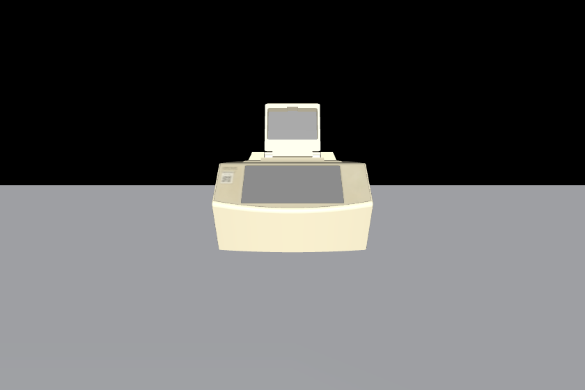
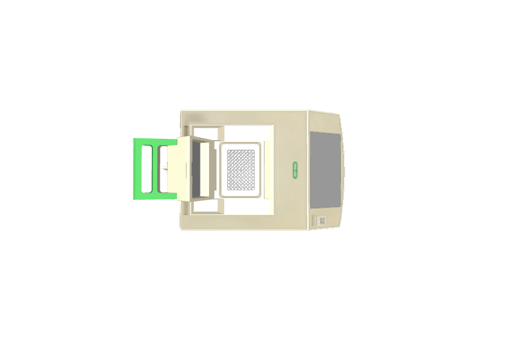
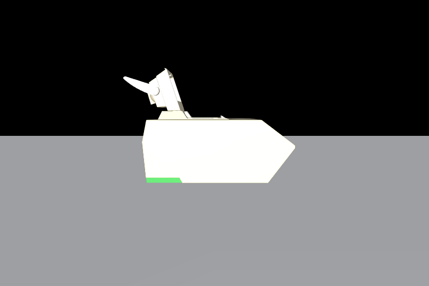
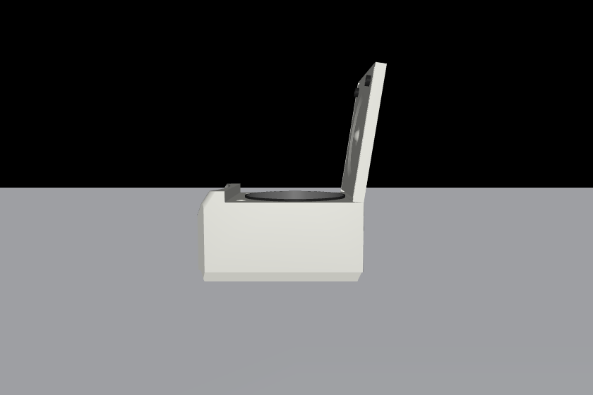
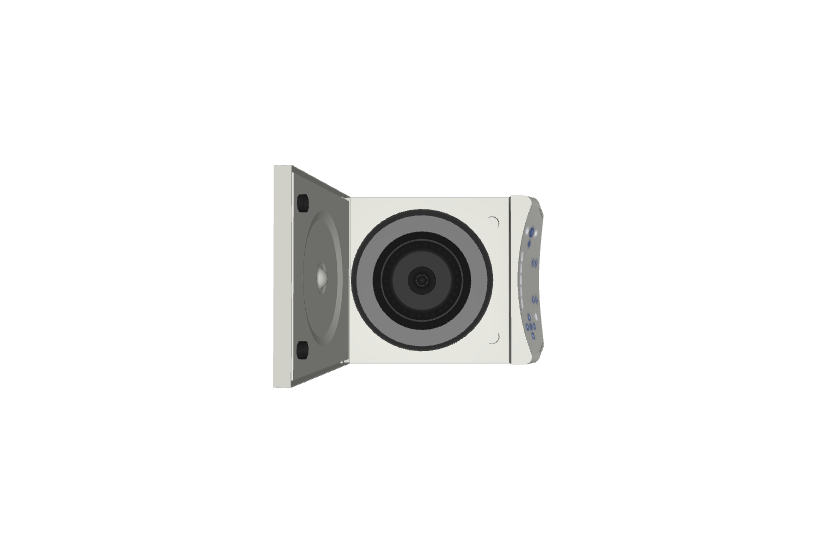
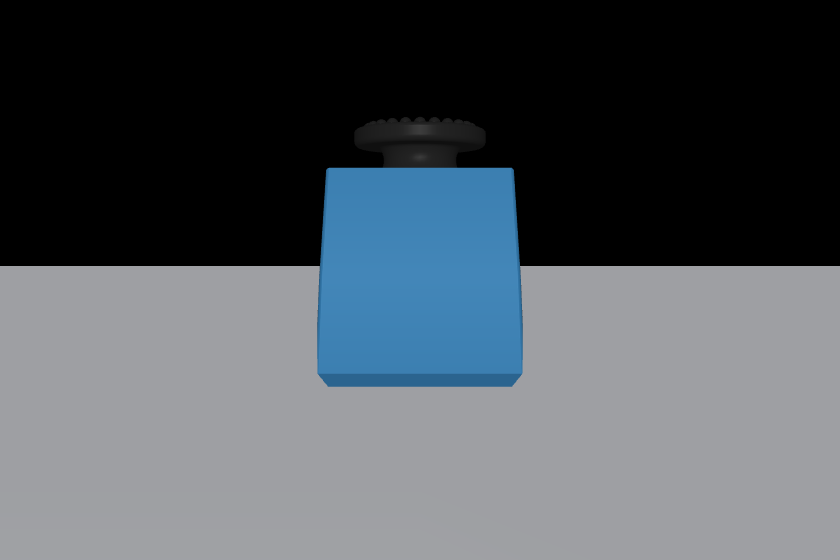
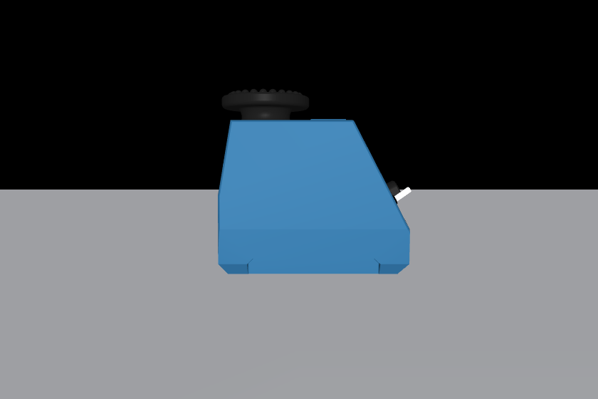
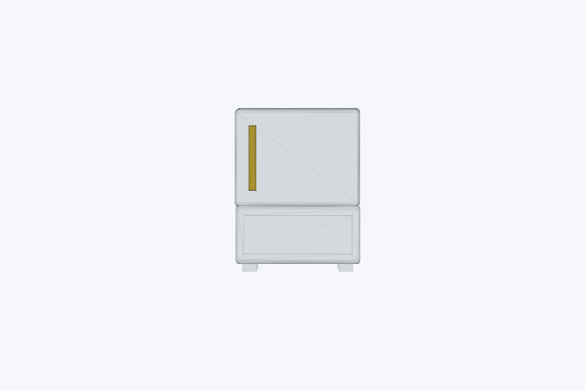
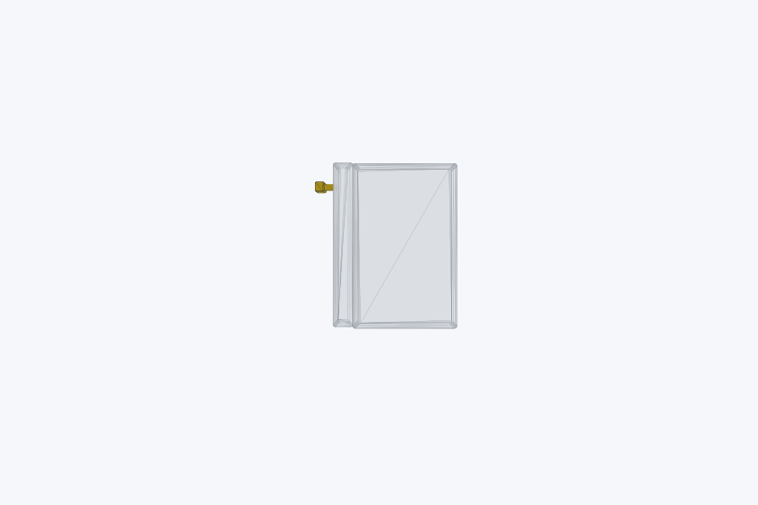
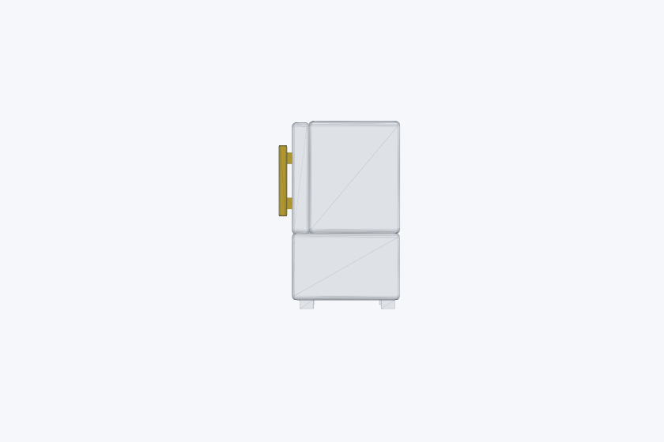

# Level 1 Demo：Experimental Asset Understanding

这个文件给出 5 道 Level 1 示例题。每道题展示一个实验室资产或场景条目的 3 张固定视角图片，图片顺序已打乱，不按前、后、左、右、上、下的固定顺序排列。

题目目标是评测模型能否从视觉资产理解其用途，并结合实验上下文选择正确操作。每题给出 10 个候选操作，正确操作来自 `data/protocol_v1/protocol_min_v1.jsonl` 中的真实 protocol 步骤。

## Q001 Thermal Cycler

**Entry ID:** `autobio_thermal_cycler_c1000`  
**视觉输入：**

  
  
  

**问题：**  
你正在进行一个植物转化相关的载体构建实验。当前已经把 pCAMBIA1300 backbone、`10× CutSmart Buffer`、`Xho I enzyme` 和 nuclease-free water 按 protocol 要求加入反应管中，并且已经完成轻柔混匀。实验目标是让限制性内切酶在受控温度下完成消化，从而把载体骨架线性化，为后续插入片段组装做准备。

图片中展示的是接下来可能要使用的实验设备。请根据该设备的功能、当前反应体系的状态，以及 protocol 中对温度和时间的要求，选择下一步最合适的操作。

**选项：**

| 选项 | 候选操作 |
| --- | --- |
| A | `centrifuge_sample(speed_xg=14000, duration_min=15, temperature_c=4)` |
| B | `incubate_in_thermal_cycler(temperature_c=37, duration_min=30)` |
| C | `vortex_sample(speed="maximum", duration_min=5)` |
| D | `seal_pcr_plate(seal_type="clear_adhesive_film")` |
| E | `sterilize_in_muffle_furnace(temperature_c=500, duration_h=5)` |
| F | `pipette_master_mix(destination="96_well_pcr_plate", volume_ul=20)` |
| G | `place_tube_on_magnetic_rack(duration_min=3)` |
| H | `incubate_on_roller(speed_rpm=20, duration_h=1, temperature_c=25)` |
| I | `wash_pellet(buffer="cold_70_percent_ethanol", volume_ul=400)` |
| J | `sonicate_coverslips(solvent="95_percent_ethanol", duration_min=15)` |

**标准答案：** B

**参考 reasoning steps：**

1. 图片中的设备是 PCR thermal cycler / thermocycler，核心用途是对 PCR 管或 PCR 板中的反应体系执行精确温控孵育或循环程序。
2. 当前步骤不是分离沉淀、混匀悬液或高温灭菌，而是让限制性内切酶在指定温度下消化 DNA。
3. 相关 protocol 明确要求将已经配好的酶切体系放入 PCR thermal cycler，并在 `37 °C` 条件下孵育 `30 min`。
4. 因此，与设备和实验目标同时匹配的操作是 `incubate_in_thermal_cycler(temperature_c=37, duration_min=30)`。

**Protocol 对齐说明：**

- `bioprot:PMC13037774`
- Title: `A Rapid and Visual Soybean Hairy Root Transformation Protocol Using the RUBY Reporter`
- Step 1: protocol 先要求将 plasmid DNA、buffer、Xho I enzyme 和水组成酶切体系，然后轻柔混匀，随后在 PCR thermal cycler 中以 `37 °C` 孵育 `30 min`。这一步的目的不是扩增 DNA，而是让酶切反应稳定进行并线性化载体骨架。

## Q002 Refrigerated Benchtop Centrifuge

**Entry ID:** `autobio_centrifuge_5430`  
**视觉输入：**

  
  
  

**问题：**  
你正在进行 SUMO 免疫沉淀实验的细胞裂解液制备阶段。细胞已经完成裂解，管内混合物中同时包含可溶性蛋白、未完全裂解的细胞碎片和其他不溶性组分。后续免疫沉淀需要尽量清澈的上清液，否则残留碎片会影响抗体结合、珠子洗涤和后续 western blot 分析。

图片中展示的是接下来可能要使用的实验设备。请根据该设备的用途和当前样本状态，选择最符合 protocol 的澄清操作。

**选项：**

| 选项 | 候选操作 |
| --- | --- |
| A | `incubate_in_thermal_cycler(temperature_c=65, duration_min=5)` |
| B | `pipette_blocking_buffer(destination="coverwell_chamber", volume_ul=300)` |
| C | `centrifuge_lysate(speed_xg=14000, duration_min=15, temperature_c=4)` |
| D | `vortex_beads(duration_s=3, speed="medium")` |
| E | `seal_plate(seal_type="clear_adhesive_film")` |
| F | `heat_shock_cells(temperature_c=42, duration_s=45)` |
| G | `place_filters_in_muffle_furnace(temperature_c=500, duration_h=5)` |
| H | `load_sample_on_agarose_gel(voltage_v=120, duration_min=20)` |
| I | `incubate_microtubes_on_roller(speed_rpm=20, duration_h=1)` |
| J | `resuspend_pellet_by_pipetting(volume_ul=40)` |

**标准答案：** C

**参考 reasoning steps：**

1. 图片中的设备是台式冷冻离心机，适合对 microtube / centrifuge tube 中的样本进行高速离心，并可控制低温条件。
2. 当前实验状态是“裂解液已经制备完成，需要澄清上清”，这通常需要高速离心把不溶性碎片沉到管底。
3. protocol 给出的参数是 `14,000×g`、`15 min`、`4 °C`，这些参数与冷冻台式离心机的典型用途一致。
4. 因此正确操作应当是对 lysate 进行低温高速离心，而不是 vortex、热循环、封板或灭菌。

**Protocol 对齐说明：**

- `bioprot:PMC13067152`
- Title: `Denaturing SUMO Immunoprecipitation From Mitotic Cells`
- Step 13: protocol 明确要求将 lysate 放入 refrigerated benchtop centrifuge，并以 `14,000×g`、`4 °C` 离心 `15 min`。该步骤的直接目标是 clarify the sample，也就是去除不溶性碎片并保留可用于后续免疫沉淀的上清液。

## Q003 Vortex Mixer

**Entry ID:** `autobio_vortex_mixer_genie_2`  
**视觉输入：**

  
  
  

**问题：**  
你正在执行蓝藻 RNA 提取流程。样本已经进入 RNA extraction 阶段，并已加入用于裂解和释放核酸的相关试剂。由于蓝藻细胞结构较为坚韧，如果只是轻轻颠倒或短暂移液，样本可能无法充分破碎，进而降低 RNA 回收量和质量。

图片中展示的是接下来可能要使用的实验设备。请判断在这个阶段应该执行哪一个操作，才能最大程度符合 protocol 对样本破碎和混匀强度的要求。

**选项：**

| 选项 | 候选操作 |
| --- | --- |
| A | `vigorously_vortex_sample(speed="maximum", duration_min=5)` |
| B | `centrifuge_sample(speed_xg=5000, duration_min=10, temperature_c=25)` |
| C | `pipette_master_mix(destination="96_well_pcr_plate", volume_ul=20)` |
| D | `incubate_in_thermal_cycler(temperature_c=37, duration_min=30)` |
| E | `sterilize_wrapped_filters(temperature_c=500, duration_h=5)` |
| F | `place_tube_on_magnetic_rack(duration_min=1)` |
| G | `wash_beads(buffer="0.1_percent_sds", volume_ul=500)` |
| H | `seal_pcr_plate(seal_type="clear_adhesive_film")` |
| I | `pour_gradient_with_serological_pipette(layer_percent=60)` |
| J | `air_dry_beads(duration_min=5, cap_open=True)` |

**标准答案：** A

**参考 reasoning steps：**

1. 图片中的设备是 vortex mixer / vortexer，适合对小管样本进行快速、强力的机械混匀。
2. 当前实验目标是充分破碎和混匀样本，而不是沉淀、封板、热循环或高温灭菌。
3. protocol 在 RNA extraction 阶段使用了很强的操作要求：最高速度 vortex `5 min`。
4. 因此最匹配的操作是 `vigorously_vortex_sample(speed="maximum", duration_min=5)`。

**Protocol 对齐说明：**

- `bioprot:PMC13067156`
- Title: `A Simple and Easy Method for RNA Extraction from the Cyanobacterium Synechocystis sp. PCC 6803`
- Step 5: protocol 在 RNA extraction 阶段直接要求 `Vigorously vortex the sample for 5 min at maximum speed`。这说明该步骤强调机械混匀和细胞破碎强度，而不是短暂混匀或温控孵育。

## Q004 96-Well PCR Plate

**Entry ID:** `autobio_pcr_plate_96well`  
**视觉输入：**

  
  
  

**问题：**  
你正在进行 AAV titration 的 qPCR 反应配置。标准曲线、阴性对照和待测样本都需要按照预先设计好的孔位图布置到 96 孔 PCR 板中，并且每个点至少做 duplicate 或 triplicate。当前阶段还没有开始热循环程序，也不是病毒纯化或离心浓缩阶段；关键任务是把 PCR master mix 精确分配到计划使用的孔中，为后续加入模板和封板做准备。

图片中展示的是当前要操作的实验载体。请根据该载体的结构和 protocol 中对反应配置体积的要求，选择最合适的下一步操作。

**选项：**

| 选项 | 候选操作 |
| --- | --- |
| A | `centrifuge_concentrator(speed_xg=3000, duration_min=8, temperature_c=25)` |
| B | `vortex_cell_suspension(duration_s=5)` |
| C | `pipette_pcr_master_mix_to_plate(destination="96_well_pcr_plate", volume_ul=20)` |
| D | `incubate_plate_in_thermal_cycler(temperature_c=37, duration_min=20)` |
| E | `sterilize_filters_in_muffle_furnace(temperature_c=500, duration_h=5)` |
| F | `resuspend_cell_pellet(buffer="dpbs_pluronic", volume_ml=13)` |
| G | `extract_iodixanol_interface(layer="40_60_percent")` |
| H | `place_microcentrifuge_tubes_on_magnetic_rack(duration_min=3)` |
| I | `sonicate_submerged_coverslips(duration_min=15)` |
| J | `incubate_beads_on_roller(speed_rpm=20, duration_h=1)` |

**标准答案：** C

**参考 reasoning steps：**

1. 图片中的条目是 96-well PCR plate，用于承载多个小体积 PCR / qPCR 反应。
2. 题干说明当前处于 qPCR 反应配置阶段，重点是按孔位图把 master mix 分配到每个计划使用的孔。
3. protocol 指定向每个使用孔加入 `20 μL` PCR master mix；阴性对照孔可按 protocol 使用不同体积，但该题关注常规使用孔的主要操作。
4. 因此正确选项是把 PCR master mix 移液到 96 孔 PCR 板，而不是把整板放进热循环仪、进行离心浓缩或执行磁架分离。

**Protocol 对齐说明：**

- `bioprot:PMC12242552`
- Title: `An Alternative Gene Editing Strategy Using a Single AAV Vector`
- Step 53: protocol 要求先绘制每个孔对应的样本、标准曲线或对照关系，然后开始配置 PCR reactions。具体操作是向每个计划使用的孔加入 `20 μL` PCR master mix；这一步发生在封板和 qPCR 运行之前。

## Q005 Muffle Furnace

**Entry ID:** `labutopia_muffle_furnace`  
**视觉输入：**

  
  
  

**问题：**  
你正在准备空气微生物群落采样所需的 Tissuquartz filters。由于这些滤膜会直接用于收集空气中的微生物颗粒，采样前必须尽量降低外源 DNA 和微生物污染。当前滤膜尚未进入采样流程，也还没有进行 PBS 洗脱、离心、DNA 提取或建库；当前任务是对滤膜进行采样前的高温灭菌预处理。

图片中展示的是接下来可能要使用的实验设备。请根据设备类型、滤膜预处理目标以及 protocol 中的温度和时间要求，选择最合适的操作。

**选项：**

| 选项 | 候选操作 |
| --- | --- |
| A | `pipette_template_to_qpcr_mix(volume_ul=1)` |
| B | `vortex_powerbead_tubes(speed="maximum", duration_min=15)` |
| C | `centrifuge_filter_tube(speed_xg=200, duration_h=3, temperature_c=4)` |
| D | `sterilize_wrapped_filters_in_muffle_furnace(temperature_c=500, duration_h=5)` |
| E | `incubate_end_repair_reaction_in_thermal_cycler(temperature_c=20, duration_min=30)` |
| F | `place_tubes_on_magnetic_rack(duration_min=1)` |
| G | `add_solution_c2_and_vortex(volume_ul=250, duration_s=5)` |
| H | `cut_filter_membrane_into_small_pieces(tool="scissors")` |
| I | `wash_ampure_beads_with_ethanol(concentration_percent=70)` |
| J | `perform_limited_cycle_pcr(cycles=12, denaturation_c=98)` |

**标准答案：** D

**参考 reasoning steps：**

1. 图片中的设备是 muffle furnace / laboratory furnace，适合在高温条件下对耐热材料进行灼烧、灰化或灭菌处理。
2. 当前任务是采样前滤膜灭菌，不是 DNA 提取中的 bead beating、磁珠分离、PCR 或低速离心。
3. protocol 明确要求将 Tissuquartz filters 用铝箔单独包裹，并在 muffle furnace 中以 `500 °C` 处理 `5 h`。
4. 因此正确操作是 `sterilize_wrapped_filters_in_muffle_furnace(temperature_c=500, duration_h=5)`。

**Protocol 对齐说明：**

- `nprot:PMC7086576`
- Title: `Optimized DNA extraction and metagenomic sequencing of airborne microbial communities`
- Step 1: protocol 在 particulate matter collection 阶段要求将最多 45 张 Tissuquartz filters 分别包入铝箔，并放入 muffle furnace，以 `500 °C` 灭菌 `5 h`。这个操作发生在采样前，目的是降低滤膜自身带来的污染风险，随后滤膜才会被保存并用于实际空气颗粒物收集。
