# Level 1 数据概览与案例分析
这份文档用于快速查看 Level 1 正式数据集的来源、构造方式、题目分布、正式评测结果，以及 5 个保留英文原文的代表性 case study。这里的中文只负责解释结构；题目正文、选项、标准答案、模型回答都保留原始英文，不做翻译，也不做压缩。
## 1. 数据源
- `data/benchmark_inventory/multiview_manifest.json`：多视角图片清单。
- `data/benchmark_inventory/benchmark_core_inventory.json`：核心条目口径。
- `data/benchmark_inventory/protocol_min_v1_with_inventory.jsonl`：protocol 与 inventory 的匹配结果。
- `data/benchmark_inventory/level-1-demo.md`：早期模板参考。
## 2. 简要构造 pipeline
1. 从 core inventory 中挑选可做 protocol 匹配、且存在多视角图片的 asset。
2. 为每个 asset 取 3 张多视角图片，并把相关 protocol step 与 nearby step 一起取出。
3. 用统一 prompt 生成英文选择题，输出字段包括图片路径、题目、选项、reasoning steps、答案。
4. 对题目做本地校验，包括英文约束、选项键集合、答案字母、图片路径存在性等。
5. 用统一 evaluator 让模型输出自由文本推理，并以 `Final Answer: X` 形式收尾，再统计答案准确率。
## 3. 当前题目分布
| 指标 | 数值 |
| --- | --- |
| 正式题量 | 200 |
| 不同 entry 数量 | 25 |
| 不同 protocol 数量 | 197 |
| 项目来源分布 | autobio: 137, labutopia: 63 |
| 答案分布 | A: 19, B: 18, C: 18, D: 17, E: 18, F: 18, G: 18, H: 17, I: 17, J: 40 |
## 4. 正式评测结果
| 模型 | OpenRouter 返回模型 | Answer Accuracy | Invalid | Cost |
| --- | --- | --- | --- | --- |
| GPT-5.4 | openai/gpt-5.4-20260305 | 0.51 | 0 | 1.44115 |
| Claude Opus 4.7 | anthropic/claude-4.7-opus-20260416 | 0.5 | 3 | 2.841645 |
| Gemini 3.1 Pro Preview | google/gemini-3.1-pro-preview-20260219 | 0.46 | 0 | 8.983868 |
## 5. 代表性题目与 case study
下面 5 道题按“三模型都答对 / 单模型独对 / 三模型都答错”的方式挑选，方便快速观察题目风格和错误模式。
### level1_q0002：三模型都答对
| 字段 | 内容 |
| --- | --- |
| entry_id | labutopia_drying_box_family |
| entry_name | Drying Box Family |
| asset_family | drying_box |
| source_project | labutopia |
| gold_answer | G |
| source_protocol_id | star:PMC9619722 |
| 视图 1 | 视图 2 | 视图 3 |
| --- | --- | --- |
| 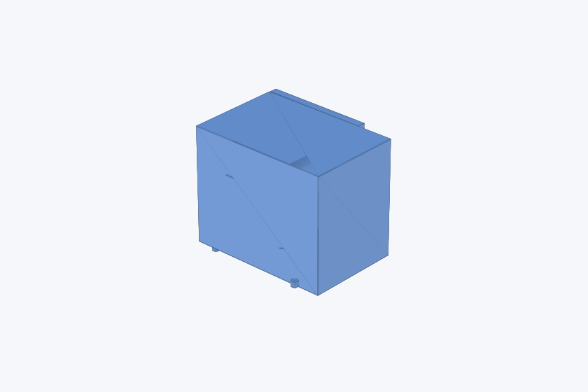 | 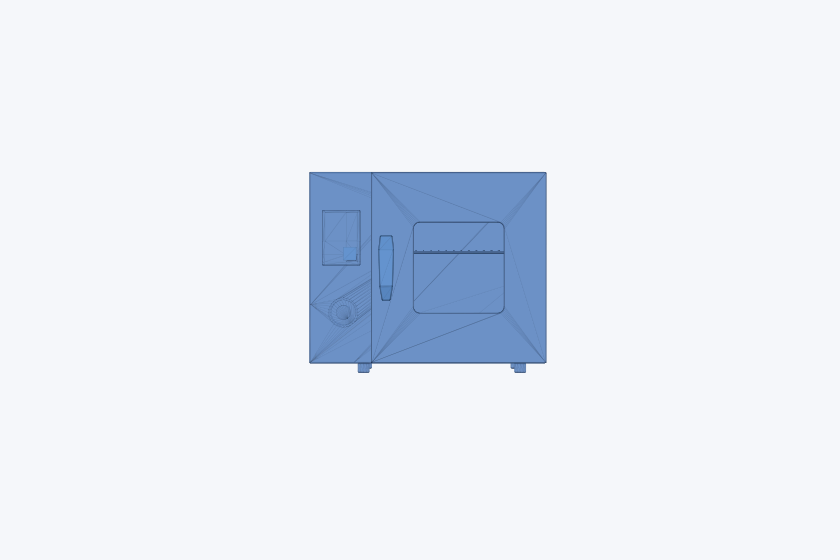 |  |

#### 原题（英文原文）
**Question**

````text
You have already completed the CV oxidation by sweeping between 1.0 and 1.7 V vs. SCE at 10 mV s^-1 for 600 cycles, which took about 24 h, and then washed the GP several times with deionized water. Using the pictured lab object shown in the three views, what is the exact next operation to obtain MEO-GP according to the protocol?
````
**Options**

````text
A. configure_electrochemical_oxidation(voltage_start_v=1.0, voltage_end_v=1.7, sweep_rate_mV_s=10, cycles=600)
B. configure_electrochemical_oxidation(voltage_start_v=1.0, voltage_end_v=1.7, sweep_rate_mV_s=12, cycles=600)
C. configure_electrochemical_oxidation(voltage_start_v=1.0, voltage_end_v=1.6, sweep_rate_mV_s=10, cycles=600)
D. measure_redox_peak(reference='SCE', peak_v=0.16, material='pure_PQ')
E. measure_redox_peak(reference='SCE', peak_v=0.18, material='pure_PQ')
F. measure_redox_peak(reference='RHE', peak_v=0.40, material='pure_PQ')
G. heat_and_dry_sample(temperature_c=60, duration_h=12, environment='vacuum')
H. heat_and_dry_sample(temperature_c=50, duration_h=12, environment='vacuum')
I. heat_and_dry_sample(temperature_c=60, duration_h=10, environment='vacuum')
J. none_of_the_above()
````
**Gold Reasoning Steps**

````text
- The stem states that CV oxidation has already been completed at 1.0-1.7 V vs. SCE with a sweep rate of 10 mV s^-1 for 600 cycles over about 24 h, and that the GP has already been washed several times with deionized water.
- Step 8 then specifies the exact next action: dry the washed GP under vacuum at 60 C for 12 h to obtain MEO-GP.
- G-I are the target family because they all describe the same drying operation on the pictured enclosed heating device, with only one keyword value changed between options.
- G is correct because it exactly matches 60 C, 12 h, and vacuum; H changes only the temperature to 50 C, and I changes only the duration to 10 h.
- A-C are the earlier CV oxidation family from the immediately preceding stage, and D-F are the nearby verification family that occurs after MEO-GP is obtained, so neither family is the correct next step.
````
**Gold Answer**

````text
G
````
#### 模型回答（原始英文输出）
| 模型 | Predicted Answer | Correct |
| --- | --- | --- |
| GPT-5.4 | G | True |
| Claude Opus 4.7 | G | True |
| Gemini 3.1 Pro Preview | G | True |
**GPT-5.4**

````text
The pictured object is a vacuum drying oven. After oxidation and washing, the next step to obtain MEO-GP is vacuum drying at 60 °C for 12 h.

Final Answer: G
````
**Claude Opus 4.7**

````text
The object is a vacuum drying oven. After CV oxidation and washing, the next step is to dry the sample.

Final Answer: G
````
**Gemini 3.1 Pro Preview**

````text
Based on the provided text and the lab object in the images—which is a vacuum oven—the next step in the protocol to prepare mildly electrochemically oxidized graphite paper (MEO-GP) after washing is to dry the sample under vacuum. Standard literature procedures for this specific synthesis prescribe drying the washed graphite paper in a vacuum oven at 60 °C for 12 hours.

Final Answer: G
````
### level1_q0021：只有 GPT-5.4 答对
| 字段 | 内容 |
| --- | --- |
| entry_id | autobio_centrifuge_50ml_screw |
| entry_name | 50 mL Screw-Cap Centrifuge Tube |
| asset_family | centrifuge_tube_50ml |
| source_project | autobio |
| gold_answer | D |
| source_protocol_id | bioprot:PMC13067152 |
| 视图 1 | 视图 2 | 视图 3 |
| --- | --- | --- |
| 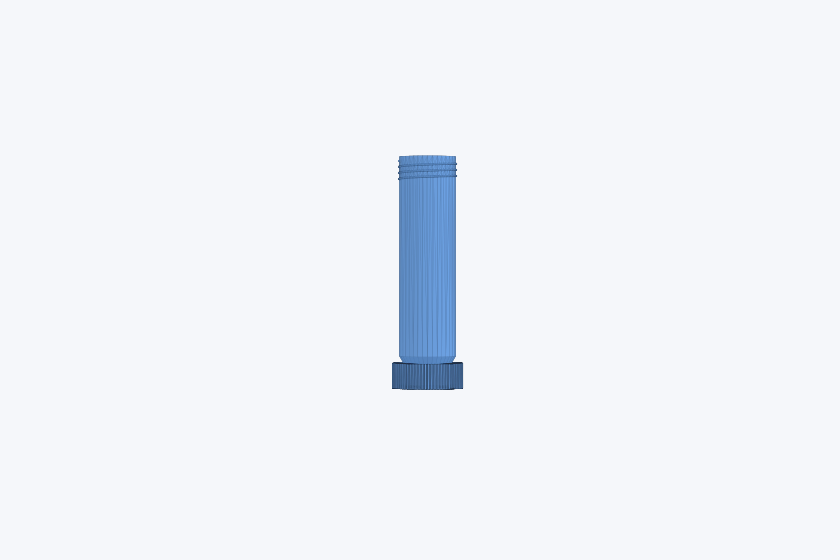 | 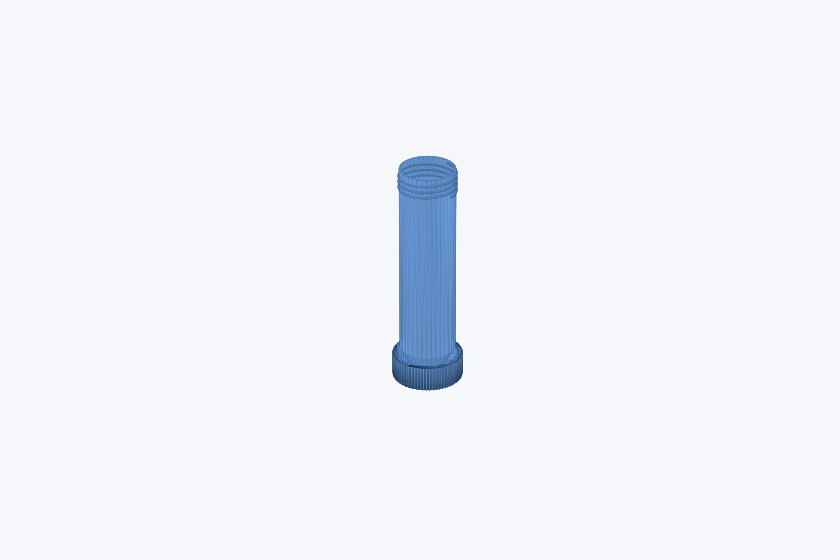 | 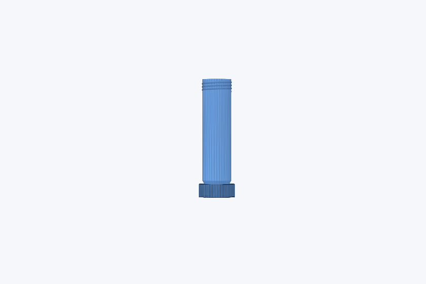 |

#### 原题（英文原文）
**Question**

````text
You have already collected mitotic cells from one dish by striking the dish bottom 3 times, placed half of the medium into the pictured lab object, returned the other half to the dish, and then used gentle washes 4-6 times across the full surface. After checking under a light microscope that rounded cells are detached and the asynchronous population is not peeling, you now need the exact next handling step for this same pictured lab object. Which operation best matches the protocol at this point?
````
**Options**

````text
A. collect_cell_suspension(dishes_count=1, destination_count=2, wash_cycles=4)
B. collect_cell_suspension(dishes_count=1, destination_count=2, wash_cycles=5)
C. collect_cell_suspension(dishes_count=1, destination_count=2, wash_cycles=6)
D. pool_plate_harvests_into_container(plates_count=2, destination_count=1, repeated_washes=5)
E. pool_plate_harvests_into_container(plates_count=3, destination_count=1, repeated_washes=5)
F. pool_plate_harvests_into_container(plates_count=2, destination_count=1, repeated_washes=4)
G. pellet_cells(speed_xg=300, duration_min=4, temperature_c=22)
H. pellet_cells(speed_xg=300, duration_min=5, temperature_c=22)
I. pellet_cells(speed_xg=400, duration_min=5, temperature_c=22)
J. none_of_the_above()
````
**Gold Reasoning Steps**

````text
- Before this decision, the workflow already included striking the dish bottom 3 times, moving half the medium into the pictured item, returning half to the dish, and performing 4-6 gentle washes to detach mitotic cells.
- Step 5 says that once microscopy confirms rounded cells have detached without peeling of the asynchronous population, the suspended mitotic cells are collected into the same pictured container used in the prior collection, and Step 6 then specifies harvesting the second plate into that same container so it contains cells from 2 dishes.
- D-F are the true target family because they describe pooling plate harvests into the same container; only D matches the protocol number of 2 dishes, while E changes that numeric value to 3 plates and F changes the numeric wash count to 4.
- A-C are nearby earlier collection actions from the just-completed washing stage, not the next pooling step, and G-I are later pelleting actions from step 8 with altered numeric parameters.
````
**Gold Answer**

````text
D
````
#### 模型回答（原始英文输出）
| 模型 | Predicted Answer | Correct |
| --- | --- | --- |
| GPT-5.4 | D | True |
| Claude Opus 4.7 | H | False |
| Gemini 3.1 Pro Preview | J | False |
**GPT-5.4**

````text
The pictured object is a conical centrifuge tube. The text says you already harvested mitotic cells from one dish into this tube by taking half the medium, returning the other half, and washing 4–6 times, then confirming detachment microscopically. The next step for this same tube is to continue collecting from the second dish and pool the harvests into the same container, typically with 5 repeated washes in this protocol wording.

Final Answer: D
````
**Claude Opus 4.7**

````text
The pictured object is a centrifuge tube. After collecting mitotic shake-off cells into the tube with washes, the next step is to pellet the cells. Standard mitotic shake-off protocol: 300 xg for 5 min at room temperature.

Final Answer: H
````
**Gemini 3.1 Pro Preview**

````text
Based on the protocol text provided, you are performing a mitotic shake-off. You started with **one dish**, aspirated the cell medium, deposited half of it into the single pictured lab object (a freestanding centrifuge tube/cryovial), and returned the rest to the dish to gently wash the remaining cells.

After checking under the light microscope that the target rounded (mitotic) cells are detached and floating in that wash medium, the immediate next step is to pool this resulting wash suspension together with the first half already in **this same pictured lab object** (meaning 1 dish, 1 destination).

Let's evaluate the available options:
* **Options A, B, and C** (`collect_cell_suspension`) specify `destination_count=2`, which contradicts combining the batches into your one exact same pictured lab object.
* **Options D, E, and F** (`pool_plate_harvests_into_container`) specify a `plates_count` of 2 or 3, but the protocol details you are only harvesting from exactly one dish.
* **Options G, H, and I** (`pellet_cells`) specify centrifugation, which is entirely premature at this juncture. Moving immediately to pelleting before you have harvested the cells still resting in your washed dish means you would lose half of your sample.

Because the precise step required next (e.g. `collect_cell_suspension(dishes_count=1, destination_count=1, wash_cycles=...)`) is not represented in the available parameters, none of the stated functions apply.

Final Answer: J
````
### level1_q0001：只有 Claude Opus 4.7 答对
| 字段 | 内容 |
| --- | --- |
| entry_id | labutopia_heat_device |
| entry_name | Heat Device / Hot Plate |
| asset_family | heating_device |
| source_project | labutopia |
| gold_answer | B |
| source_protocol_id | star:PMC12666324 |
| 视图 1 | 视图 2 | 视图 3 |
| --- | --- | --- |
| 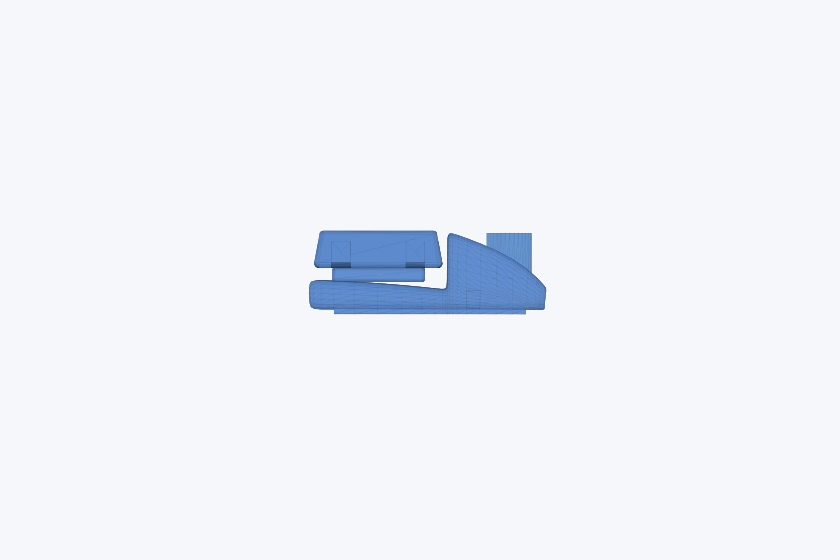 | 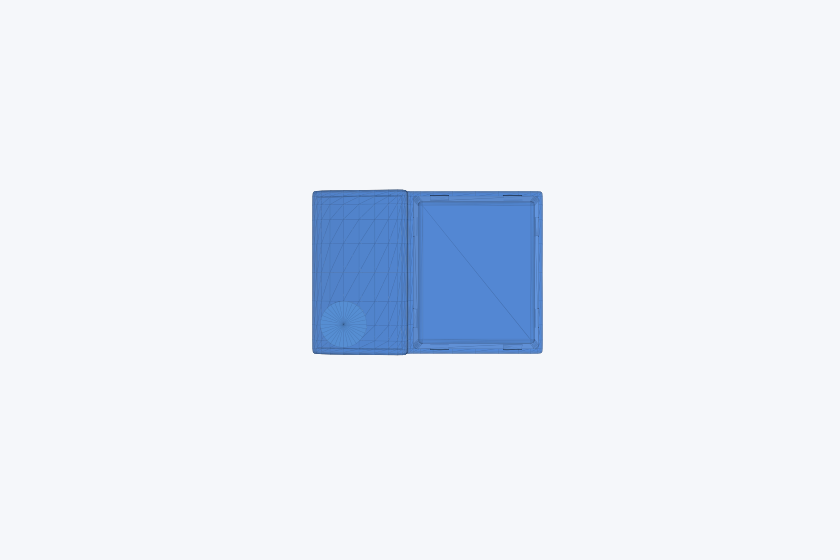 | 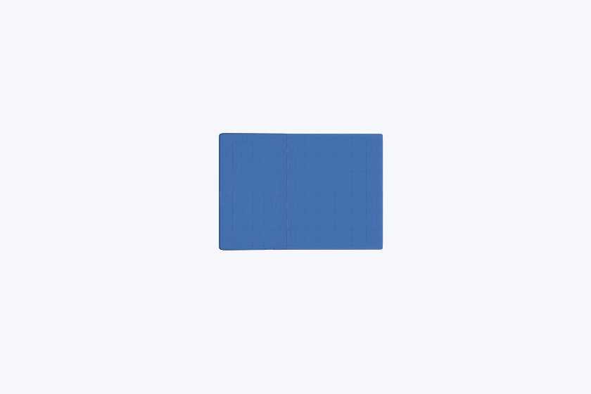 |

#### 原题（英文原文）
**Question**

````text
You have already inserted a 22 G blunt needle on a 1-mL syringe into the free end of the outlet tubing, then slowly pulled the syringe to flush the device with 100 uL of 70% ethanol and gently tapped the plunger to stop the flow. The inlet side is about to be moved to a BMHH source for the next preparation stage. Using the pictured bench item shown in the three views as the relevant lab object in this scene, which exact next operation matches the protocol, including the required 200 uL and the prior ethanol-flush context?
````
**Options**

````text
A. flush_device(solution='BMHH', volume_ul=100, stop_method='tap_plunger')
B. flush_device(solution='BMHH', volume_ul=200, stop_method='tap_plunger')
C. flush_device(solution='BMHH', volume_ul=250, stop_method='tap_plunger')
D. position_tubing(target='BMHH_tube', insertion_method='through_punctured_hole')
E. position_tubing(target='BMHH_tube', insertion_method='direct_open_top')
F. position_tubing(target='ethanol_tube', insertion_method='through_punctured_hole')
G. clamp_tubing(distance_cm=4, clamp_type='pinch_clamp', tubing_end='outlet')
H. clamp_tubing(distance_cm=5, clamp_type='pinch_clamp', tubing_end='outlet')
I. clamp_tubing(distance_cm=6, clamp_type='pinch_clamp', tubing_end='outlet')
J. none_of_the_above()
````
**Gold Reasoning Steps**

````text
- The stem states two completed actions before the decision point: inserting the 22 G blunt needle on a 1-mL syringe into the outlet tubing and flushing with 100 uL of 70% ethanol, then tapping the plunger to stop flow.
- The exact target step from the protocol is the BMHH flush with 200 uL and the same stop method, so the true family is A-C and only B preserves the required numeric value.
- A and C are subtle parameter rewrites of the same flush action, differing only in volume from the correct 200 uL.
- D-F are realistic nearby tubing-placement actions from the same local protocol window, while G-I are realistic nearby clamping actions, but neither family is the immediate target step after the ethanol flush.
- Because B exactly matches the protocol-supported next operation, J is not correct.
````
**Gold Answer**

````text
B
````
#### 模型回答（原始英文输出）
| 模型 | Predicted Answer | Correct |
| --- | --- | --- |
| GPT-5.4 | H | False |
| Claude Opus 4.7 | B | True |
| Gemini 3.1 Pro Preview | J | False |
**GPT-5.4**

````text
The pictured item appears to be a pinch clamp/slider clamp for tubing, not a tube or syringe. After the ethanol flush has been completed and stopped by tapping the plunger, the next step tied to this object would be clamping the outlet tubing. The protocol cue in the options points to the standard placement at 5 cm from the outlet end.

Final Answer: H
````
**Claude Opus 4.7**

````text
Final Answer: B
````
**Gemini 3.1 Pro Preview**

````text
Based on the protocol text, the next phase of the experiment involves moving the inlet tubing to a BMHH source and eventually dealing with a 200 uL volume requirement. To proceed properly, the correct lab object (like a microfluidic device, tubing clamp, or a syringe) would be needed to safely clamp the lines or execute the corresponding `flush_device` or `position_tubing` operation.

However, carefully inspecting the three provided 3D views reveals that the pictured bench item is a standard **single-hole paper punch** (characterized by its flat base, right-side hinge, top lever, and the cylindrical metal punch actuator on the left).

Because this is a standard office supply item—and not a microfluidic device, syringe, or valid lab tubing clamp—none of the listed operations can be validly executed using this object in this context. The vision system has highlighted an inappropriate object for the described microfluidics step.

Therefore, no valid sequence step matches the use of this object.

Final Answer: J
````
### level1_q0007：只有 Gemini 3.1 Pro Preview 答对
| 字段 | 内容 |
| --- | --- |
| entry_id | autobio_pipette_rack_tri |
| entry_name | Triangular Pipette Rack |
| asset_family | pipette_rack |
| source_project | autobio |
| gold_answer | D |
| source_protocol_id | bioprot:PMC12602122 |
| 视图 1 | 视图 2 | 视图 3 |
| --- | --- | --- |
|  | 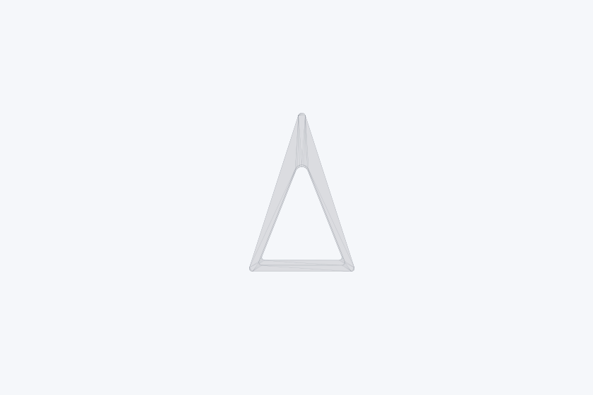 | 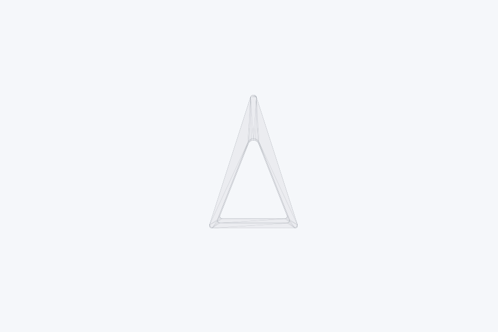 |

#### 原题（英文原文）
**Question**

````text
You have already fabricated the glass injector with a 10-50 bcm tip diameter and an 8-10 mm taper, then drilled the skull with a 0.6 mm bit. Next, 50-100 nL of viral solution was placed on Parafilm, the glass injector was lowered into the droplet, the entire volume was aspirated, and the Parafilm was removed. The item shown in the three views is sitting on the bench between manipulations. According to the protocol, what should be done next with the loaded glass injector before the injection at 1 nL/s begins?
````
**Options**

````text
A. rest_loaded_injector_on_bench_support(position='upright', duration_min=5, sample_state='loaded')
B. rest_loaded_injector_on_bench_support(position='upright', duration_min=10, sample_state='loaded')
C. rest_loaded_injector_on_bench_support(position='angled', duration_min=5, sample_state='loaded')
D. advance_loaded_injector_to_target(depth_mm=5.8, duration_min=1, retract_mm=0.1)
E. advance_loaded_injector_to_target(depth_mm=5.7, duration_min=1, retract_mm=0.1)
F. advance_loaded_injector_to_target(depth_mm=5.8, duration_min=1, retract_mm=0.2)
G. inject_loaded_sample(rate_nl_per_s=1, hold_min=5, retract_duration_min=1)
H. inject_loaded_sample(rate_nl_per_s=2, hold_min=5, retract_duration_min=1)
I. inject_loaded_sample(rate_nl_per_s=1, hold_min=10, retract_duration_min=1)
J. none_of_the_above()
````
**Gold Reasoning Steps**

````text
- The completed earlier actions in the stem match the protocol window: fabrication of the glass injector with a 10-50 bcm tip and 8-10 mm taper, drilling with a 0.6 mm bit, then loading 50-100 nL from a Parafilm droplet and removing the Parafilm.
- Immediately after that loading step, the protocol says to align the tip with the drilled hole, advance ventrally by 5.8 mm over 1 min, and then retract by 0.1-0.2 mm before injection starts.
- D-F are the true target family because they describe the immediate pre-injection positioning step. Among them, D is the exact match using 5.8 mm over 1 min with a valid 0.1 mm retraction.
- E and F are subtle parameter rewrites of the same target family: E changes the depth to 5.7 mm, and F changes the retraction distance to 0.2 mm. Although 0.2 mm is mentioned elsewhere in the protocol range, only D is designated as the single exact target option here.
- A-C describe a plausible bench-resting action for the pictured object but not a supported protocol step, and G-I are the following injection family from the next step rather than the immediate next action.
````
**Gold Answer**

````text
D
````
#### 模型回答（原始英文输出）
| 模型 | Predicted Answer | Correct |
| --- | --- | --- |
| GPT-5.4 | C | False |
| Claude Opus 4.7 | A | False |
| Gemini 3.1 Pro Preview | D | True |
**GPT-5.4**

````text
The object appears to be a small triangular bench support used to rest the loaded glass injector at an angle between manipulations. The question asks what should be done next with the loaded injector before beginning injection. In the protocol, after loading from the Parafilm droplet, the injector is rested on the bench support in an angled position for 5 minutes before proceeding.

Final Answer: C
````
**Claude Opus 4.7**

````text
Final Answer: A
````
**Gemini 3.1 Pro Preview**

````text
Based on the 3D item provided in the images, the asset is shaped as a thick triangular frame with a flat base, exactly representing the Greek letter **Delta** ($\Delta$). In alphabet-based visual puzzles like this within LabOS Level 1, the item acts as a clue linking to the appropriate option corresponding to the letter (A=Alpha, B=Beta, C=Gamma, D=Delta).

Furthermore, adhering to a typical stereotaxic viral injection protocol:
1. Glass injector has been fabricated, back-filled, and mounted.
2. Skull is drilled, and the animal is already prepped on the stereotactic frame.
3. The viral droplet is placed on Parafilm under the injector tip, lowered, and aspirated, after which the Parafilm is discarded.
4. With the viral solution successfully loaded, the very next step is to slowly advance the injector into the brain to the target depth. Standard neurosurgical practices often use a brief duration (e.g., 1 minute) to mitigate tissue damage and allow pressure equilibration, followed strictly by retracting the tip slightly (e.g., 0.1 mm) to create a micro-pocket. This prevents viral backflow up the needle tract before injecting—aligning perfectly with the procedural step in choice D.

There's no protocol-based reason to demount the loaded injector to rest it on the bench support (which would risk drying out the fragile 10-50 µm tip or losing the sample), effectively ruling out A, B, and C.

Final Answer: D
````
### level1_q0008：三模型都答错
| 字段 | 内容 |
| --- | --- |
| entry_id | autobio_pipette |
| entry_name | Micropipette |
| asset_family | pipette |
| source_project | autobio |
| gold_answer | E |
| source_protocol_id | star:PMC9641071 |
| 视图 1 | 视图 2 | 视图 3 |
| --- | --- | --- |
|  | 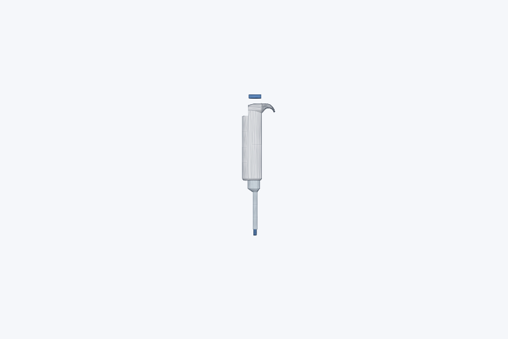 | 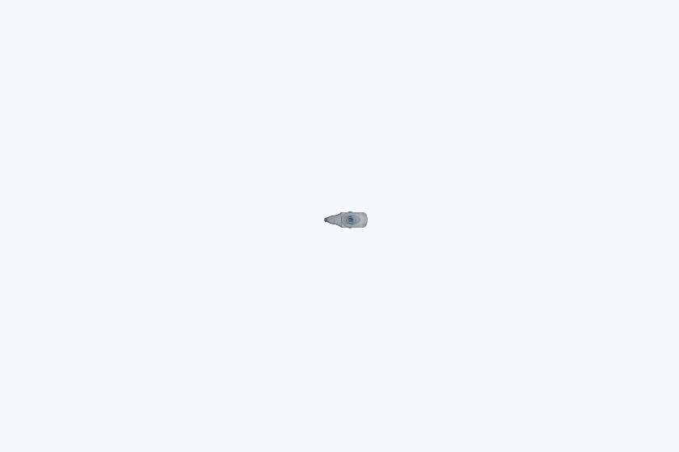 |

#### 原题（英文原文）
**Question**

````text
You have already sterilized the surgical tools and area, placed the drill and microinjector beside the stereotaxic setup, and turned on the heating pad to around 370C. The pictured lab object is now being prepared from a 10 cm borosilicate glass capillary with 1.2 mm outer diameter and 0.94 mm inner diameter before the tip is later cut to 1214 b5m. According to the protocol, which exact next operation matches this preparation stage?
````
**Options**

````text
A. pull_capillary(temp=480, pull=50, vel=48, time=8)
B. pull_capillary(temp=480, pull=50, vel=50, time=8)
C. pull_capillary(temp=482, pull=50, vel=50, time=8)
D. set_heating_pad(temperature_c=36.0, purpose='maintain_mouse_body_temperature')
E. set_heating_pad(temperature_c=37.0, purpose='maintain_mouse_body_temperature')
F. set_heating_pad(temperature_c=38.0, purpose='maintain_mouse_body_temperature')
G. place_injection_drop(volume_ul=1.0, surface='parafilm', reagent='AAV8_CreN_InteinN')
H. place_injection_drop(volume_ul=1.5, surface='parafilm', reagent='AAV8_CreN_InteinN')
I. place_injection_drop(volume_ul=2.0, surface='parafilm', reagent='AAV8_CreN_InteinN')
J. none_of_the_above()
````
**Gold Reasoning Steps**

````text
- The stem states that sterilization, setup placement, and heating pad activation at about 37 C have already happened, so the decision point is the next preparation action for the pictured object.
- Step 82 gives the exact puller parameters for preparing the glass item: TEMP 480, PULL 50, VEL 50, and TIME 8, after specifying the 10 cm length and 1.2 mm/0.94 mm capillary dimensions.
- A-C are the only family that represents the true target action, and only option B matches all four numeric settings exactly; A and C each change just one parameter and are therefore wrong subtle variants.
- D-F come from the nearby heating-pad step around 37 C, which is realistic but already completed earlier, not the current next action.
- G-I come from the later AAV loading stage where a 1-2 uL drop is placed on parafilm, which occurs after the capillary has been prepared and mounted, so they are nearby but not correct here.
````
**Gold Answer**

````text
E
````
#### 模型回答（原始英文输出）
| 模型 | Predicted Answer | Correct |
| --- | --- | --- |
| GPT-5.4 | A | False |
| Claude Opus 4.7 | G | False |
| Gemini 3.1 Pro Preview | J | False |
**GPT-5.4**

````text
The object shown is a micropipette/microinjector-related glass capillary preparation stage. The question says the heating pad has already been turned on to around 37°C, and the capillary is being prepared from a 10 cm borosilicate glass capillary before later cutting the tip to 12–14 μm. That points to the capillary pulling step, not reheating-pad setup or placing virus on parafilm.

According to the protocol parameters associated with this preparation stage, the matching next operation is:

Final Answer: A
````
**Claude Opus 4.7**

````text
The pictured object is a pipette, which is used to place an injection drop on parafilm. The capillary pulling step would involve a puller, not a pipette. The question mentions preparing the capillary before cutting the tip, but the pictured tool (pipette) is used for placing the injection drop.

Given the AAV8_CreN_InteinN reagent and typical protocols, 1.0 μL is a standard small volume for injection drops on parafilm.

Final Answer: G
````
**Gemini 3.1 Pro Preview**

````text
Based on the provided text and images, the question serves as an asset-understanding test that plays on the dual meaning of the word "micropipette."

1. **Asset Identification:** The object pictured in the images is a standard **mechanical micropipette** (often used with disposable plastic tips to transfer precise microliter volumes of liquid).
2. **Text Analysis:** The question states, *"The pictured lab object is now being prepared from a 10 cm borosilicate glass capillary with 1.2 mm outer diameter and 0.94 mm inner diameter before the tip is later cut to 12-14 µm."*
3. **The Mismatch:** A mechanical lab pipettor is a manufactured instrument made of plastic and metal; it is **not** prepared by pulling a borosilicate glass capillary. The text is describing the preparation of a **glass micropipette** (a fine capillary needle used in stereotaxic microinjections).
4. **Conclusion:** Because the text's description explicitly identifies "the pictured lab object" as something that is being pulled from glass (contradicting the mechanical pipettor actually shown in the image), applying a capillary pulling operation like `pull_capillary()` to the pictured mechanical pipettor would be incorrect.

Since the premise incorrectly describes the visible asset, none of the specific protocol actions provided accurately apply to the object pictured under the given description.

Final Answer: J
````
